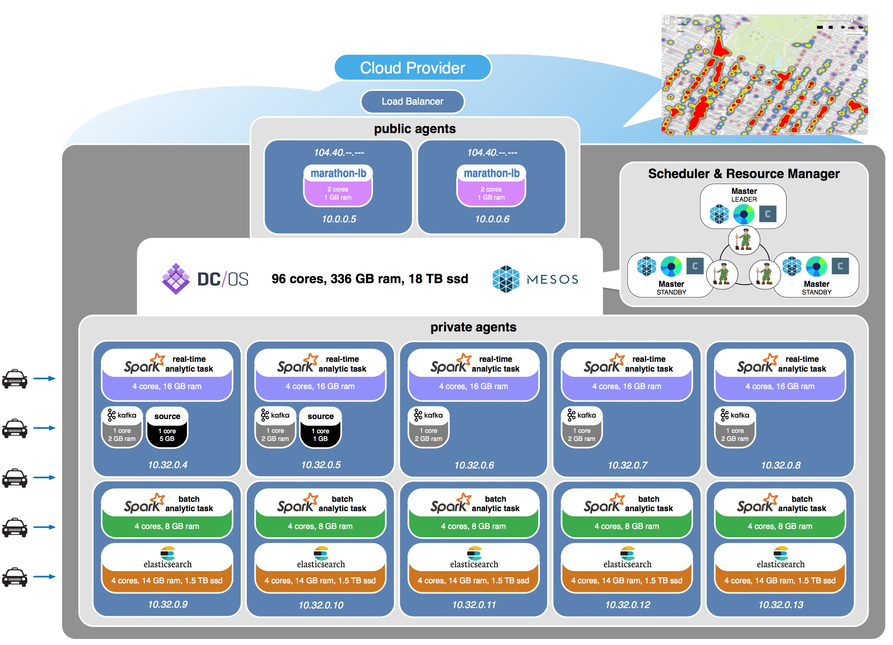

# Datacenter Operating System Internet of Things Demo (dcos-iot-demo)

This project demonstrates how to configure a full stack geo-enabled Internet of Things (IoT) solution using <a href="https://mesosphere.com/">Mesosphere's</a> open sourced <a href="https://dcos.io/">Data Center Operating System (DC/OS)</a> using <a href="https://www.docker.com/">Docker</a> containerization and <a href="http://mesos.apache.org/">Mesos</a> frameworks including <a href="https://mesosphere.github.io/marathon/">Marathon</a>, <a href="http://kafka.apache.org/">Kafka</a>, <a href="http://spark.apache.org/">Spark</a>, and <a href="http://elasticsearch.mesosframeworks.com/">Elasticsearch</a>.

## dcos-iot-demo in action:

## create your own dcos-iot-demo environment:
1. <a href="docs/overview.md">review architecture & application overview</a> 
2. <a href="docs/acs-setup.md">get a DC/OS cluster running on the Microsoft Azure or Amazon Web Services</a> 
3. <a href="docs/dcos-explore.md">explore the DC/OS and Mesos dashboards</a> 
4. <a href="docs/kafka-setup.md">schedule Kafka brokers</a> 
5. <a href="docs/es-setup.md">schedule an Elasticsearch cluster</a> 
6. <a href="docs/marathon-lb-setup.md">schedule marathon-lb (load balancer) to run on public agents</a> 
7. <a href="docs/azure-ports-setup.md">open up load balancer ports</a> 
8. <a href="docs/map-setup.md">schedule the map visualization</a> 
9. <a href="docs/app-setup.md">schedule the components of the application</a> 
10. <a href="docs/source-setup.md">schedule a Source that emits events</a> 

## other topics of interest:
1. <a href="docs/other/cleanup-demo.md">cleanup procedures between demo runs</a> 
2. <a href="docs/other/running-local.md">running on a local machine for verification during development</a> 
3. <a href="docs/other/running-dcos-old.md">running on DC/OS (old content)</a> 
