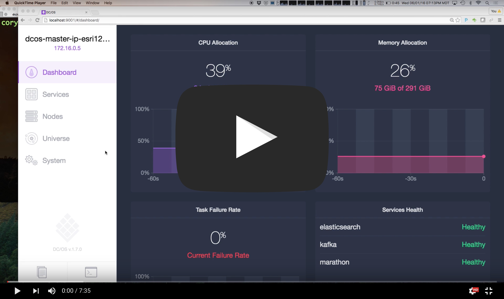
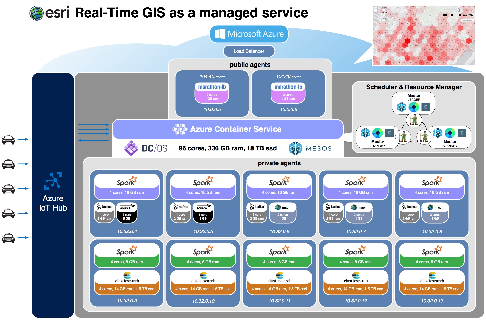
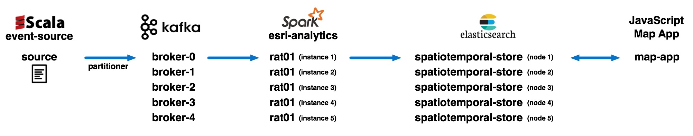

# dcos-iot-demo
This project demonstrates how to configure a full stack geo-enabled Internet of Things (IoT) solution using <a href="https://mesosphere.com/">Mesosphere's</a> open sourced <a href="https://dcos.io/">Data Center Operating System (DC/OS)</a> using <a href="https://www.docker.com/">Docker</a> containerization and <a href="http://mesos.apache.org/">Mesos</a> frameworks including <a href="https://mesosphere.github.io/marathon/">Marathon</a>, <a href="http://kafka.apache.org/">Kafka</a>, <a href="http://spark.apache.org/">Spark</a>, and <a href="http://elasticsearch.mesosframeworks.com/">Elasticsearch</a>.

## Architecture

All components of the IoT Event Flow described below (sources, brokers, spark streaming, elasticsearch & map apps) are scheduled on DC/OS as marathon apps.

## IoT Event Flow

Sources emit events to Kafka brokers.  Real-time Analytic Tasks (RATs) use Spark Streaming to consume events from Kafka brokers, perform spatiotemporal analytics and sink results to one or more sinks.  The spatiotemporal-store uses Elasticsearch to efficiently index observations by space, time, and all the other attributes of the event.  The JavaScript Web app periodically queries to reflect the latest state of observations on a map.

### Sources
Sources emit events to Kafka brokers.  When producing sources are responsible for partioning the data as evenly as possible across the available brokers.  There are two available sources to choose from.  The event-source allows you to play back a file at constant velocity over regular intervals, e.g. send 100 events every 1 second.  The spatiotemporal-event-source plays back a file based on the temporal values supplied in the file, e.g. play back each unique timestamp at an interval of 3 seconds.

### Kafka Brokers
Kafka brokers provide topics that are published to by Sources and consumed from by Real-time Analytic Tasks (Spark Streaming).

### Real-time Analytic Tasks (Spark Streaming)
Real-time Analytic Tasks (RATs) use Spark Streaming to consume events from Kafka brokers, perform spatiotemporal analytics and sink results to one or more sinks.  The real-time analytics tasks combines the <a href="https://github.com/Esri/geometry-api-java">esri/geometry-java-api</a> to perform geospatial analytics in near real-time.

### spatiotemporal-store (Elasticsearch)
The spatiotemporal-store uses Elasticsearch to efficiently index observations by space, time, and all the other attributes of the event.

### JavaScript Web App
The JavaScript Web app periodically queries to reflect the latest state of observations on a map.  The JavaScript web app queries for geohash aggregations that are visualized as rectangles on the map or raw observations visualized as symbols on the map.

## Deploying dcos-iot-demo to your own environment
1. <a href="acs-setup.md">Provision a DC/OS cluster on the cloud provider of your choice</a> 
2. <a href="kafka-setup.md">Schedule Kafka brokers to run on DC/OS</a> 

## Working locally (for verification prior to deploying on DC/OS):
It is useful to do development and verification locally prior to installing applications onto DC/OS.  This section will walk you through the process of setting up, building, and running individual apps locally prior to installing them onto DC/OS.
### To setup locally:
<pre>
(1) TODO: Setup SBT
(2) TODO: Setup Kafka
(3) TODO: Spark, go to Github, find the 1.6.1 release, download zip
    https://github.com/apache/spark/releases
    http://spark.apache.org/docs/latest/building-spark.html#building-for-scala-211
      $ ./dev/change-scala-version.sh 2.11
      $ mvn -Pyarn -Phadoop-2.4 -Dscala-2.11 -DskipTests clean package
      $ ./make-distribution.sh --name spark-1.6.1_2.11-bin-hadoop2.4 --tgz -Psparkr -Phadoop-2.4 -Phive -Phive-thriftserver -Pyarn
      
    ~$ export SPARK_HOME=~/spark-1.6.1-bin-hadoop2.6
</pre>

### To build locally:
<pre>
(1) Build event source:
    event-source$ sbt assembly
(2) Build Spark analytic tasks:
    spatiotemporal-esri-analytics$ sbt assembly
    TODO: add other analytics ...
</pre>

### To run locally:
<pre>
(1) Start Zookeeper:
    kafka_2.11-0.9.0.1$ ./bin/zookeeper-server-start.sh config/zookeeper.properties
(2) Start Kafka:
    kafka_2.11-0.9.0.1$ ./bin/kafka-server-start.sh config/server.properties
(3) Run Source:
    event-source$ java -jar target/scala-2.11/event-source-assembly-1.0.jar localhost:9092 source01 4 1000 true
    note: you can verify events are being sent by running a command line Kafka Consumer utility to listen to the topic:
    kafka_2.11-0.9.0.1$ ./bin/kafka-console-consumer.sh --zookeeper localhost:2181 --topic source01
(4) Run Spark analytic tasks:
    spatiotemporal-esri-analytics$ 
        $SPARK_HOME/bin/spark-submit --class "org.cam.geo.analytics.esri.SpatiotemporalEsriAnalyticTask"
            --master local[2] target/scala-2.10/spatiotemporal-esri-analytic-task-assembly-1.0.jar
            localhost:9092 source01 source01-consumer-id false true
        $SPARK_HOME/bin/spark-submit --class "org.cam.geo.analytics.esri.SpatiotemporalEsriAnalyticTaskWithElasticsearchSink"
            --master local[2] target/scala-2.10/spatiotemporal-esri-analytic-task-assembly-1.0.jar
            localhost:2181 source01 source01-consumer-id false true
            adammac.esri.com:9200 spatiotemporal-store
</pre>

## Working on DC/OS:
### To configure a DC/OS:
<pre>
(1) TODO: Create a DC/OS cluster on Azure or Amazon
(2) TODO: Install packages on DC/OS:
    In DC/OS dashboard, go to 'Universe' and install the Marathon, Chronos, Kafka & Spark packages.
(3) TODO: Configure the DC/OS-CLI
    ~$ dcos config set core.dcos_url <your DC/OS url>
</pre>

### To build apps in preperation for installing them on DC/OS:
<pre>
(1) Configure docker:
    spatiotemporal-event-source$ docker-machine start default
    spatiotemporal-event-source$ eval "$(docker-machine env default)"
    spatiotemporal-event-source$ docker login
(2) Build & push event-source to DockerHub:
    spatiotemporal-event-source$ docker build -t amollenkopf/spatiotemporal-event-source .
    spatiotemporal-event-source$ docker push amollenkopf/spatiotemporal-event-source
(3) Build & upload spatiotemporal-esri-analytic-task to make it publicly available:
    spatiotemporal-esri-analytics$ sbt assembly
    Upload target/scala-2.10/spatiotemporal-esri-analytic-task-assembly-1.0.jar to S3/Azure Blob storage and make publicly available.
</pre>

### to run on DC/OS:
<pre>
(1) Configure Kafka topic:
    ~$ dcos kafka broker list
    ~$ dcos kafka topic list
    ~$ dcos kafka topic create source01 --partitions=3 --replication=1
    ~$ dcos kafka topic list
    ~$ dcos kafka topic describe source01
    ~$ dcos kafka topic create taxi-pickup --partitions=1 --replication=1
(2) Add event source as a Marathon app:
    event-source$ dcos marathon app add eventsource-docker.json
    note: you can verify events are being sent by running command line Kafka Consumer utilities to listen to the topic:
      azureuser@dcos-master-3F983CB-0:~$ wget http://mirror.reverse.net/pub/apache/kafka/0.9.0.1/kafka_2.10-0.9.0.1.tgz
      azureuser@dcos-master-3F983CB-0:~$ tar -xvf kafka_2.10-0.9.0.1.tgz
      azureuser@dcos-master-3F983CB-0:~$ cd kafka_2.10-0.9.0.1
      azureuser@dcos-master-3F983CB-0:~/kafka_2.10-0.9.0.1$ ./bin/kafka-console-consumer.sh --zookeeper master.mesos:2181/kafka --topic source01
(3) Add spatiotemporal-esri-analytics as a Marathon app:
    spatiotemporal-esri-analytics$ dcos marathon app add spatiotemporal-esri-analytic-task-docker.json
    to run w/ Spark directly:
    $ dcos spark run --submit-args="-Dspark.mesos.coarse=false
          --driver-cores 1 --driver-memory 1G --executor-cores 2 --executor-memory 1G
          --class org.cam.geo.analytics.esri.SpatiotemporalEsriAnalyticTask
          http://esri.box.com/s/w4rrhuxbh4bwitozcjhekqc4utszbmkb  
          broker-0.kafka.mesos:10040,broker-1.kafka.mesos:9312,broker-2.kafka.mesos:9601
          source01 source01-consumer-id false true"
    note: copy the driver-id, you will need it to kill the Spark app later
(4) Observe stdout of both

(5) Add spatiotemporal-store Elasticsearch cluster as a Marathon app:
    dcos-iot-demo-extras$ dcos marathon app add sat-marathon.json
(5) Install marathon-lb via Universe UI.
(6) Add map service as a Marathon app:
    dcos-iot-demo-extras$ dcos marathon app add badmf-marathon.json

(5) Remove apps:
    event-source$ dcos marathon app remove source01
    event-source$ dcos spark kill driver-20160503154055-0003
</pre>
