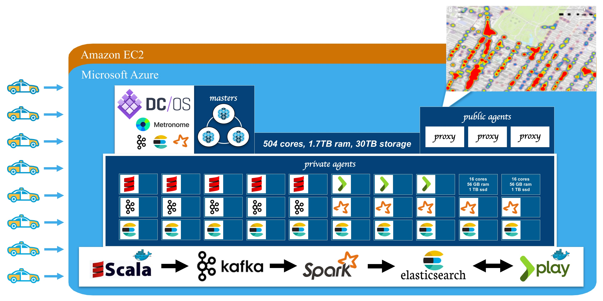

# DC/OS IoT demo

This project demonstrates how to configure a full stack geo-enabled Internet of Things (IoT) solution using <a href="https://mesosphere.com/">Mesosphere's</a> open sourced <a href="https://dcos.io/">Data Center Operating System (DC/OS)</a> using <a href="https://www.docker.com/">Docker</a> containerization and <a href="http://mesos.apache.org/">Mesos</a> frameworks including <a href="https://mesosphere.github.io/marathon/">Marathon</a>, <a href="http://kafka.apache.org/">Kafka</a>, <a href="http://spark.apache.org/">Spark</a>, and <a href="http://elasticsearch.mesosframeworks.com/">Elasticsearch</a>.   <!-- To see the DC/OS IoT demo in action click on the video link below.  -->

<table><tr><td width="50%"></td><td width="50%"></td></tr></table>

<!-- 

 -->

## To create your own DC/OS IoT demo environment:
1. <a href="docs/0-overview/README.md">Review the application & architecture overview</a>. 
2. Provision compute resources on <a href="docs/1-azure/README.md">Microsoft Azure</a>, <a href="docs/1-amazon/README.md">Amazon Web Services</a>, Amazon C2S or on-premise. 
3. <a href="docs/2-install/README.md">Install DC/OS</a> and then <a href="docs/3-explore/README.md">Explore the DC/OS & Mesos dashboards</a>. 
4. <a href="docs/4-kafka/README.md">Install Kafka & schedule brokers</a>. 
5. <a href="docs/5-elasticsearch/README.md">Install Elasticsearch & schedule a cluster</a>. 
6. <a href="docs/6-webapp/README.md">Install Map web application</a>. 

## Running the demo:
7. <a href="docs/7-stream/README.md">Schedule a Spark Streaming job</a> (taxi-stream). 
8. <a href="docs/8-source/README.md">Schedule a Kafka producer application</a> (taxi-source). 
9. <a href="docs/9-visual/README.md">Visualize IoT movement behavior</a> (map-webapp). 
10. <a href="docs/cleanup-demo.md">Applying cleanup procedures</a> between demo runs.
