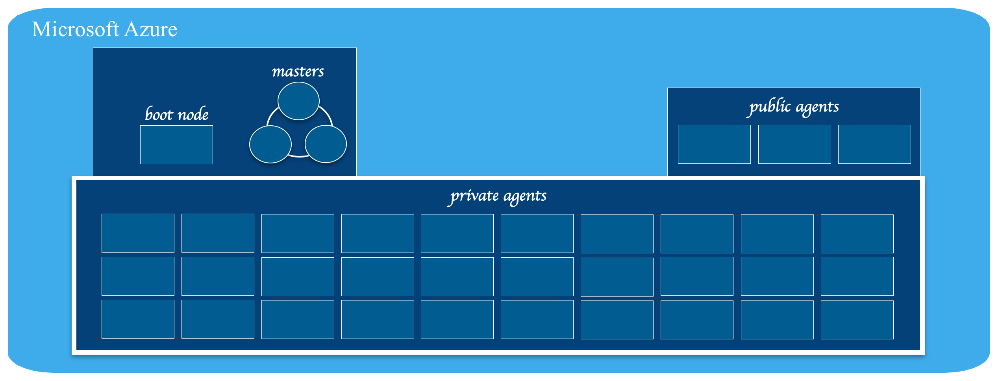
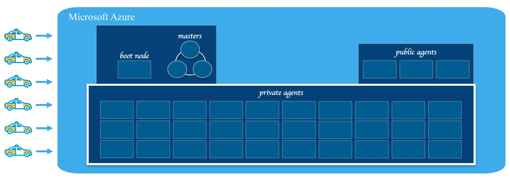

# Microsoft Azure
This section walks you through step-by-step on how to provision compute resources on Azure that will be used to form a DC/OS environment.  A DC/OS environment consists of 'master' nodes that administer the DC/OS environment and schedule work to run on agents, 'private agent' nodes that have perform work and 'public agent' nodes that are accessable via the public internet.  The # of masters, # of private & public agents will vary depending on your performance & scalability requirements.  The diagram below and used throughout this documentation illustrates DC/OS environment that has 3 master, 30 private agent & 3 public agent (3-30-3) nodes.  Microsoft Azure has the ability to provision a set compute resources using an 'Azure Template'.  This repo provides an 'Azure Template' that is used to provision master & agent compute resources. 

<small><i>Compute resources provisionmed for a 3 master, 30 private agent & 3 public agent (3-30-3) DC/OS environnment.</i></small>

 

## Pre-requisites:
<b>Pre-requisite 1:</b> 
Establish an Azure Account.  If you are new or don't have credentials you can sign-up for Azure <a href="https://azure.microsoft.com/en-us/free/">here</a> and try it out.  
<b>Pre-requisite 2:</b> 
<a href=""><a href="">Configure an Azure Template</a> that provisions your desired compute resources.  
<b>Pre-requisite 3:</b> 
<a href=""><a href="">Establish a SSH Key Pair</a> to securely communicate with compute resources. 

# Provision compute resources on Microsoft Azure
<b>Step 1:</b> Login to <a href="http://portal.azure.com">portal.azure.com</a> using your Microsoft Azure credentials.  

  <b>Step 2:</b> Click the 'New' button in the left hand menu.

  <b>Step 3:</b> Type 'Azure Container Service'

  <b>Step 4:</b> Click the 'Azure Container Service' result that has the purple icon.

 
<i>Resources for a 3 master, 30 private agent and 3 public agent (3-30-3) compute cluster.</i>  

  <b>Step 5:</b> Review the 'Azure Container Service' description and click the 'Create' button.

  <b>Step 6:</b> Create a SSH key that will enable you to access the 'Azure Container Service' once it has been created.<ul><li>for more info see the <a href="https://azure.microsoft.com/en-us/documentation/articles/virtual-machines-linux-ssh-from-linux/">Azure ssh doc</a>.</li>
<li>ssh-keygen -t rsa -b 2048 -f azureuser -C "azureuser@linuxvm"</li></ul>

  <b>Step 7:</b> Fill in the 'Basic' information needed to create the 'Azure Container Service' including:<ul>
<li>SSH user name & public key, more ~/.ssh/azureuser.pub and very carefully cut (without any extra whitespace) and paste the public key contents.</li>
<li>select the Azure subscription you wish to associate this Azure Container Service with.</li>
<li>create a new 'Resource Group' and enter a new unique name, e.g. esri40.</li>
<li>select the 'Location'/region you wish this Azure Container Service to run in.</li></ul>

  <b>Step 8:</b> In the 'Framework configuration' section choose 'DC/OS' as the Orchestrator configuration and click the 'OK' button.

  <b>Step 9:</b> Fill in the 'Azure Container service settings' information needed to create the 'Azure Container Service' including:<ul>
<li>Set the 'Agent count' to the number of private agents you desire for your cluster.  For the purposes of this demo app we will create 10 private agents.</li>

  <li>Click on 'Agent virtual machine size' to choose the VM size you would like your private agents to be.</li>

  <li>Click the 'View all' link to browse through all available VM sizes.</li>
<li>Select the VM size you desire and click the 'Select' button.  For the purposes of this demo app we will choose 'D4_V2 Standard' (8 cores, 28GB memory, 400GB local SSD storage)</li>

  <li>Set the 'Master count' to the amount you desire.  For the purpose of the demo you can choose '1' or '3', either will work.</li>
<li>Specify a new unique value for the 'DNS prefix for container service' field and hit the 'OK' button.</li></ul>

  <b>Step 10:</b> Review the 'Summary' section, make sure that the 'Validation passed', and hit the 'OK' button.

  <b>Step 11:</b> Carefully review the 'Buy' section and if you are ok with the pricing & terms of use hit the 'Purchase' button.

  <b>Step 12:</b> Wait patiently for between 10-15 minutes for your 'Azure Container Service' to be provisioned.

  <b>Step 13:</b> You will know your 'Azure Container Service' has been succefully created when you see the 'Resource group' appear.

  <b>Step 14:</b> Scroll down in the 'Resource group' to find the entry marked 'Public IP address' for the DC/OS master(s) and click it.

  <b>Step 15:</b> Wait a few seconds for it to appear, then hover the 'DNS name' and click the copy to clipboard icon.

  <b>Congratulations:</b> You now have an 'Azure Container Service' in place on Microsoft Azure that is configured to orchestrate using DC/OS.
