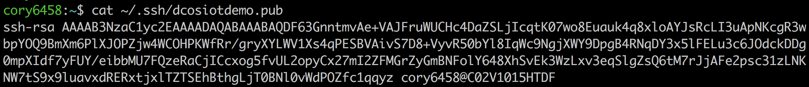
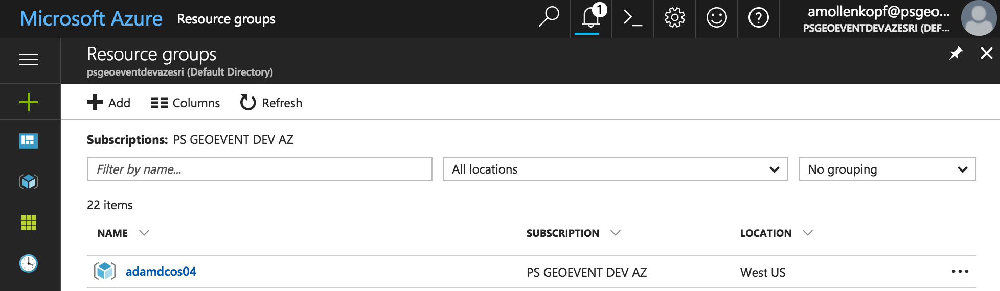
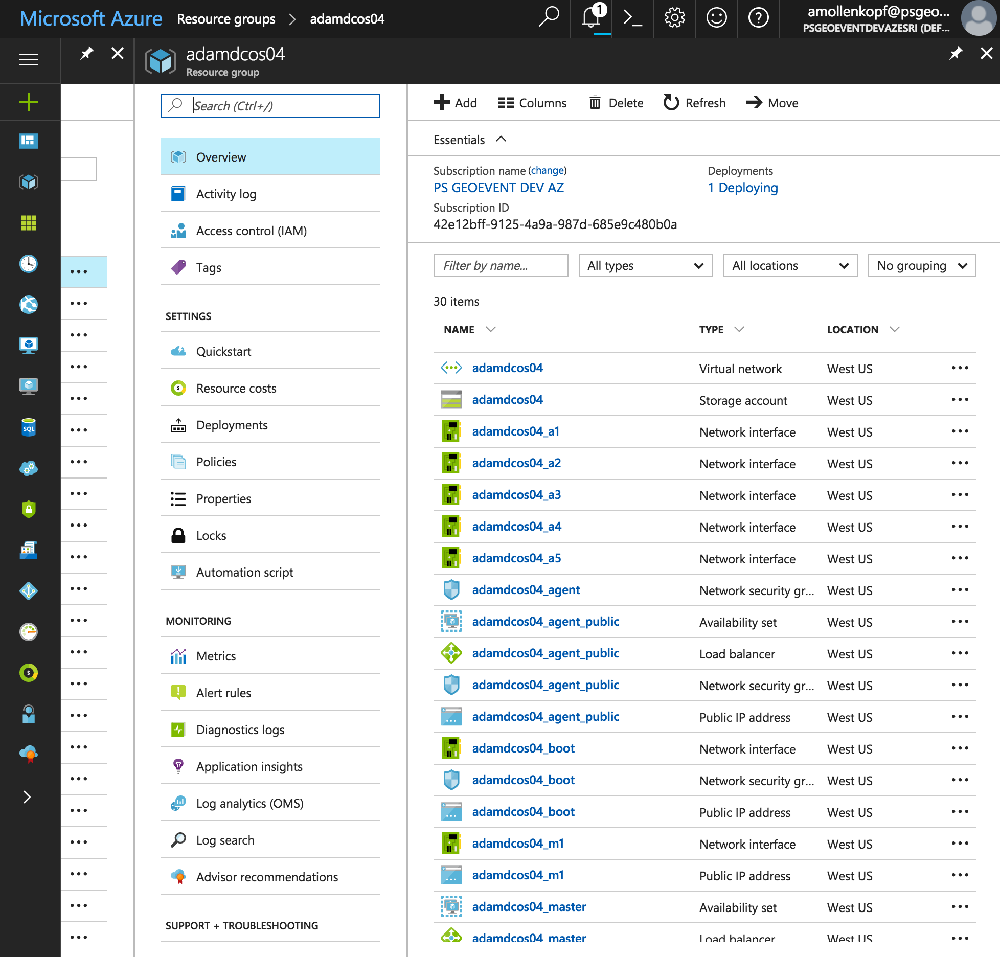
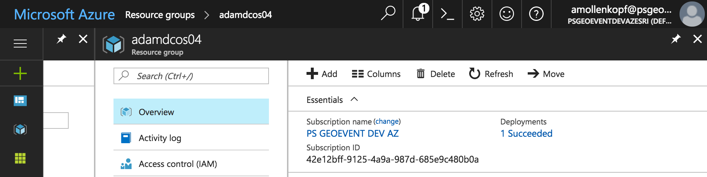
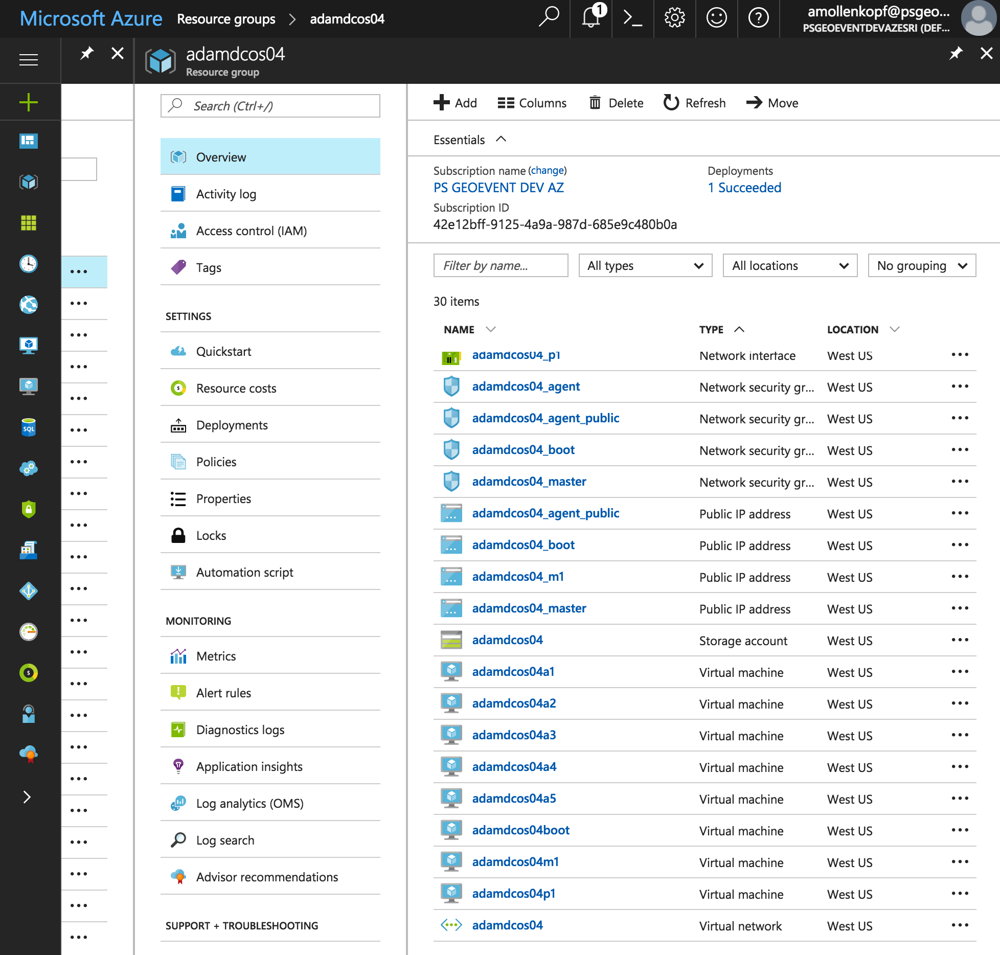
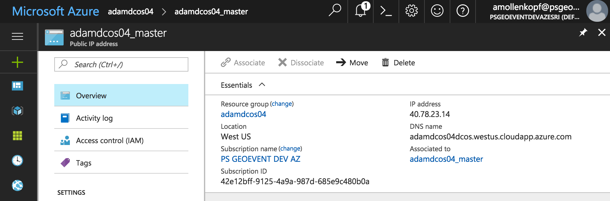

# Microsoft Azure
This section walks you through step-by-step on how to provision compute resources on Azure that will be used to form a DC/OS environment.  A DC/OS environment consists of 'master' nodes that administer the DC/OS environment and schedule work to run on agents, 'private agent' nodes that have perform work and 'public agent' nodes that are accessable via the public internet.  The # of masters, # of private & public agents will vary depending on your performance & scalability requirements.  The diagram below and used throughout this documentation illustrates DC/OS environment that has 3 master, 30 private agent & 3 public agent (3-30-3) nodes.  Microsoft Azure has the ability to provision a set compute resources using an 'Azure Template'.  This repo provides an 'Azure Template' that is used to provision master & agent compute resources. 

<i>Compute resources provisioned for a 3 master, 30 private agent & 3 public agent DC/OS environnment:</i>

## Pre-requisites:
<b>Pre-requisite 1:</b> Establish an Azure Account. If you are new or don't have credentials you can sign-up for Azure <a href="https://azure.microsoft.com/en-us/free/">here</a> and try it out.
  <b>Pre-requisite 2:</b> [Establish a SSH Key Pair](ssh/README.md) to securely communicate with compute resources.
  

## Provision compute resources on Microsoft Azure
<b>Step 1:</b> The easiest way to provision compute resources on Microsoft Azure is to make use of an 'Azure Template'.
Opening the [DC/OS Azure Template](https://portal.azure.com/#create/Microsoft.Template/uri/https%3A%2F%2Fraw.githubusercontent.com%2Famollenkopf%2Fdcos-iot-demo%2Fmaster%2Fdocs%2F1-azure%2Ftemplate%2Fdcos.json) will prompt you to login to your Azure Portal using your credentials.  <i>note: In case you are interested, the configuration of the Azure Template can be found</i> [here](https://raw.githubusercontent.com/amollenkopf/dcos-iot-demo/master/docs/1-azure/template/dcos.json).

 <b>Step 2:</b> With the 'dcos' Azure template open, click the 'Deploy' button and fill in the parameters as follows: 

- Subscription: Choose the Azure subscription you want to use for your compute resources, <i>PS GEOEVENT DEV AZ</i>.
- Resource Group: Choose 'Create new' and give your resource group a name, <i>e.g. adamdcos4</i>.
- Location: choose the Azure region you wish to deploy your compute resources to, <i>e.g. West US</i>.
- Username & Public Key: to get the username & public key view the contents of your SSH Key Pair public file:
&nbsp;&nbsp;&nbsp;&nbsp;
- Username: the username can be found towards the end of the public key file in front of the @ character, <i>e.g. cory6458</i>.
- Public Key: copy and past the contents of the .pub file paying close attention not to include any leading or trailing whitespace.
- Num Masters: the number of Mesos master compute resources you wish to provision, <i>e.g. 1</i>.
- Master Size: the [Linux Virtual Machine size](https://docs.microsoft.com/en-us/azure/virtual-machines/linux/sizes) you wish to provision for master nodes, <i>e.g. Standard_DS3_V2 (4 vCPU, 14 GiB memory)</i>.
- Num Agents: the number of Mesos private agent compute resources you wish to provision, <i>e.g. 5</i>.
- Agent Size: the [Linux Virtual Machine size](https://docs.microsoft.com/en-us/azure/virtual-machines/linux/sizes) you wish to provision for private agent nodes, <i>e.g. Standard_DS4_V2 (8 vCPU, 28 GiB memory)</i>.
- Agent Disk Size GB: the additional disk to add to each agent in GB (10 to 1023), <i>e.g. 1023</i>.
- Num Public Agents: the number of Mesos public agent compute resources you wish to provision, <i>e.g. 1</i>.
- Public Agent Size: the [Linux Virtual Machine size](https://docs.microsoft.com/en-us/azure/virtual-machines/linux/sizes) you wish to provision for public agent nodes, <i>e.g. Standard_DS3_V2 (4 vCPU, 14 GiB memory)</i>.
- Scroll Down and review the 'Terms and Conditions' and if you agree check the 'I agree' checkbox.

 <b>Step 3:</b> Click the 'Purchase' button to start provisioning your compute resources on Azure.  You will be returned back to main portal dashboard screen where you can see in the notification area one deployment occurring. 

  <b>Step 4:</b> Click on the 'Resource Groups' icon on the left hand menu (second item down) and click on the name of the resource group you are deploying. 

  <b>Step 5:</b> Your 'Resource Group' will likely still be in a status of 'Deploying' for around 3-4 minutes. 

  <b>Step 6:</b> Wait until another notification appears saying 'Deployment succeeded' and then hit the 'Refresh' button. 

  <b>Step 7:</b> Click on the 'Type' column to sort by type of resource. We can see each of the virtual machines created, e.g. <i>m1 = master1, a1/a2/a3 = agent1/2/3, p1 = public agent 1</i> 

  <b>Step 8:</b> Click on the 'Public IP address' of the boot node to get information on how to connect to it. Take note of the 'IP address', <i>e.g. 40.78.18.217</i>. 

  <b>Congratulations:</b> You now have compute resources in place on Microsoft Azure that can be used to [Install DC/OS](../2-install/README.md).
