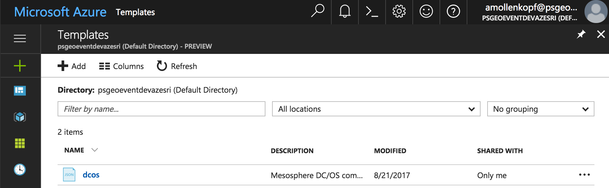
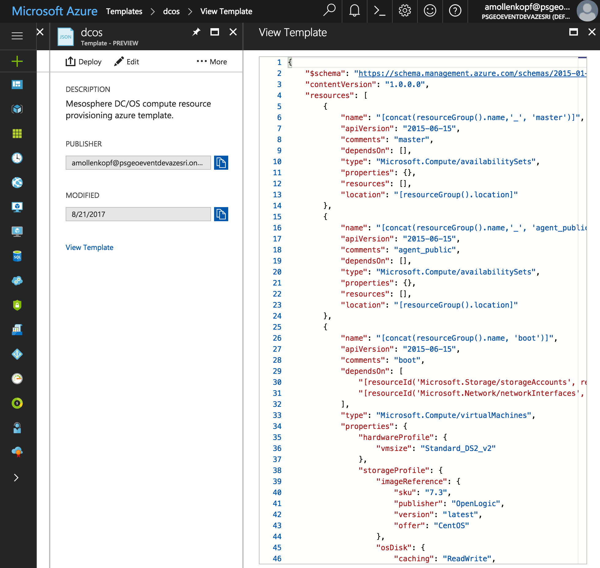
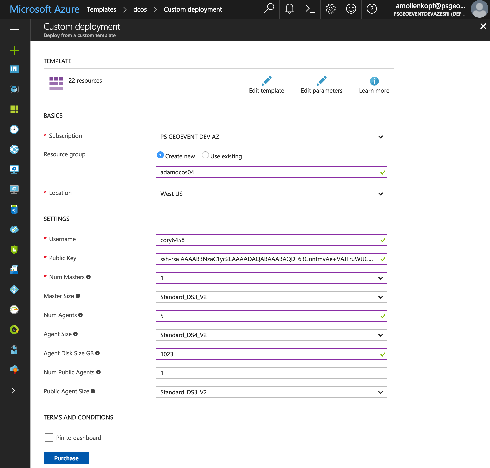

# Microsoft Azure
This section walks you through step-by-step on how to provision compute resources on Azure that will be used to form a DC/OS environment.  A DC/OS environment consists of 'master' nodes that administer the DC/OS environment and schedule work to run on agents, 'private agent' nodes that have perform work and 'public agent' nodes that are accessable via the public internet.  The # of masters, # of private & public agents will vary depending on your performance & scalability requirements.  The diagram below and used throughout this documentation illustrates DC/OS environment that has 3 master, 30 private agent & 3 public agent (3-30-3) nodes.  Microsoft Azure has the ability to provision a set compute resources using an 'Azure Template'.  This repo provides an 'Azure Template' that is used to provision master & agent compute resources. 

<i>Compute resources provisioned for a 3 master, 30 private agent & 3 public agent (3-30-3) DC/OS environnment:</i>

## Pre-requisites:
<b>Pre-requisite 1:</b> Establish an Azure Account. If you are new or don't have credentials you can sign-up for Azure <a href="https://azure.microsoft.com/en-us/free/">here</a> and try it out.
  <b>Pre-requisite 2:</b> [Configure an Azure Template](template/README.md) with your desired compute resources.
  <b>Pre-requisite 3:</b> [Establish a SSH Key Pair](ssh/README.md) to securely communicate with compute resources.
  

## Provision compute resources on Microsoft Azure
<b>Step 1:</b> Log into your [Azure](http://portal.azure.com) account using your credentials. 

  <b>Step 2:</b> Click the 'More services >' menu option on the left hand side at the very bottom to expand additional services and type 'templates' into the search box. 

  <b>Step 3:</b> Click on the 'Templates' result to open up your account's Azure Templates.

  <b>Step 4:</b> Click on the 'dcos' Azure template to open it. <i>note: If you do not see a 'dcos' template please see [Pre-requisite 2: Configure an Azure Template](template/README.md).</i> 

  <b>Step 5:</b> With the 'dcos' Azure template open, click the 'Deploy' button and fill in the parameters as follows: 

- Subscription: 
- Resource Group: Choose 'Create new' and give your resource group a name, <i>e.g. adamdcos4</i>.
- Location: choose the Azure region you wish to deploy your compute resources to, <i>e.g. West US</i>.

  <b>Congratulations:</b> You now have an 'Azure Container Service' in place on Microsoft Azure that is configured to orchestrate using DC/OS.
