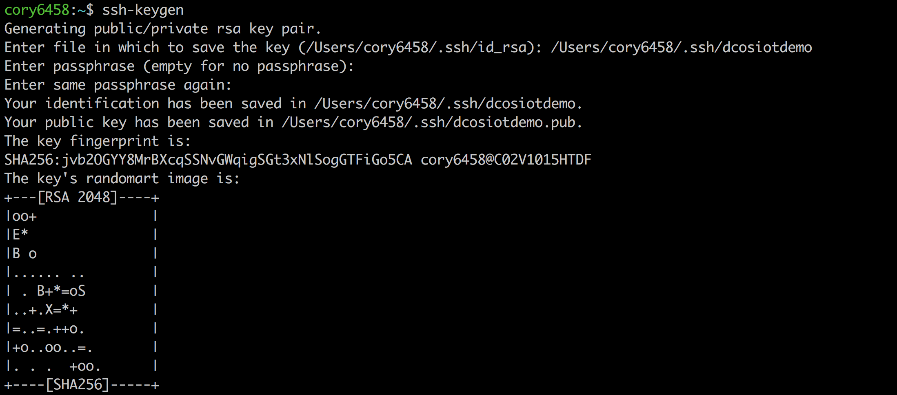

# Establish a SSH Key Pair
To securely with compute resources on Microsoft Azure it is necessary to establish a SSH Key Pair.

## Create an SSH Key Pair
The following steps are an abbreviated form of [Azure's detailed instructions on creating an SSH Key Pair](https://docs.microsoft.com/en-us/azure/virtual-machines/linux/create-ssh-keys-detailed).  These steps can be performed from command line on Linux, Mac, or Windows (via [MobaXterm](http://mobaxterm.mobatek.net/)).

<b>Step 1:</b> Run 'ssh-keygen': 
<pre>
$ ssh-keygen
</pre>
- Change the path to the path & filename you want your key to be stored in, <i>e.g. /Users/cory6458/.ssh/dcosiotdemo</i>
- Leave passphrase blank by hitting the return key.

 <b>Step 2:</b> Review the resulting SSH Key Pair files.  The .pub file is the public key and the file without an extension is the private key file. 

 <b>Congratulations:</b> You now have an SSH Key Pair in place that can be used securely communicate to compute resources on Azure.

