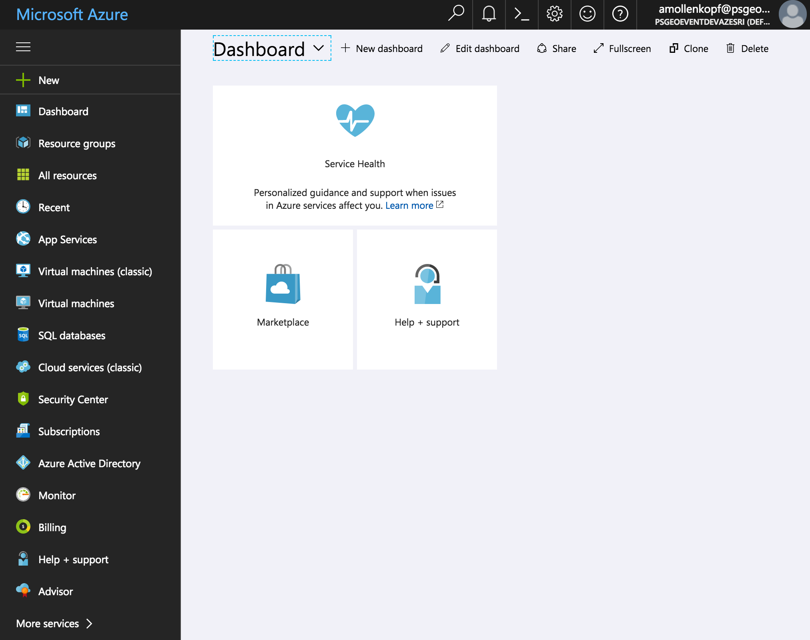
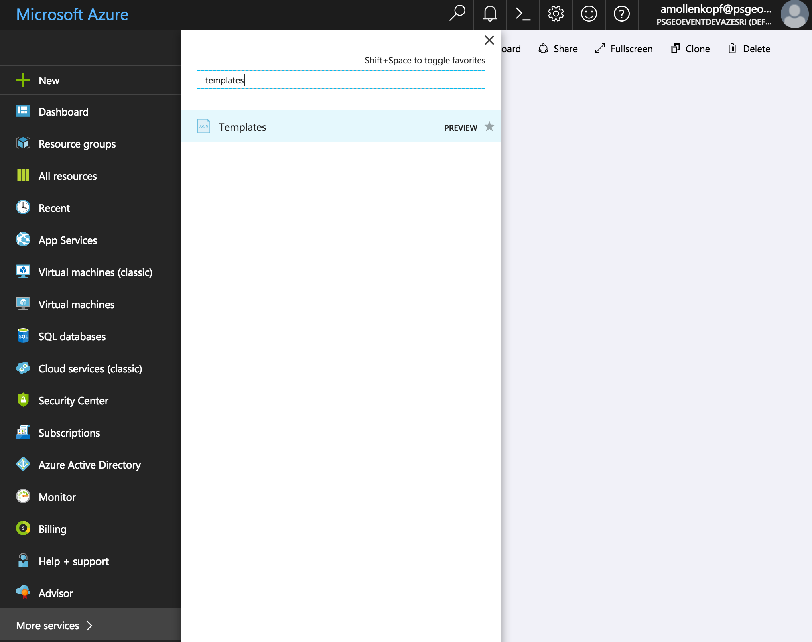
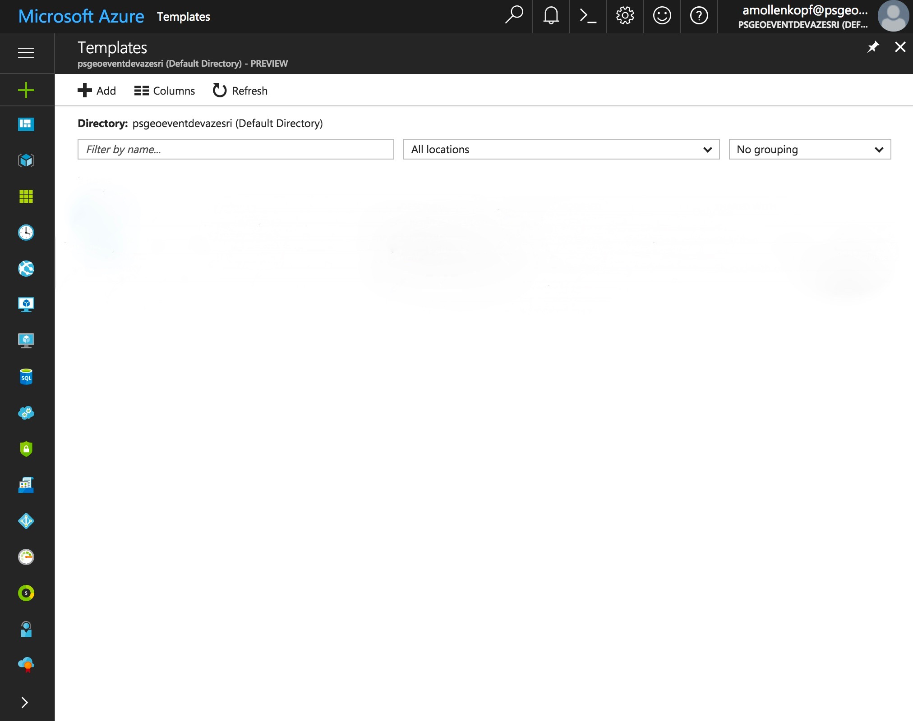
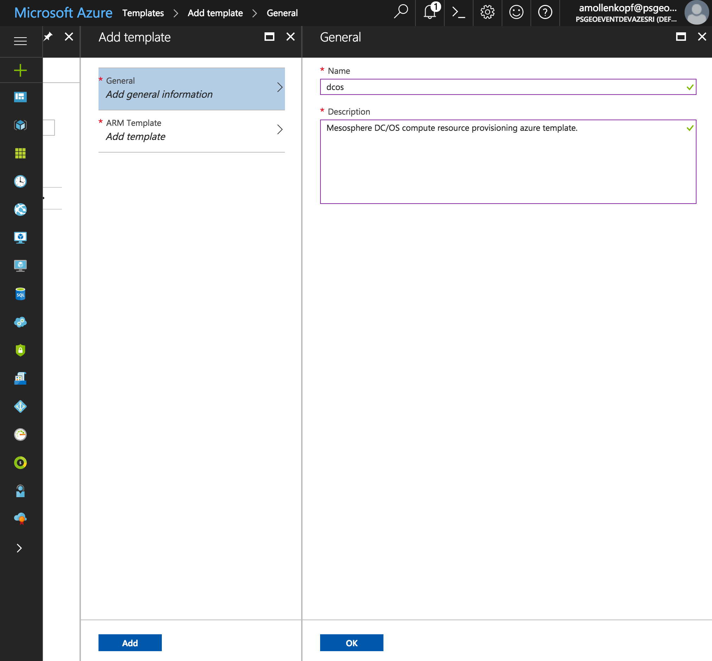
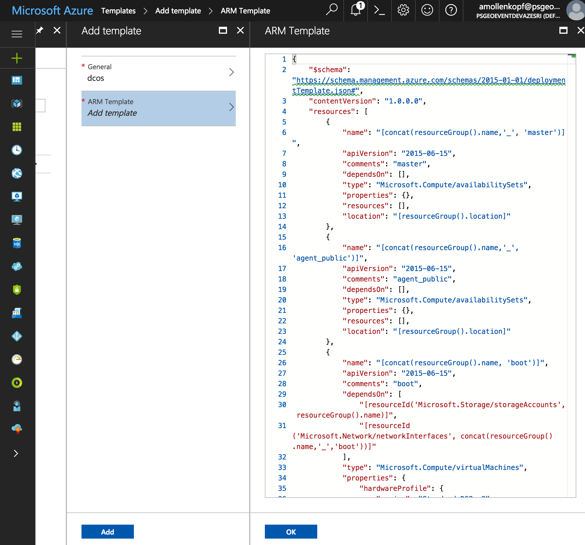
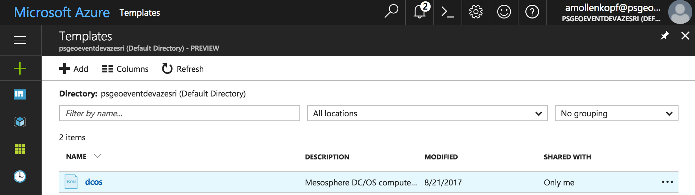

# Configure an Azure Template

The Azure Templates for this application were created by hand using Mesosphere's [DC/OS on Azure Template](https://downloads.dcos.io/dcos/stable/azure.html) as the foundation with customizations that were made using [Azure docs](https://azure.microsoft.com/en-us/resources/templates/) as a guideline. 

## Azure Templates
- [dcos.json](dcos.json): used to provision compute resources needed to support a Mesosphere DC/OS installation.
- [add_agents.json](add_agents.json): used post installation to add additional private agents to an existing DC/OS environment.
- [add_publicagents.json](add_publicagents.json): used post installation to add additional public agents to an existing DC/OS environment.

## Importing to Azure
<b>Step 1:</b>Log into your [Azure](http://portal.azure.com) account using your credentials.  Once logged in your will see the main Azure dashboard page. 

  <b>Step 2:</b> Click the 'More services >' menu option on the left hand side at the very bottom to expand additional services and type 'templates' into the search box. 

  <b>Step 3:</b>Click on the 'Templates' result to open up your account's Azure Templates.  Click the 'Add' button at the top to configure a new template. 

  <b>Step 4:</b> Name the Azure Template 'dcos', fill in a description of 'Mesosphere DC/OS compute resource provisioning azure template.' and click the 'OK' button at the bottom. 

  <b>Step 5:</b> Cut and paste the contents of [dcos.json](dcos.json) in raw form as the content for the 'ARM Template' (replacing the default json that is provided).  You can browse this JSON and adjust the image sizes to those that you would like to utilize for masters and agents if desired.  Once you are happy with the configuration click 'OK' and then click 'Add' to add the Azure Template to your account.

  <b>Step 6:</b> Click the 'Refresh' button at the top to verify the configured Azure Template is in place.
 

