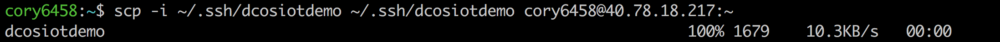
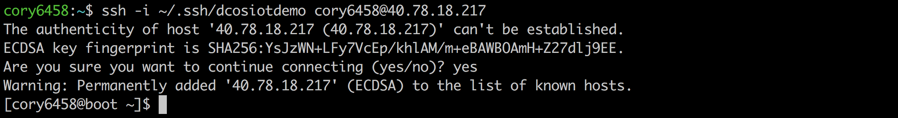
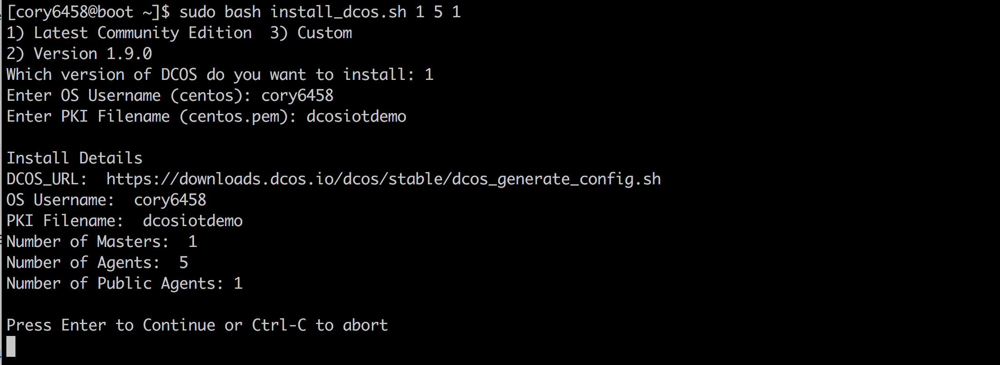
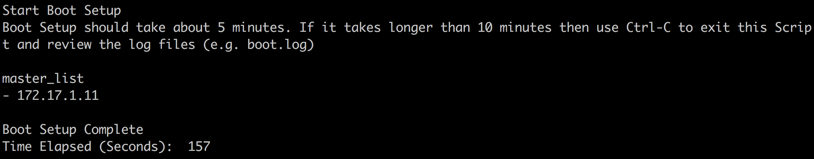
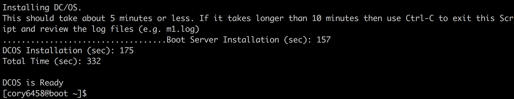

# Install DC/OS
This section walks you through step-by-step on how to install a DC/OS environment.  A DC/OS environment consists of 'master' nodes that administer the DC/OS environment and schedule work to run on agents, 'private agent' nodes that have perform work and 'public agent' nodes that are accessable via the public internet.  The # of masters, # of private & public agents will vary depending on your performance & scalability requirements.  The diagram below and used throughout this documentation illustrates DC/OS environment that has 3 master, 30 private agent & 3 public agent (3-30-3) nodes. 

<i>Compute resources provisioned for a 3 master, 30 private agent & 3 public agent DC/OS environnment:</i>

## Prepare for installation
<b>Step 1:</b> Copy your private key to the boot node. 
<pre>
$ scp -i {private-key} {private-key} {username}@{boot server ip}:~

Example:
$ scp -i ~/.ssh/dcosiotdemo ~/.ssh/dcosiotdemo cory6458@40.78.18.217:~
</pre>

  <b>Step 2:</b> Copy DC/OS install script to the boot node. 
<pre>
$ scp -i {private-key} {your-local-path}/dcos-iot-demo/install/install_dcos.sh {username}@{boot server ip}:~

Example:
$ scp -i \~/.ssh/dcosiotdemo \~/iot/dcos-iot-demo/install/install_dcos.sh cory6458@40.78.18.217:\~
</pre>

  <b>Step 3:</b> Establish a secure connection to the boot node using ssh. 
<pre>
$ ssh -i {private-key} {username}@{boot server ip}

Example:
$ ssh -i ~/.ssh/dcosiotdemo cory6458@40.78.18.217
</pre>

  <b>Windows Users Only:</b> <a href="windows.md">see further instructions</a>. 
 

## Run installer
<b>Step 4:</b> From the ssh terminal run the DC/OS installer: 
<pre>
$ sudo bash install_dcos.sh {number-of-masters} {number-of-private-agents} {number-of-public-agents}

Example (for 1 master, 5 private agents, and 1 public agent):
$ sudo bash install_dcos.sh 1 5 1
</pre>
 
- Which version of DC/OS do you want to install: specify the version you want, using the number 
&nbsp;&nbsp;&nbsp;&nbsp;<i>e.g. 1 for Latest Community Edition)</i> 
&nbsp;&nbsp;&nbsp;&nbsp;<i>e.g. 3 allows you to enter the URL from [Mesosphere Releases](https://dcos.io/releases/)</i> 
&nbsp;&nbsp;&nbsp;&nbsp;&nbsp;&nbsp;&nbsp;&nbsp;<i>e.g. for [1.8.6](https://dcos.io/releases/1.8.6/) use https://downloads.dcos.io/dcos/stable/commit/cfccfbf84bbba30e695ae4887b65db44ff216b1d/dcos_generate_config.sh</i> 
&nbsp;&nbsp;&nbsp;&nbsp;&nbsp;&nbsp;&nbsp;&nbsp;<i>e.g. for [1.8.7](https://dcos.io/releases/1.8.7/) use https://downloads.dcos.io/dcos/stable/commit/1b43ff7a0b9124db9439299b789f2e2dc3cc086c/dcos_generate_config.sh</i> 
- Enter OS Username (centos): specify your username, <i>e.g. cory6458</i>
- Enter PKI Filename (centos.pem): specify your key filename, <i>e.g. dcosiotdemo</i>

  <b>Step 5:</b> Press 'Enter' to continue the installation.  The first step of installation is for the boot node to provision itself with the installers that will be eventually executed on the master & agent nodes.  You will see a listing of the master private IPs and then a message stating the 'Boot Setup Complete'.  The duration of this step is typically 2-5 minutes and should not take longer than 10 minutes. 

  <b>Step 6:</b> Once the boot setup is complete DC/OS powered by Apache Mesos is installed on all master, private agent & public agent nodes.  DC/OS installation typically takes 5 minutes or less and should not take longer than 10 minutes.  The last output line from the installer should read 'DC/OS is Ready'. 

 

## Access DC/OS

  <b>Congratulations:</b> You have successfully installed DC/OS.  Next we will <a href="../3-explore/README.md">Explore the DC/OS & Mesos dashboards</a>.
