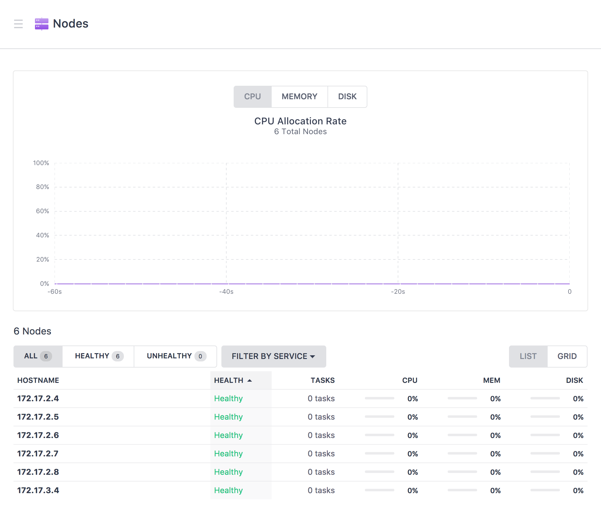
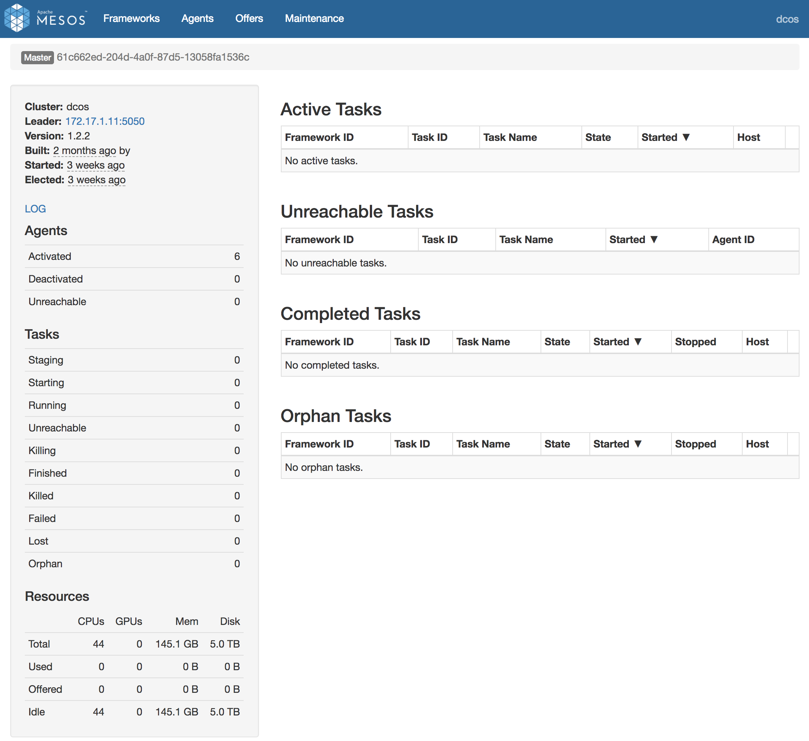
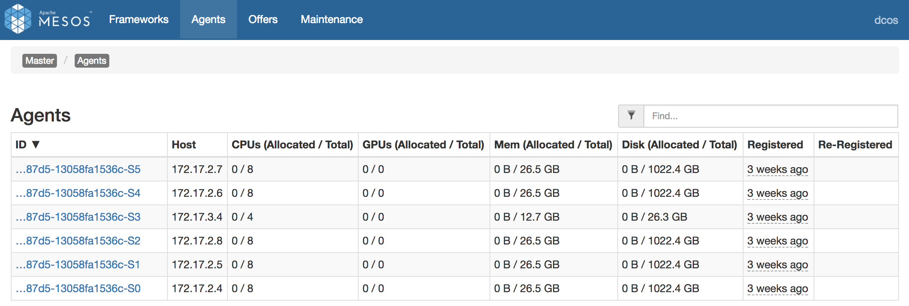

# Explore the DC/OS & Mesos dashboards
This section walks you through step-by-step on how to exlore the dashboards of a DC/OS environment. 

The DC/OS and Mesos dashboards allows you to visualize what has been allocated on the cluster, enables you to manage <a href="https://github.com/mesosphere/universe/tree/version-3.x/repo/packages">packages (Mesos frameworks)</a> that you enable the cluster can use, and to schedule tasks to run on the cluster.  This section provides a brief walk through of the DC/OS & Mesos dashboards and describes what information can be seen and what actions can be performed.  

## Explore the DC/OS administrative dashboard
 <b>Step 1:</b> Connect to the DC/OS administrative dashboard by opening a web browser to the 'DNS name' or 'IP address' of your master agent node, e.g. https://adamdcos04dcos.westus.cloudapp.azure.com or https://40.78.23.14.  The first time you connect you will get a 'Not Secure' warning page, to proceed beyond this expand the 'Advanced' section and click on the 'Process to ...' link.  Once connected to your DC/OS dashboard you will see a high level dashboard of your cluster including information about CPU Allocation, Memory Allocation, Task Failure Rate, and Services Health. 
<ul>
<li>CPU Allocation: showing 0 of 44 shares.  e.g. In this environment we have five 8 core private agents and one 2 core public agent. Master resources are not considered as part of the allocation.</li><ul>
<li>Five of these nodes we specified as private agents.  Private agent nodes are the nodes that typically perform the majority of task work that gets scheduled on the cluster.</li>
<li>One node is a public agent.  Public agent nodes are the the nodes that expose public IPs/ports out publicly and typically are only used for running load balancers such as marathon-lb that balance work to private agents.  While the number of public agents is not an option to specify when creating the cluster it is based on the number of masters you selected.  We specified a 1 master setup which resulted in 1 public agent node.  In fact, had we specified 3, 5, 7, or 9 masters we would still get 3 public agent nodes.  The assumption of DC/OS is that if you want a highly available configuration for masters you also want a highly available configuration of public agents.</li></ul>
<li>Memory Allocation: showing 0 B of 145 GiB.  e.g. In this environmment we have five 28GiB private agents abd one 14GiB public agent.  DC/OS reserves a portion of each agent node's memory for it's own usage which is why we show a slight discrepency.  Master resources are not considered as part of the allocation.</li>
<li>Task Failure Rate: shows the rate of tasks (work that is scheduled on the DC/OS cluster) that have failed over time.  With distributed systems failure is a given and DC/OS has measures in place to keep tasks resilient upon failure.  This dashboard widget provides you visibility into failures that have happened over time.</li>
<li>Services Health: Shows the health of services that are running on the cluster.</li></ul>

 <b>Step 2:</b> On the DC/OS dashboard click the 'Nodes' tab to see the nodes that are participating in the cluster.
 

  <b>Step 3:</b> Scroll down to see the full listing of nodes participating in the cluster.<ul>
<li>Public agent node hostnames start with 10.0.0.*.</li>
<li>Private agent node hostnames start with 10.32.0.*.</li></ul>
 

## Explore the Mesos dashboards
  <b>Step 4:</b> The foundation of DC/OS is Apache Mesos.  The Mesos dashboard provides very detailed information about active and completed tasks.  To access the Mesos dashboard use the same URL you used to access the DC/OS dashboard and append '/mesos' at the end, e.g. <a href="http://localhost:9001/mesos">https://localhost:9001/mesos</a>.
 

  <b>Step 5:</b> Scrolling down on the Mesos dashboard on the bottom left we can see another view of the resources avaiable in the cluster.  Once we start deploying tasks we will see the shares of CPUs/mem/disk we have allocated in the 'Used' row.
 

  <b>Step 6:</b> In the Mesos dashboard click on the 'Slaves' menu.  Slaves are the same as DC/OS agents and were renamed at the Mesos 1.0 release.  DC/OS 1.8 is based on Mesos 1.0 so consistent Agent naming will be present at that release.
 

 <b>Step 7:</b> In the DC/OS dashboard click on the 'Services' tab.  Initially marathon is the only service on the cluster and is in an Idle state until we submit our first application to marathon.  Marathon is like a distributed init.d for the cluster where we submit apps to it to run and it will make sure they are running and resilient.  We will explore marathon in greater detail later.
 

  <b>Congratulations:</b> You have have successfully explored the DC/OS and Mesos dashboards.  Next we will [Install Kafka & schedule brokers](../4-kafka/README.md).
