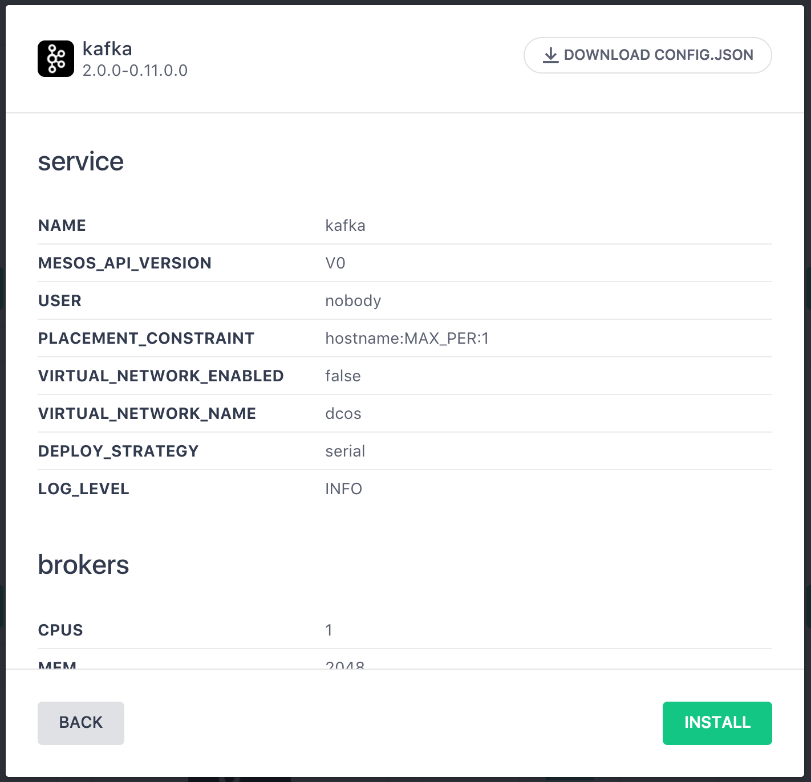
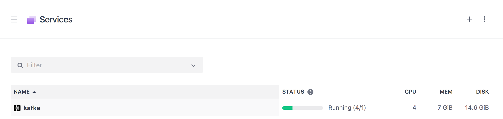
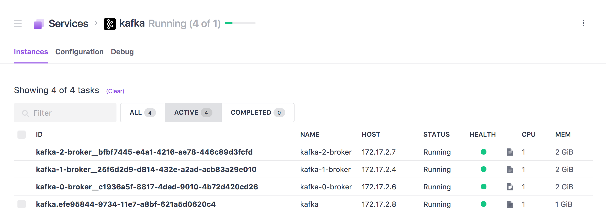
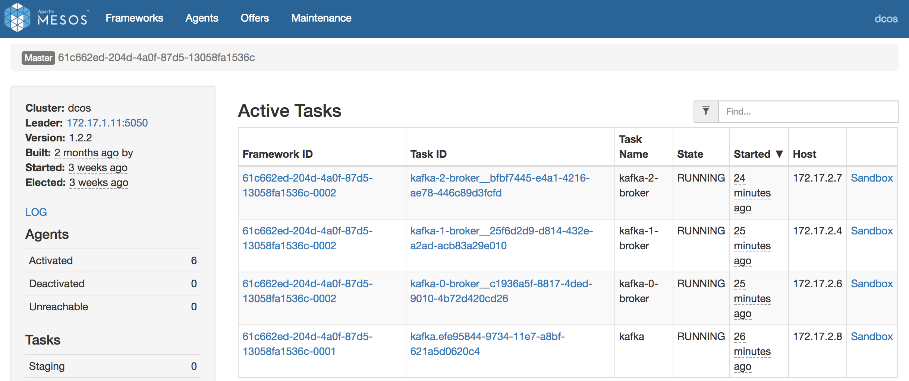

# Install Kafka & schedule brokers

<b>Step 1:</b> In the DC/OS dashboard navigate to 'Universe - Packages'.  The 'Universe' is where you can manage what packages (aka mesos frameworks) your cluster can make use of. 

 <b>Step 2:</b> Scroll down in the 'Universe' package listings to find the 'kafka' package and click it's corresponding 'INSTALL PACKAGE' button. 

 <b>Step 3:</b> Click the 'Advanced Installation' button to start the package installation process with the ability to override the default configuration.  The first section to review is the kafka 'service' configuration. Leave the defaults on this section. 

 <b>Step 4:</b> Click the 'brokers' to fine tune the broker installation parameters. 

 <b>Step 5:</b> Scroll down through the 'brokers' installation parameters.  Find the 'count' parameter and change the value to the number of brokers you desire, for the purpose of the demo we will keep the default of '3'. 

 <b>Step 6:</b> Click 'kafka' and check the option to 'DELETE.TOPIC.ENABLE' so that we can clean up our data between demonstration runs. 

 <b>Step 7:</b> Click the 'REVIEW AND INSTALL' button and review the parameters values. 

 <b>Step 8:</b> Click the 'Install' button to install the Kafka package. 

 <b>Step 9:</b> In the DC/OS dashboard navigate to 'Services - Services'.  The 'Services' tab is where you can monitor what services have been scheduled and are running on the DC/OS cluster.  Notice there is a Service named 'kafka' that now appears. 

 <b>Step 10:</b> Click on 'kafka' in the service listing to open up more information on the 'kafka' service.  Here we can see the three brokers, their names, their status, and the resources that have been allocated to them. 

 <b>Step 11:</b> Taking a quick glimpse at the Mesos dashboard we can see the 'Active Tasks' that are running to support our Kafka brokers.  <i>Note: you can launch into the log files, etc... of any of the brokers from this dashboard.</i> 

  <b>Congratulations:</b> You now have Kafka installed with three brokers ready to receive data on the DC/OS cluster.  Next, we will walk through how to [Install Elasticsearch & schedule a cluster](../5-elasticsearch/README.md).
