# Install Elasticsearch & schedule a Cluster

<b>Step 1:</b> In the DC/OS dashboard navigate to 'Universe - Packages'. 
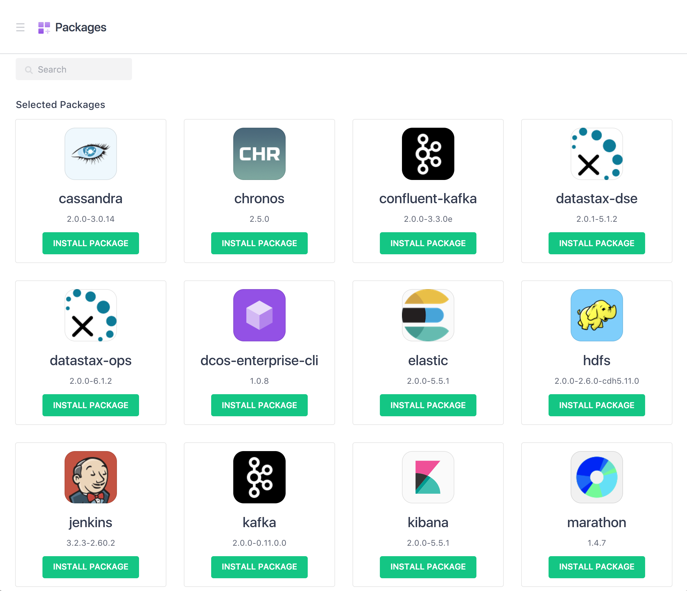

 <b>Step 2:</b> Scroll down in the 'Universe' package listings to find the 'elastic' package and click it's corresponding 'INSTALL PACKAGE' button. 
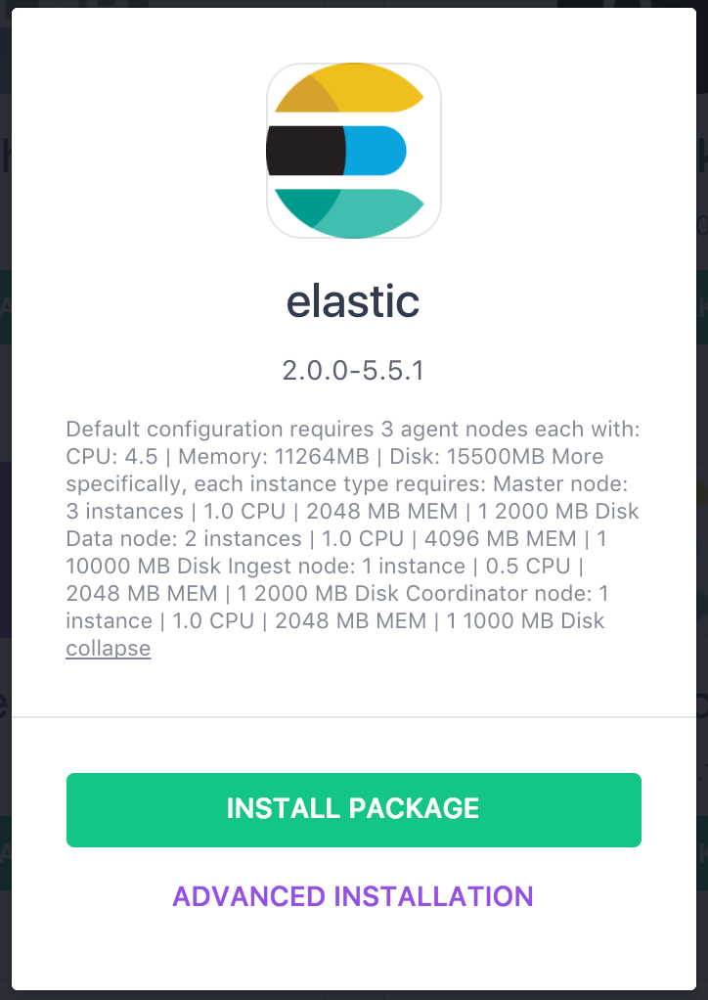

 <b>Step 3:</b> Click the 'Advanced Installation' button to start the package installation process with the ability to override the default configuration.  The first section to review is the elasticsearch 'service' configuration. Leave the defaults on this section. 
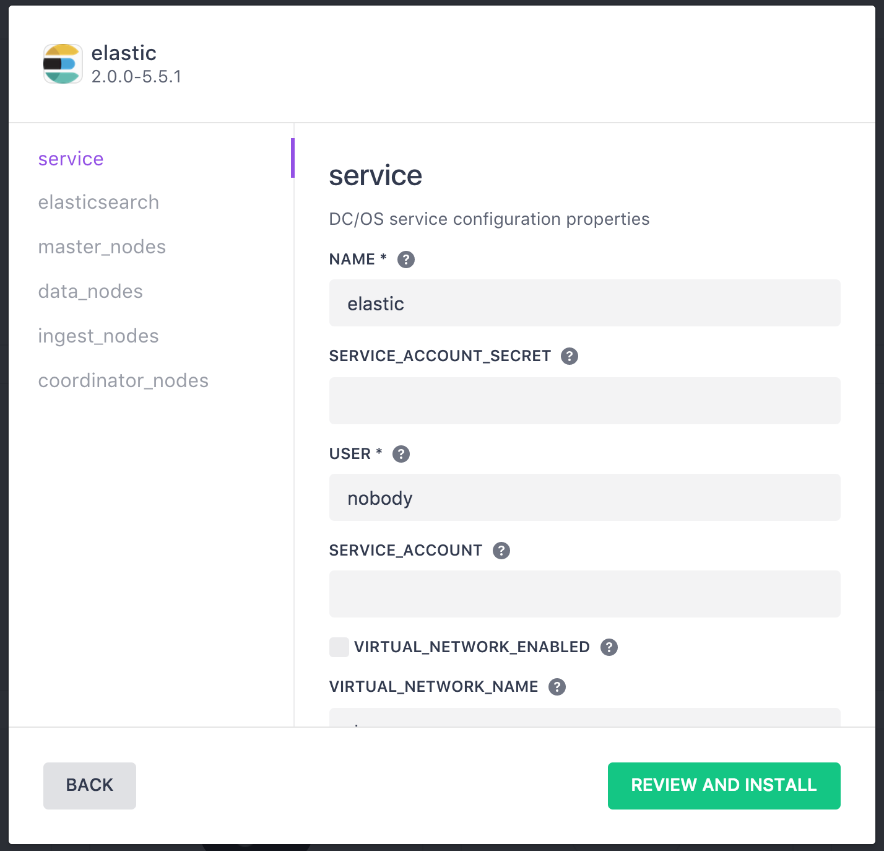

 <b>Step 4:</b> Click 'elasticsearch' to review the parameters and leave all the defaults. 
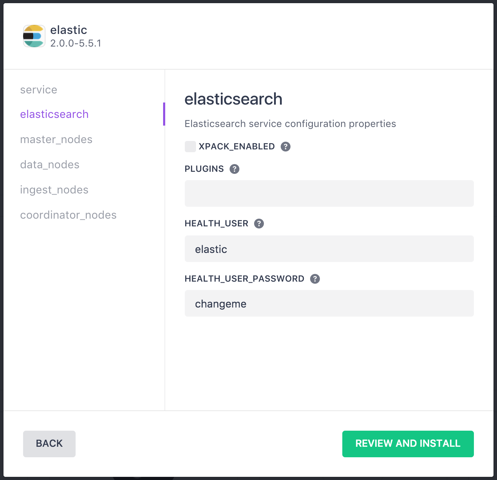

 <b>Step 5:</b> Click 'master_nodes' and adjust the 'CPUS', 'MEM', 'HEAP SIZE', 'DISK' and 'DISK_TYPE' parameters to your desired settings. 
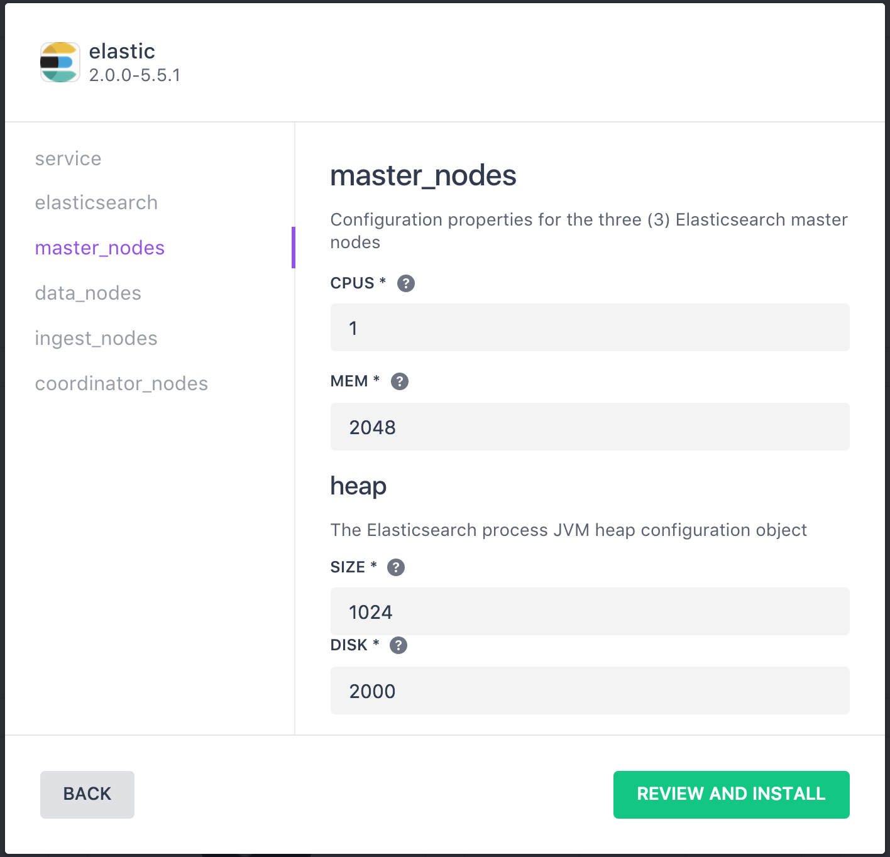

 <b>Step 6:</b> Click 'data_nodes' and adjust the 'COUNT', 'CPUS', MEM', 'HEAP SIZE', 'DISK' and 'DISK_TYPE' paramaters to your desired settings. 
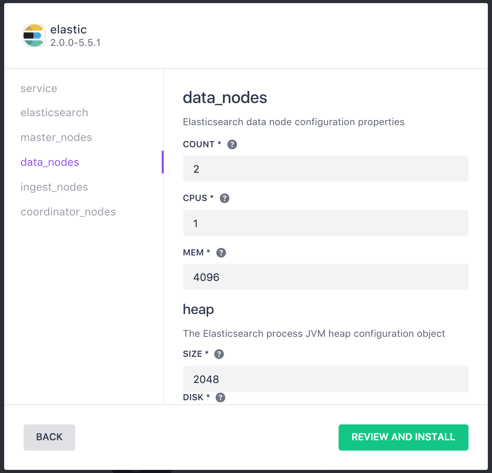

 <b>Step 7:</b> Click 'ingest_nodes' to review the parameters and leave all the defaults. 
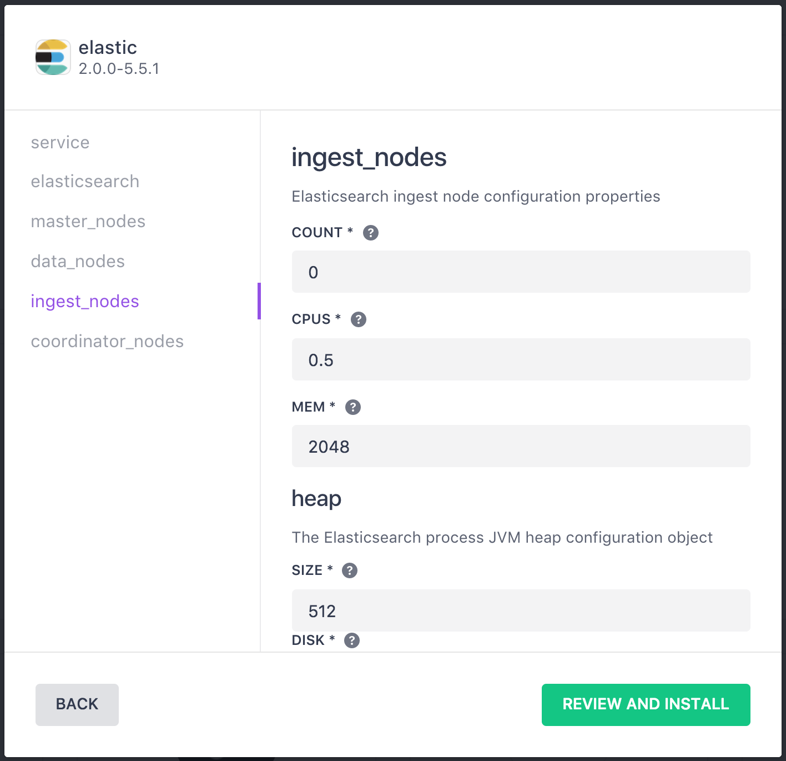

 <b>Step 8:</b> Click 'coordinator_nodes' to adjust the 'COUNT', 'CPUS', MEM', 'HEAP SIZE', 'DISK' and 'DISK_TYPE' paramaters to your desired settings. 
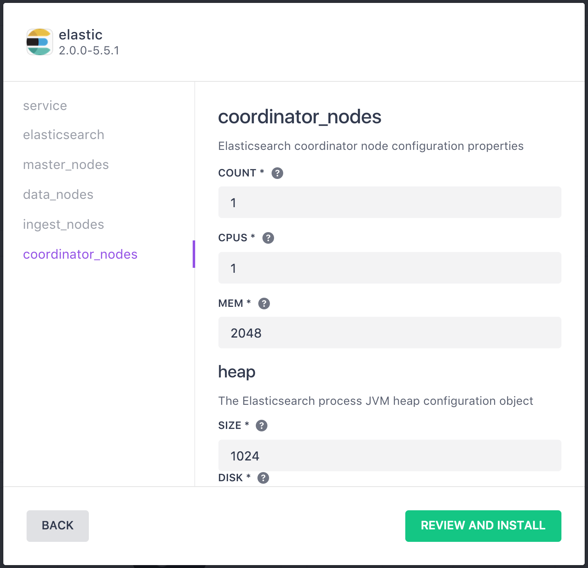

 <b>Step 9:</b> Click the 'REVIEW AND INSTALL' button and review the parameters values. 
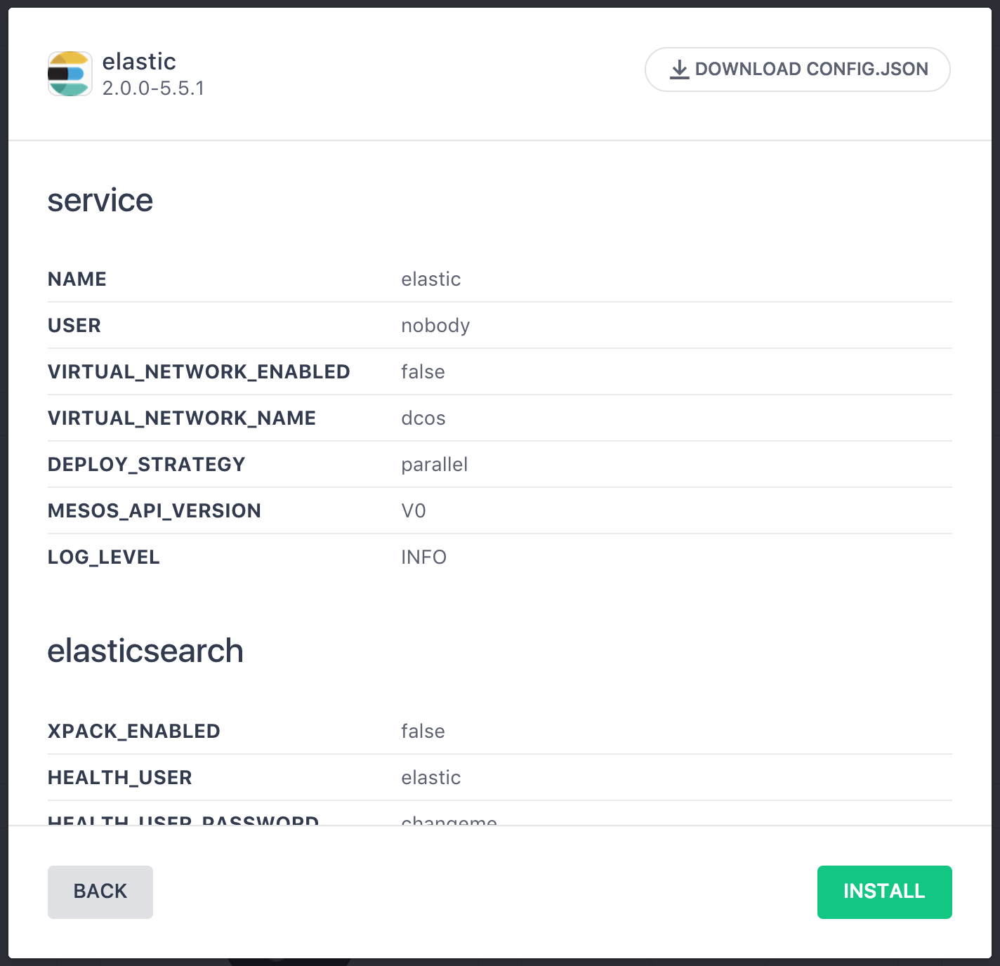

 <b>Step 10:</b> Click the 'INSTALL' button to install the elastic package. 
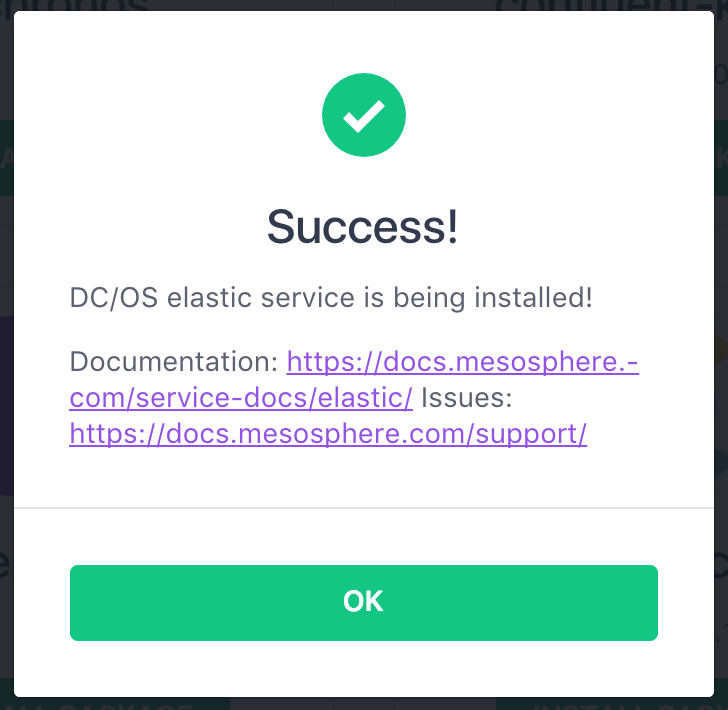

 <b>Step 11:</b> In the DC/OS dashboard navigate to 'Services - Services'.  Notice there is a Service named 'elastic' that now appears. 
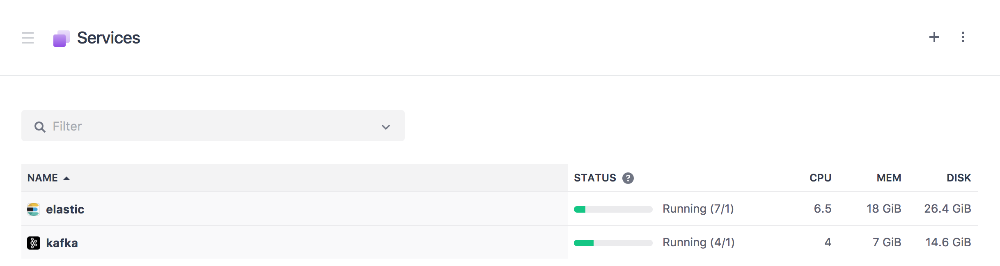

 <b>Step 12:</b> Click on 'elastic' in the service listing to open up more information on the 'elastic' service.  Here we can see TODO:... and the resources that have been allocated to them. 
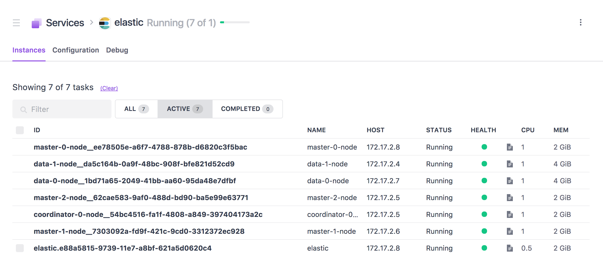

 <b>Step 13:</b> Taking a quick glimpse at the Mesos dashboard we can see the 'Active Tasks' that are running to support our Elasticsearch cluster.  <i>Note: you can launch into the log files, etc... of any of the tasks from this dashboard.</i> 
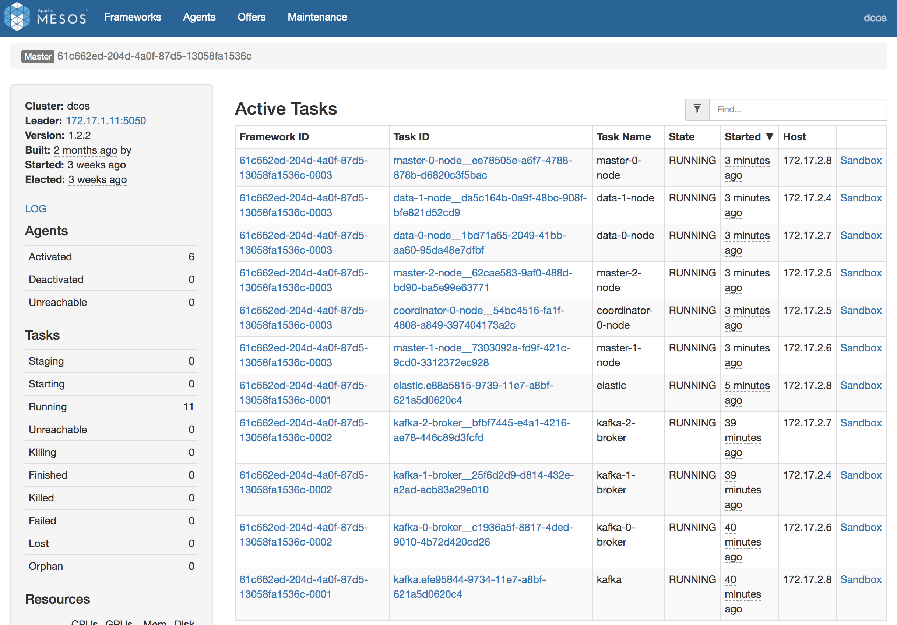

  <b>Congratulations:</b> You now have an Elasticsearch cluster installed with two data nodes ready to store data on the DC/OS cluster.  Next, we will walk through how to TODO.

