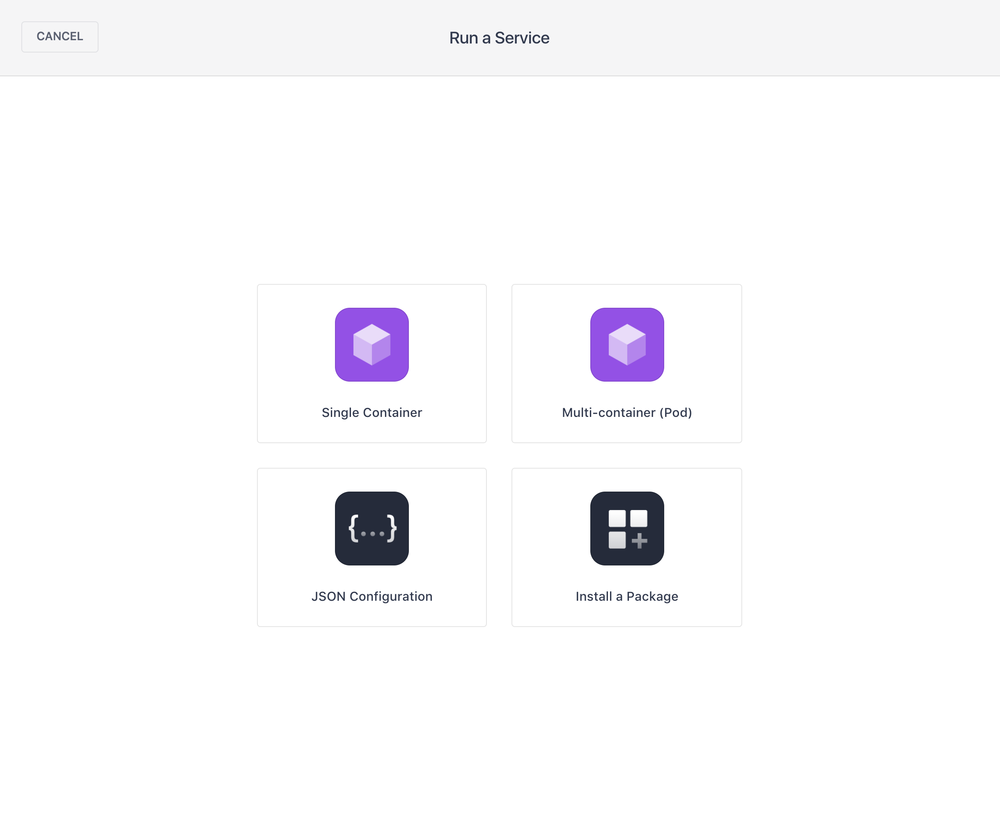
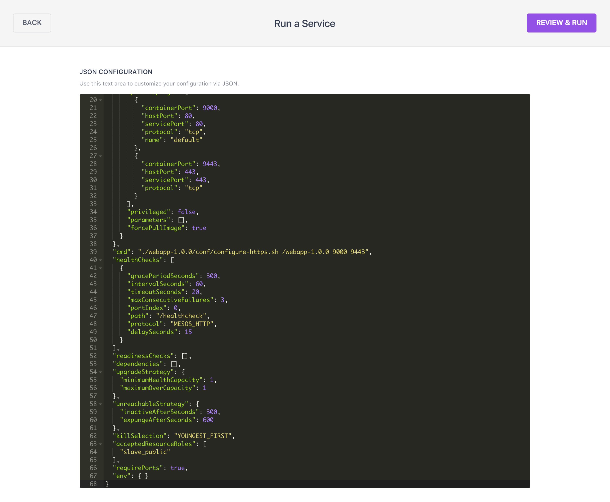
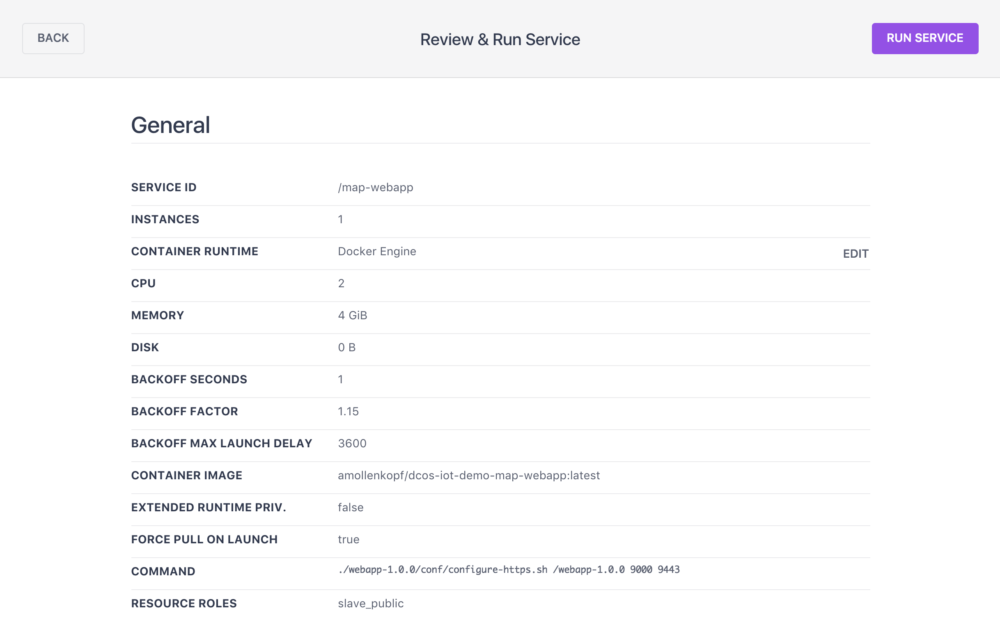
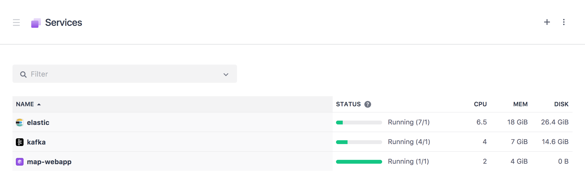
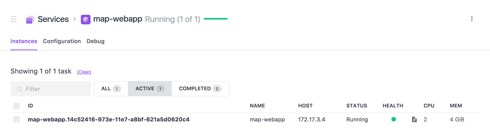
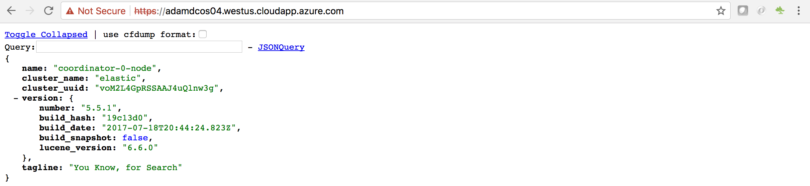
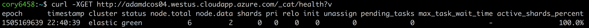

# Install a Map web application

<b>Step 1:</b> In the DC/OS dashboard navigate to 'Services - Services'. To deploy a new Service click the '+' button at the top right of the Services screen. 

 <b>Step 2:</b> We will 'Run a Service' by copy & pasting a 'JSON Configuration' so select the 'JSON Configuration option. 

 <b>Step 3:</b> Copy the contents of <a href="../map-webapp/map-webapp.json">map-webapp/map-webapp.json</a> to your clipboard, paste the contents to the 'JSON Configuration' area and click the 'REVIEW & RUN' button. 

 <b>Step 4:</b> Click 'RUN SERVICE' to install the Map web application. 

 <b>Step 5:</b> In the DC/OS dashboard navigate to 'Services - Services'.  Notice a new service running named 'map-webapp'. 

 <b>Step 6:</b> Click on the 'map-webapp' service to see it's deployment information. 

 <b>Step 7:</b>  

 <b>Step 8:</b> ... 

  <b>Congratulations:</b> You now have a Map web application in place ...  Next, we will walk through how to ....

