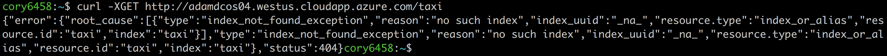
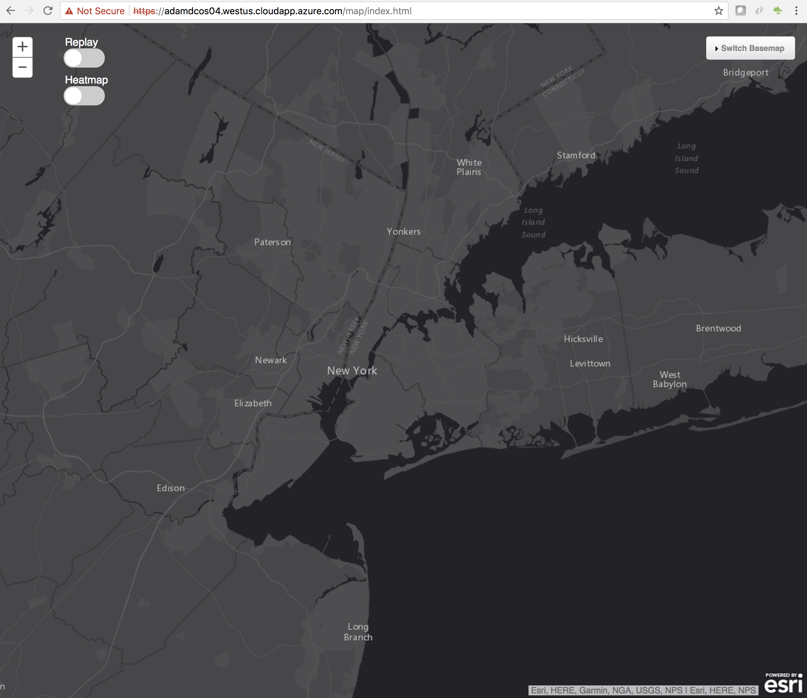

# Install a Map web application

<b>Step 1:</b> In the DC/OS dashboard navigate to 'Services - Services'. To run a new Service click the '+' button at the top right of the Services screen. 

 <b>Step 2:</b> We will 'Run a Service' by copy & pasting a 'JSON Configuration' so select the 'JSON Configuration option. 

 <b>Step 3:</b> Copy the contents of <a href="../map-webapp/map-webapp.json">map-webapp/map-webapp.json</a> to your clipboard, paste the contents to the 'JSON Configuration' area and click the 'REVIEW & RUN' button. 

 <b>Step 4:</b> Click 'RUN SERVICE' to install the Map web application. 

 <b>Step 5:</b> In the DC/OS dashboard navigate to 'Services - Services'.  Notice a new service running named 'map-webapp'. 

 <b>Step 6:</b> Click on the 'map-webapp' service to see it's deployment information. 

 <b>Step 7:</b> To do a quick verification that the webapp is running open a web browser to your public agent 'DNS name' or 'IP address', e.g. https://adamdcos04.westus.cloudapp.azure.com or https://40.78.20.221. The default response is an acknowledgment back from the elastic coordinator node describing the elasticsearch cluster. 

 <b>Step 8:</b> The webapp serves as a proxy for elasticsearch queries so it is possible to 'curl' queries to elasticsearch.  For example:<ul>
<li>To check the health of the elasticsearch cluster: <pre>curl -XGET http://adamdcos04.westus.cloudapp.azure.com/_cat/health?v</pre></li>
<li>To list all indices in the elasticsearch cluster: <pre>curl -XGET http://adamdcos04.westus.cloudapp.azure.com/_cat/indices?v</pre></li>
<li>To query a specific index named 'taxi': <pre>curl -XGET http://adamdcos04.westus.cloudapp.azure.com/taxi</pre></li>
<li>For more information about querying elasticsearch, see the <a href="https://www.elastic.co/guide/en/elasticsearch/reference/5.5/index.html">Elasticsearch 5.5 Reference Guide</a>.</li>
</ul>

 <b>Step 9:</b> The webapp also has a map application that can be accessed at ...., e.g. ... 

  <b>Congratulations:</b> You now have a Map web application in place ...  Next, we will walk through how to ....

