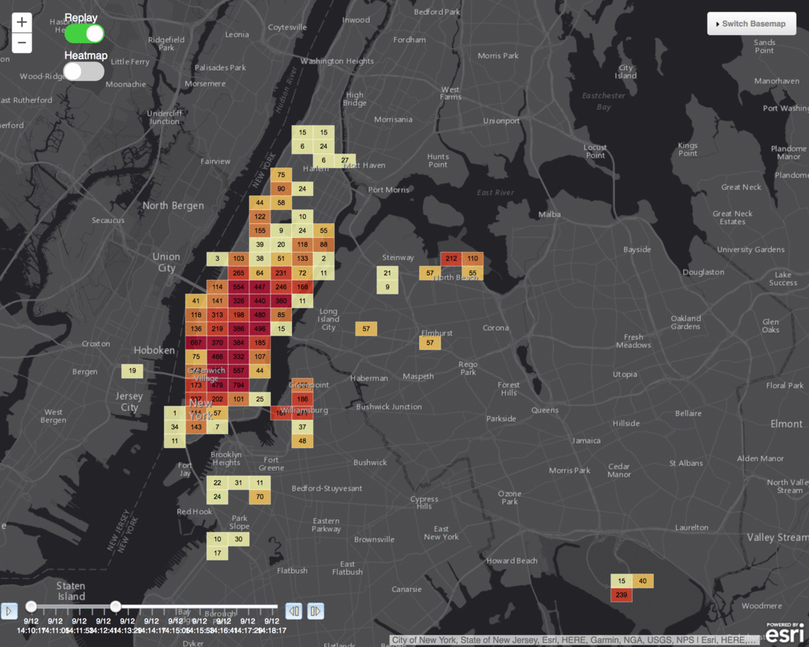
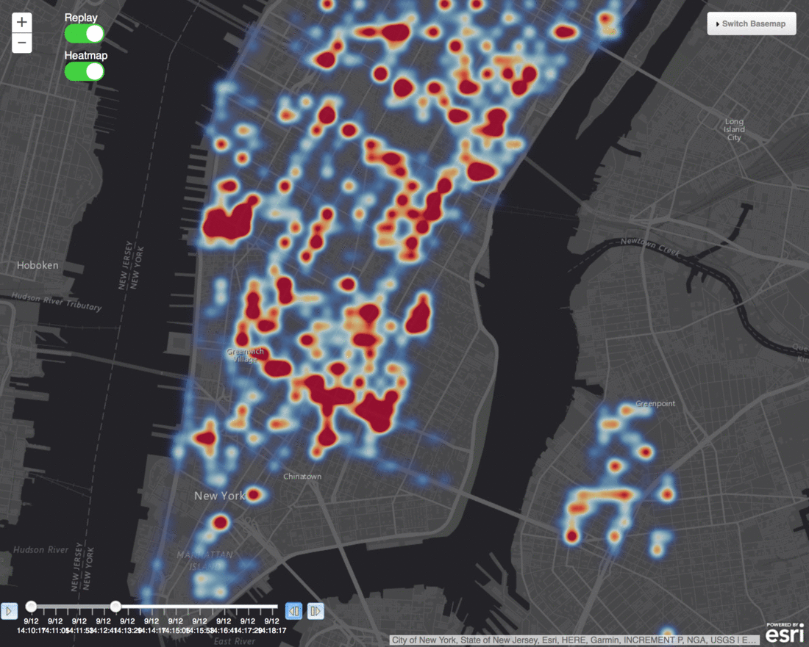
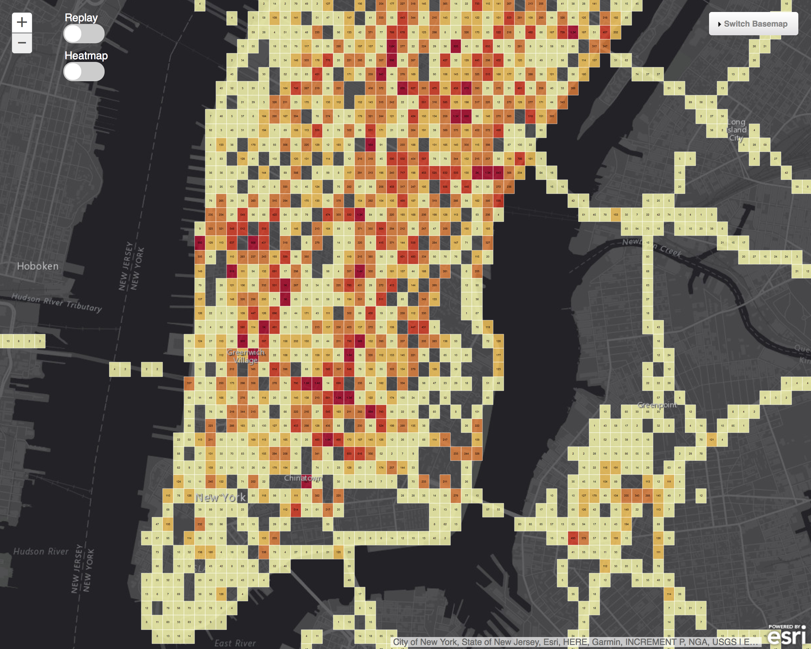

# Run the demo
Schedule a real-time analytic task & a source that emits events. 
We will now configure a Source to emit data into the Kafka brokers.  A real-time analytic task using Spark Streaming will then consume the data and write the results to the spatiotemporal-store.  The spatiotemporal-store uses Elasticsearch to efficiently index observations by space, time, and all the other attributes of the event.  The JavaScript map app periodically queries to reflect the latest state of observations on a map.

## Run a Spark Streaming job (taxi-stream)
<b>Step 1:</b> Review the taxi-stream spark streaming task marathon configuration found at <a href="../../spatiotemporal-esri-analytics/taxi-stream.json">spatiotemporal-esri-analytics/taxi-stream.json</a>.  Breaking the marathon app configuration file down:<ul><li>deploys a spark streaming 'taxi-stream' job using the <a href="https://hub.docker.com/r/mesosphere/spark/">mesosphere/spark:1.1.1-2.2.0-hadoop-2.7</a> Docker image.</li>
<li>the --class gets bootstraped in via a URI that is downloaded prior to the start of each worker task</li>
<li>each worker task is allocated 2 cpu shares & 1GB of memory</li>
<li>each worker task starts up with the spark-submit command with lots of application specific parameters</li></ul>

 <b>Step 2:</b> To schedule 'task-stream' go to the DC/OS dashboard and navigate to 'Services - Services'. To run a new Service click the '+' button at the top right of the Services screen.
 

 <b>Step 3:</b> Click the 'Single Container' option. 
 

 <b>Step 4:</b> Toggle the 'JSON EDITOR' button to on and cut & paste the contents of <a href="../../spatiotemporal-esri-analytics/taxi-stream.json">spatiotemporal-esri-analytics/taxi-stream.json</a> into the JSON area. 
 

 <b>Step 5:</b> Click the 'REVIEW & RUN' button, review the service configuration & click the 'RUN SERVICE' button to schedule 'taxi-stream'. 
 

 <b>Step 6:</b> On the 'Services' page note that 'taxi-stream' is in 'Deploying' status.  <i>note: The first time you deploy the service it will download the .jar file from S3 and will likely take a couple of minutes so be patient.</i> 
 

 <b>Step 7:</b> Once the 'taxi-stream' shows a status of 'Running' click on 'taxi-stream' to see more information. 
 

 <b>Step 8:</b> 'taxi-stream' is a Spark Streaming job.  Here we can see the host where the Spark Streaming driver was scheduled to as well as the status of the driver.  To see the actual worker tasks we must dive into the Mesos Dashboard. 
 

 <b>Step 9:</b> Open the Mesos dashboard to view the tasks of 'taxi-stream'.  Here we can see the driver task 'taxi-stream' and it's corresponding worker tasks 'taxi-rat 0', 'taxi-rat 1' and 'taxi-rat 2'.  note: 'rat' is an abbreviation for real-time analytic task. 
 

 <b>Step 10:</b> To view the progress of the spark streaming job click on the 'Sandbox' of the driver task 'taxi-stream'. 
 

 <b>Step 11:</b> In the Sandbox of a task we can gain access to the output files such as the stdout file to monitor the verbose print outs of the 'taxi-stream' task.  Click on the 'stdout' link to view this.  The stdout file is showing that it is saving 0 records to Elasticsearch.  This is because we have not yet enabled a 'taxi-source' that will emit events to Kafka for this Spark Streaming job to consume. 
  

## Run a Kafka producer appplication (taxi-source)
<b>Step 12:</b> Review the taxi-source Kafka producer task marathon configuration found at <a href="../../spatiotemporal-event-source/taxi-source.json">spatiotemporal-event-source/taxi-source.json</a>.  Breaking the marathon app configuration file down:<ul><li>deploys one instance of a 'taxi-source' deployed as a <a href="https://hub.docker.com/r/amollenkopf/spatiotemporal-event-source/">amollenkopf/spatiotemporal-event-source</a> Docker container</li>
<li>each container is allocated 1 cpu shares & 5GB of memory (needed to load the large simulation file into memory)</li>
<li>each container starts up with a java command with lots of application specific parameters (including the Kafka Mesos DNS entry)</li>
<li>the --class gets resolved as part of the <a href="https://hub.docker.com/r/amollenkopf/spatiotemporal-event-source/">amollenkopf/spatiotemporal-event-source</a> Docker image</li></ul>

 <b>Step 13:</b> To schedule 'task-source' go to the DC/OS dashboard and navigate to 'Services - Services'. To run a new Service click the '+' button at the top right of the Services screen and click the 'Single Container' option. 
 

 <b>Step 14:</b> Toggle the 'JSON EDITOR' button to on and cut & paste the contents of <a href="../../spatiotemporal-event-source/taxi-source.json">spatiotemporal-event-source/taxi-source.json</a> into the JSON area. 
 

 <b>Step 15:</b> Click the 'REVIEW & RUN' button, review the service configuration & click the 'RUN SERVICE' button to schedule 'taxi-source'. 
 

 <b>Step 16:</b> On the 'Services' page note that 'taxi-source' is in 'Deploying' status.  <i>note: The first time you deploy the service it will download the .csv simulation file from S3 and will likely take a couple of minutes so be patient.</i> 
 

 <b>Step 17:</b> Once the 'taxi-source' shows a status of 'Running' click on 'taxi-source' to see more information. 
 

 <b>Step 18:</b> 'taxi-source' is a custom Scala source application that reads a CSV file from S3, loads it's contents into memory and then produces taxi vehicle movement events to a Kafka topic.  Here we can see the host where the app was scheduled to as well as the status of the app.  To see the progress of the app we can dive into the Mesos Dashboard. 
 

 <b>Step 19:</b> Open the Mesos dashboard to view the task of 'taxi-source'. 
 

 <b>Step 20:</b> Here we can see the application task for 'taxi-source' and can monitor the progress by clicking into the 'Sandbox' and opening it's 'stdout' file. 
 

 <b>Step 21:</b> In the Mesos dashboard navigate to open the 'stdout' file of the 'taxi-stream' Spark Streaming driver.  Here we can see that the Spark Streaming workers tasks are now recieving the events from Kafka. 
  

## Visualize taxi movement behavior (map-webapp)
 <b>Step 22:</b> 
The 'taxi-stream' task is writing events it recieves to Elasticsearch data nodes.  The 'map-webapp' that was deployed previously continuously queries Elasticsearch to visualize the latest taxi movement information on a map.  The map application can be accessed on the public agent node at /map/index.html, e.g. https://adamdcos04.westus.cloudapp.azure.com/map/index.html. 
 

 <b>Step 23:</b> The 'map-webapp' has the ability to enable 'Replay' of the spatiotemporal observations.  To enable this flip the dial to on and use the time slider on the bottom left corner to specify the time window you want to replay with.  Stepping forward on the replay we can see the counts (labels on the goehash aggregations) increasing: 
 

 <b>Step 24:</b> The 'map-webapp' also supports the ability to generate a client-side heatmap based on content being queried from Elasticsearch.  To enable this flip the 'Heatmap' dial to on and interact with the replay bar to see how taxi movement density changes with time using heatmap as the visualization technique. 
 

 <b>Step 25:</b> Disabling the 'Replay' dial we can switch back into 'live' mode visualizing near real-time taxi movement as it occurs. 
 

 <b>Step 26:</b> Disabling the 'Heatmap' dial we can switch back into a geohash aggregation visualization of the near real-time taxi movement. 
 

  <b>Congratulations:</b> You now have successfully run the dcos-iot-demo and visualized taxi movement using geoaggregation techniques.
