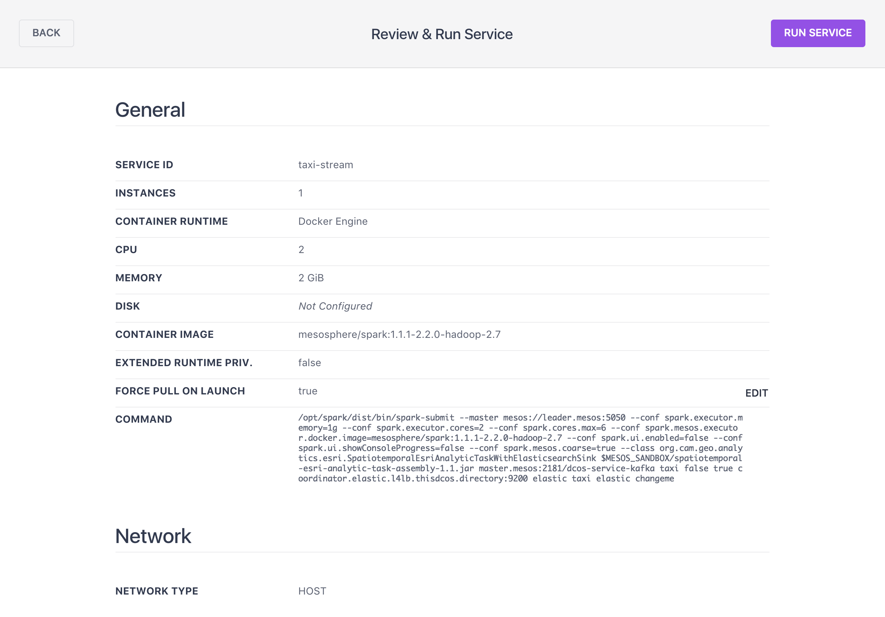
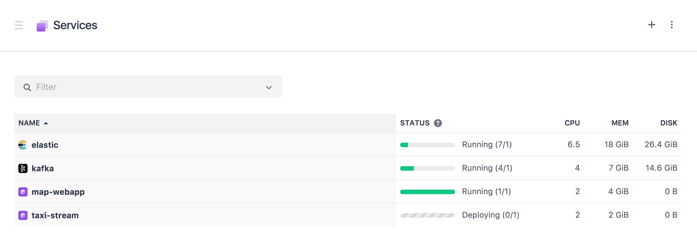
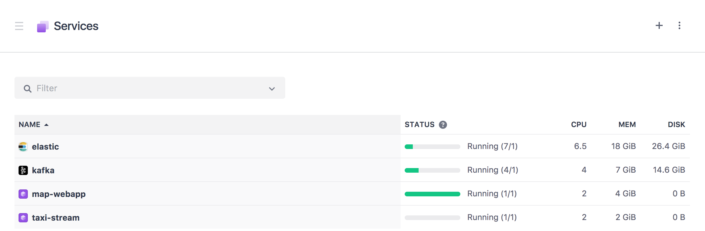

# Run the demo
Schedule a real-time analytic task & a source that emits events

## Run a Spark Streaming job

<b>Step 1:</b> ... 

 <b>Step 2:</b> ... 

## Produce data to Kafka

 <b>Step 3:</b> ... 

 <b>Step 4:</b> ... 

 <b>Step 5:</b> ... 

 <b>Step 6:</b> ... 

 <b>Step 7:</b> ... 

  <b>Congratulations:</b> You now have ...

