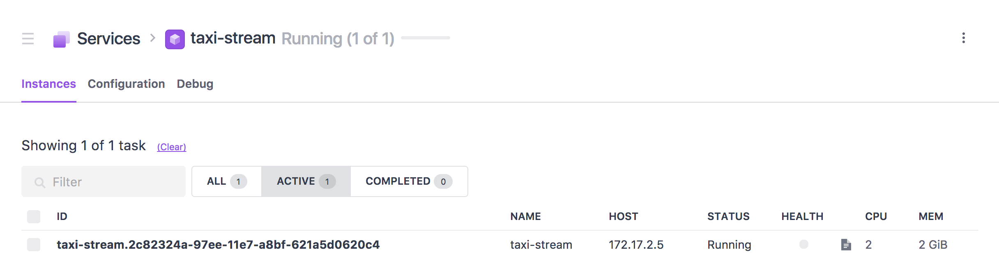
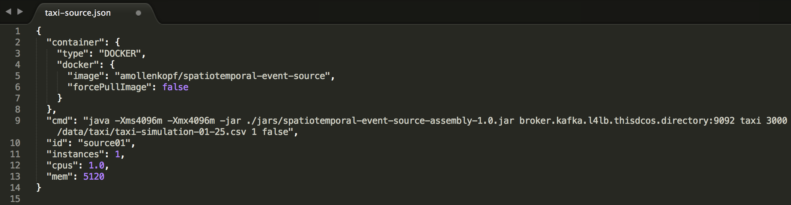
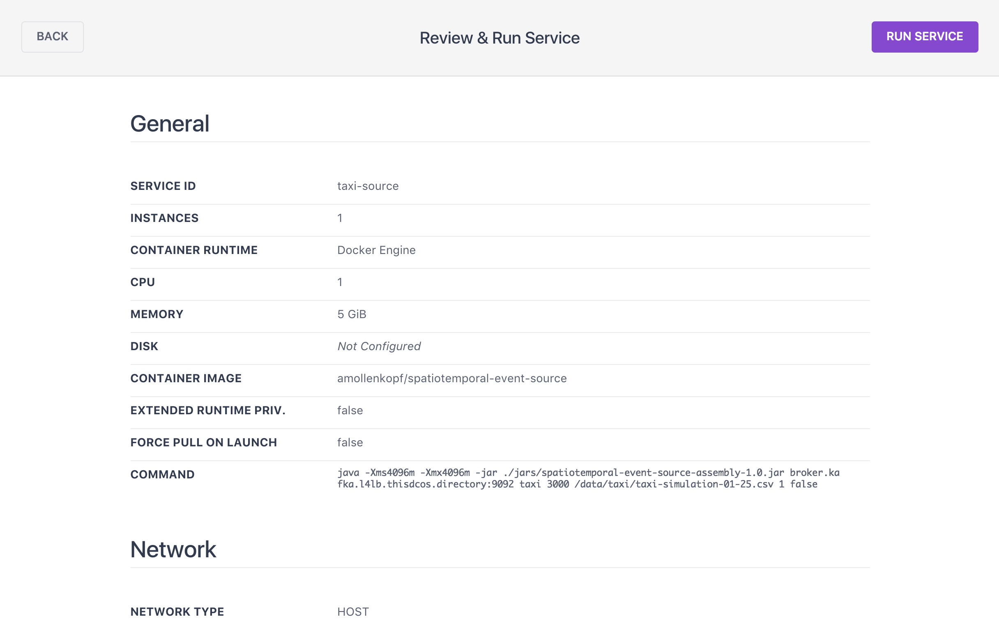
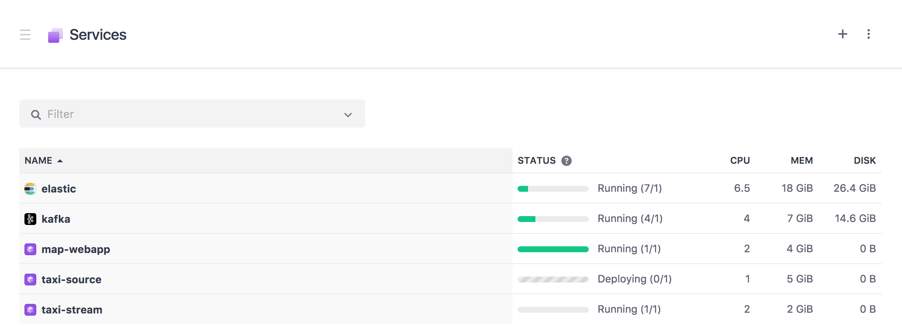
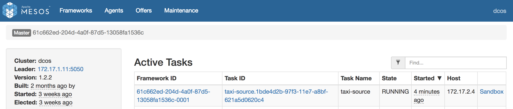

# Run the demo
Schedule a real-time analytic task & a source that emits events. 
We will now configure a Source to emit data into the Kafka brokers.  A real-time analytic task using SPark Streaming will then consume the data and write the results to the spatiotemporal-store.  The spatiotemporal-store uses Elasticsearch to efficiently index observations by space, time, and all the other attributes of the event.  The JavaScript map app periodically queries to reflect the latest state of observations on a map.

## Run a Spark Streaming job: taxi-stream
<b>Step 1:</b> Review the taxi-stream spark streaming task marathon configuration found at <a href="../../spatiotemporal-esri-analytics/taxi-stream.json">spatiotemporal-esri-analytics/taxi-stream.json</a>.  Breaking the marathon app configuration file down:<ul><li>deploys a spark streaming 'taxi-stream' job deployed using the <a href="https://hub.docker.com/r/mesosphere/spark/">mesosphere/spark:1.1.1-2.2.0-hadoop-2.7</a> Docker image.</li>
<li>the --class gets bootstraped in via a URI that is downloaded prior to the start of each worker task</li></ul>
<li>each worker task is allocated 2 cpu shares & 1GB of memory</li>
<li>each worker task starts up with the spark-submit command with lots of application specific parameters</li>
 

 <b>Step 2:</b> To schedule <a href="../spatiotemporal-esri-analytics/rat01.json">spatiotemporal-esri-analytics/rat01.json</a> onto the DC/OS cluster go to the DC/OS dashboard and navigate to 'Services - Services'. To run a new Service click the '+' button at the top right of the Services screen.
 

 <b>Step 3:</b> Open the Marathon dashboard to view the deployment progress of rat01: 
 

 <b>Step 4:</b> Click on the rat01 application to see more details include what hosts and ports it was scheduled to: 
 

 <b>Step 5:</b> Open the Mesos dashboard to view the active tasks of rat01: 
 

 <b>Step 6:</b> For each rat01 instance click on it's 'Sandbox' and open the stdout file to monitor verbose print outs of rat01: 
 

 <b>Step 7:</b> The three stdout files of the associated rat01 instances are showing that they are saving 0 records to Elasticsearch.  This is because we have not yet enabled a Source that will emit events. 
 

 <b>Step 8:</b> In order for us to partition events sent to Kafka in an evenly distributed mode we will create a topic with partitions matching the number of brokers we have deployed.  The Source (producer) has code, see <a href="../spatiotemporal-event-source/src/main/scala/org/cam/geo/source/SpatiotemporalFileEventSource.scala">SpatiotemporalFileEventSource.scala</a> use of <a href="../spatiotemporal-event-source/src/main/scala/org/cam/geo/source/SimplePartitioner.scala">SimplePartitioner.scala</a>, that partitions the events in a consistent manner so the same taxi ids go to the same partitions while evenly distributing the load across the configured partitions of the topic. <ul><li>dcos kafka topic create taxi --partitions=3 --replication=1</li></ul>
 

 <b>Step 9:</b> The Source has runtime parameters that specify deployment hosts & ports of the Kafka brokers.  To learn this information use the DC/OS CLI and issue the following command <ul><li>dcos kafka connection</li></ul>
 

 <b>Step 10:</b> We will now review a source task marathon configuration found at <a href="../spatiotemporal-event-source/source01.json">spatiotemporal-event-source/source01.json</a>.  Breaking the marathon app configuration file down:<ul><li>deploys 1 instance of a 'source01' deployed as a <a href="https://hub.docker.com/r/amollenkopf/spatiotemporal-event-source/">amollenkopf/spatiotemporal-event-source</a> Docker container</li>
<li>each container is allocated 1 cpu shares & 5GB of memory (needed for the large simulation file)</li>
<li>each container starts up with the java command with lots of application specific parameters (including the Kafka broker hosts & ports)</li>
<li>the --class comes as part of the <a href="https://hub.docker.com/r/amollenkopf/spatiotemporal-event-source/">amollenkopf/spatiotemporal-event-source</a> Docker image</li></ul>
 
<ul><li>NOTE: MAKE SURE you change the broker hosts and port numbers in the <a href="../spatiotemporal-event-source/source01.json">spatiotemporal-event-source/source01.json</a> with what was learned in Step 9.</li></ul>

 <b>Step 11:</b> To schedule a Source that emits events into a Kafka topic's partitions running on a DC/OS cluster issue the following DC/OS CLI command<ul><li>dcos marathon app add spatiotemporal-event-source/source01.json</li></ul>
 

 <b>Step 12:</b> Open the Marathon dashboard to view the deployment progress of source01 (it will take 1-2 minutes to deploy as the Docker image is large due to the size of the simulation file): 
 

 <b>Step 13:</b> Click on the source01 application to see more details include what host and port it was scheduled to: 
 

 <b>Step 14:</b> Open the Mesos dashboard to view the active task of source01: 
 

 <b>Step 15:</b> Click on the 'Sandbox' of the source01 instance and open the stdout file to monitor verbose print outs of source01: 
 

 <b>Step 16:</b> The stdout file of the associated source01 instance shows that it is emitting events to the Kafka topic partitions every 3 seconds: 
 

 <b>Step 17:</b> The three stdout files of the associated rat01 instances are now showing they are consuming these events evenly as each is subscribed to a unique Kafka topic partition: 
 

 <b>Step 18:</b> Go back to the browser tab that has the map app and hit the refresh button.  You should now see taxi content appearing on the map asgeohash aggregations that are auto-updated as new data appears in Elasticsearch: 
 

 <b>Step 19:</b> The map app has the ability to enable 'Replay' of the spatiotemporal observations.  To enable this flip the dial to on and use the time slider on the bottom left corner to specify the time window you want to replay with: 
 

 <b>Step 20:</b> Steppign forward on the replay we can see the counts (labels on the goehash aggregations) increasing: 
 

 <b>Step 21:</b> The map app also supports the ability to generate a client-side heatmap based on content being queried from Elasticsearch: 
 

 <b>Step 22:</b> Using the timeslider we can see how the density changes over time 
 

 <b>Step 23:</b> Disabling both the Heatmap and Replay capabilities we get back to a near real-time view of the obervations: 
 

 <b>Step 24:</b> Reviewing the stdout files of the associated real-time analytic tasks we can see that they are continuing to process events in a distributed fashion: 
 

  <b>Congratulations:</b> You now have ...
