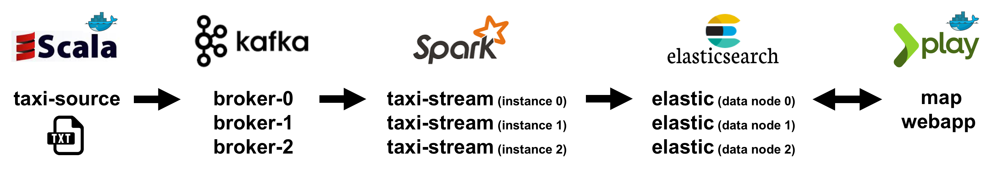
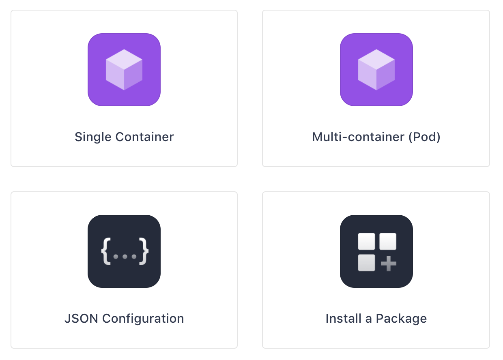
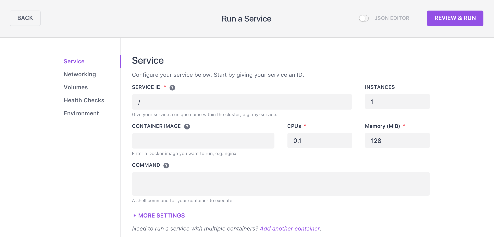
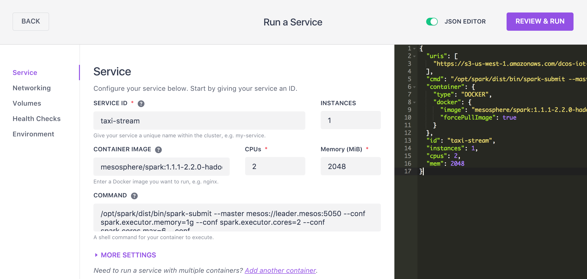
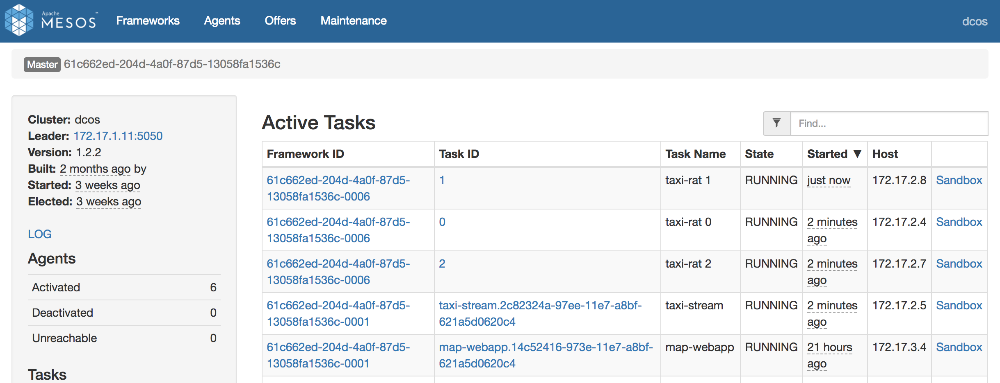
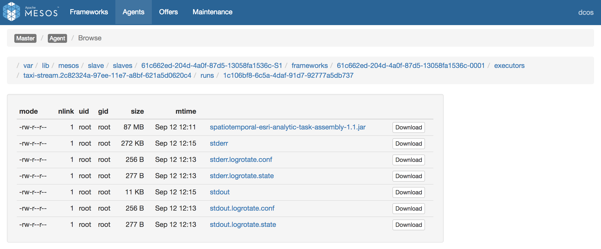
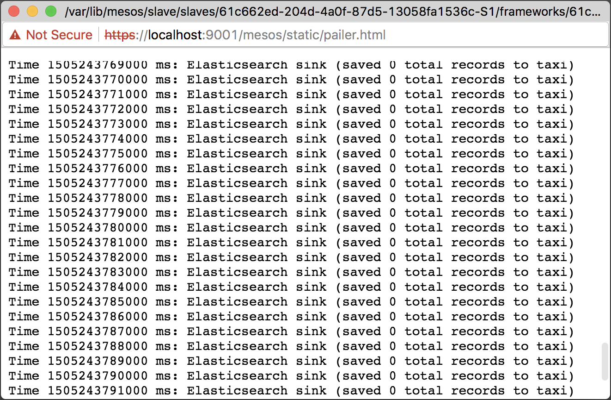

# Run the demo
Schedule a real-time analytic task & a source that emits events. 
We will now configure a Source to emit data into the Kafka brokers.  A real-time analytic task using Spark Streaming will then consume the data and write the results to the spatiotemporal-store.  The spatiotemporal-store uses Elasticsearch to efficiently index observations by space, time, and all the other attributes of the event.  The JavaScript map app periodically queries to reflect the latest state of observations on a map.

## Run a Spark Streaming job (taxi-stream)
<b>Step 1:</b> Review the taxi-stream spark streaming task marathon configuration found at <a href="../../spatiotemporal-esri-analytics/taxi-stream.json">spatiotemporal-esri-analytics/taxi-stream.json</a>.  Breaking the marathon app configuration file down:<ul><li>deploys a spark streaming 'taxi-stream' job using the <a href="https://hub.docker.com/r/mesosphere/spark/">mesosphere/spark:1.1.1-2.2.0-hadoop-2.7</a> Docker image.</li>
<li>the --class gets bootstraped in via a URI that is downloaded prior to the start of each worker task</li>
<li>each worker task is allocated 2 cpu shares & 1GB of memory</li>
<li>each worker task starts up with the spark-submit command with lots of application specific parameters</li></ul>

 <b>Step 2:</b> To schedule 'task-stream' go to the DC/OS dashboard and navigate to 'Services - Services'. To run a new Service click the '+' button at the top right of the Services screen.
 

 <b>Step 3:</b> Click the 'Single Container' option. 
 

 <b>Step 4:</b> Toggle the 'JSON EDITOR' button to on and cut & paste the contents of <a href="../../spatiotemporal-esri-analytics/taxi-stream.json">spatiotemporal-esri-analytics/taxi-stream.json</a> into the JSON area. 
 

 <b>Step 5:</b> Click the 'REVIEW & RUN' button, review the service configuration & click the 'RUN SERVICE' button to schedule 'taxi-stream'. 
 

 <b>Step 6:</b> On the 'Services' page note that 'taxi-stream' is in 'Deploying' status.  <i>note: The first time you deploy the service it will download the .jar file from S3 and will likely take a couple of minutes so be patient.</i> 
 

 <b>Step 7:</b> Once the 'taxi-stream' shows a status of 'Running' click on 'taxi-stream' to see more information. 
 

 <b>Step 8:</b> 'taxi-stream' is a Spark Streaming job.  Here we can see the host where the Spark Streaming driver was scheduled to as well as the status of the driver.  To see the actual worker tasks we must dive into the Mesos Dashboard. 
 

 <b>Step 9:</b> Open the Mesos dashboard to view the tasks of 'taxi-stream'.  Here we can see the driver task 'taxi-stream' and it's corresponding worker tasks 'taxi-rat 0', 'taxi-rat 1' and 'taxi-rat 2'.  note: 'rat' is an abbreviation for real-time analytic task. 
 

 <b>Step 10:</b> To view the progress of the spark streaming job click on the 'Sandbox' of the driver task 'taxi-stream'. 
 

 <b>Step 11:</b> In the Sandbox of a task we can gain access to the output files such as the stdout file to monitor the verbose print outs of the 'taxi-stream' task.  Click on the 'stdout' link to view this.  The stdout file is showing that it is saving 0 records to Elasticsearch.  This is because we have not yet enabled a 'taxi-source' that will emit events to Kafka for this Spark Streaming job to consume. 
  

  <b>Congratulations:</b> You have ...
