# Get a DC/OS cluster running on Amazon Web Services
<a href="https://mesosphere.com/">Mesosphere</a> (creator of <a href="http://mesos.apache.org/">Mesos</a> and <a href="https://dcos.io/">DC/OS</a>) has great documentation on how to establish a DC/OS cluster on Amazon that can be found <a href="https://mesosphere.com/amazon/">here</a>. 

<b>Step 1:</b> Navigate to the <a href="http://www.mesosphere.com/amazon">Mesosphere Amazon launch page</a> and click the 'Get Started on AWS For Free' button.  Read through the 'System' and 'Software' requirements.  As a prerequisite you must have an Amazon EC2 Key Pair for the same region as your cluster. Key pairs cannot be shared across regions. The AWS key pair uses public-key cryptography to provide secure login to your AWS cluster.  If you don't already have a key pair for the region you wish to deploy a DC/OS cluster follow these <a href="amazon-keypair-setup.md">instructions</a> 
 
 <b>Step 2:</b> 
After reviewing <a href="https://dcos.io/docs/1.7/administration/installing/cloud/aws/">Installing DC/OS on AWS</a> documentation 
launch the <a href="https://downloads.dcos.io/dcos/EarlyAccess/commit/14509fe1e7899f439527fb39867194c7a425c771/aws.html?_ga=1.161721663.282044494.1466715839">DC/OS Template</a> on CloudFormation and select the region and number of masters (1 or 3). You must have a key pair for your selected region. 
 
 <b>Step 3:</b>Out of the box, the template supplied by Mesosphere, allocates instances of type  m3.xlarge.  We have found that using instances of type m3.2xlarge works better for this demo.  So we  recommend downloading the default template and modifying it to use m3.2xlarge for its instance type.  To do that, open the link in the default  page that shows up in the Select Template page and save it to disk. 
 
 <b>Step 4:</b> 
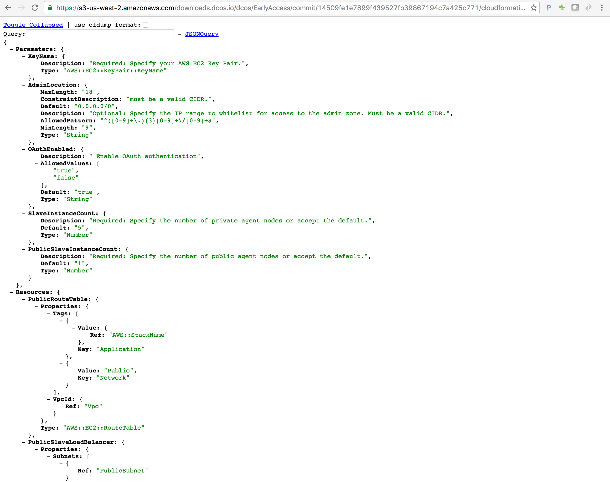 
 <b>Step 5:</b>
After saving the file to disk, open it in your favorite text editor and  look for the three JSON entries: Mappings.Paramters.MasterInstanceType, Mappings.Paramters.PublicSlaveInstanceType, and SlaveInstanceType.  For all three, change  m3.xlarge to m3.2xlarge and save the file. 
 
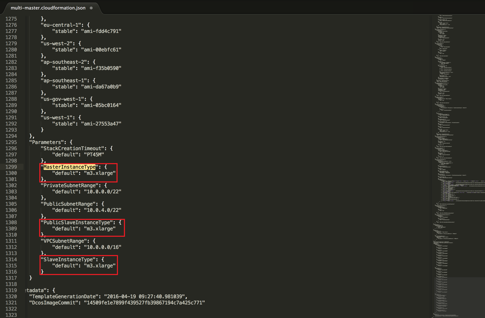 
 <b>Step 6:</b> 
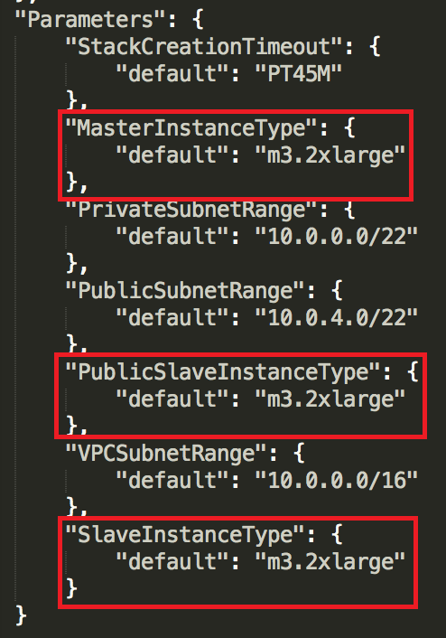 
 <b>Step 7:</b> 
Once you modify and save the file, go back to the Create stack -> Select Template screen and choose the "Upload a template to Amazon S3" option and choose the json file you just saved to disk and click the "Next" button.
 
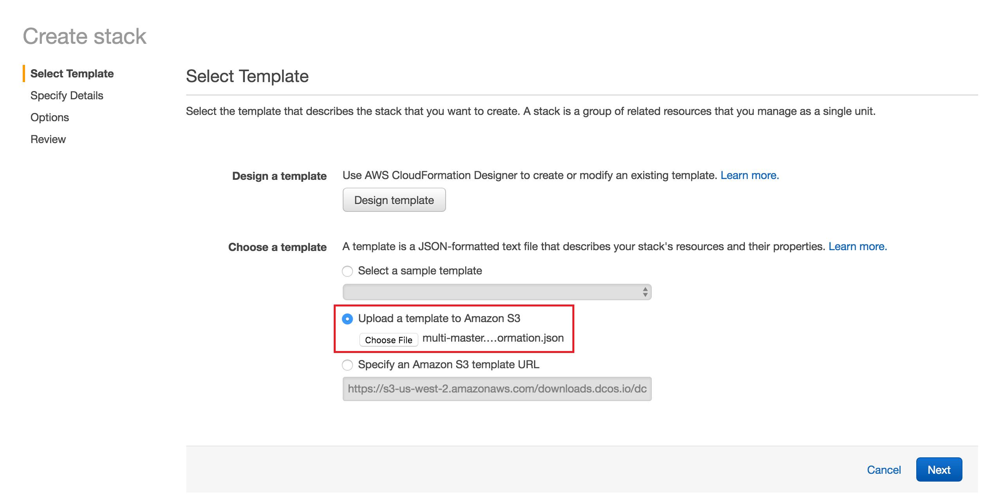 
 <b>Step 8:</b> 
On the "Specify Details" page, do the  following:
* Provide a "Stack Name"
* For KeyName, select the private key to use to create the instances.  <b>Make sure you have access to the private key as you may need it to ssh to your cluster later.</b>
* Set OAuthEnabled to false
* Set PublicSlaveInstanceCount to 3 for a Highly Available (HA) Master (you can leave this to one, but your demo will not be HA)
* Set SlaveInstanceCount to 10
* Click Next

Note: You can modify the instance counts  as you see fit, but during testing these are the configurations that provided the best experience.
 
 
 <b>Step 9:</b> 
Under Options, you can set any metadata you want.  We  recommend adding a cluster-owner key/value pair so you know who to contact if there any issues that arise with the cluster.  Once you've entered the data you'd like, hit Next.
 
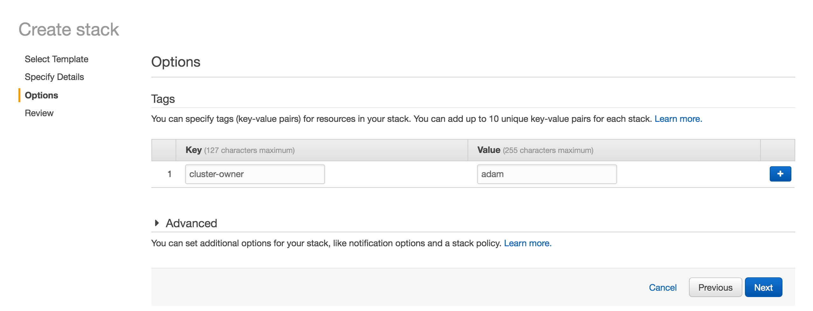 
 <b>Step 10:</b> ... 
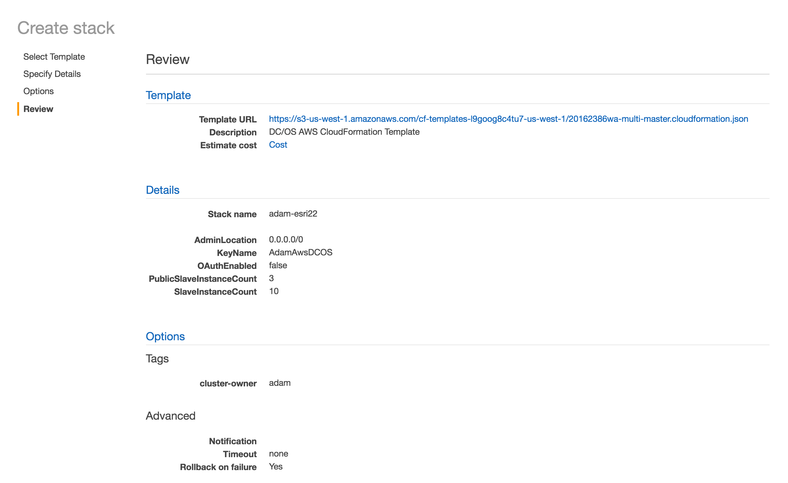 
 <b>Step 11:</b> 
Click the checkbox next to "I acknowledge  that AWS CloudFormation might create IAM resources" and push the Create button.
 
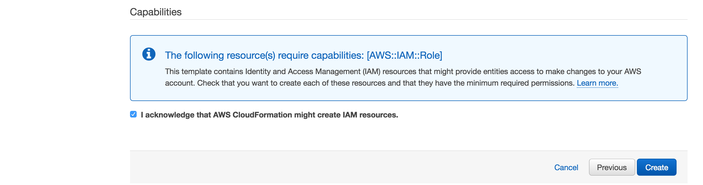 
 <b>Step 12:</b> 
If you haven't created  any clusters before, you might see this screen. If you do, then push the refresh button in the top right hand corner.
 
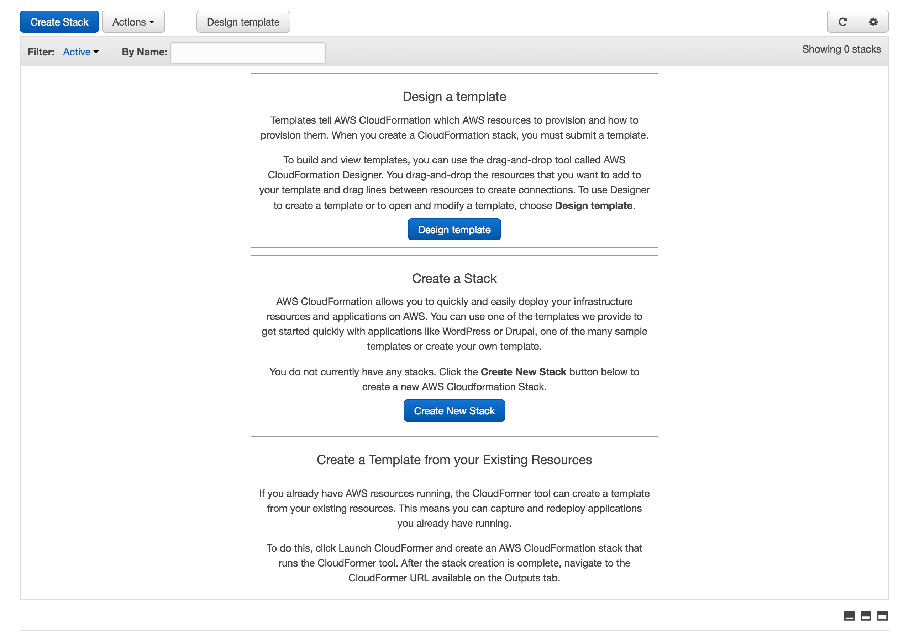 
 <b>Step 13:</b> 
You'll see updates as all the various components  are created.
 
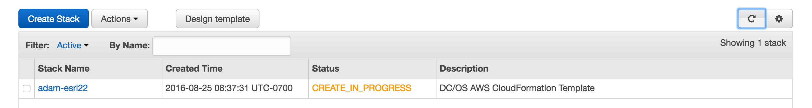 
 <b>Step 14:</b> 
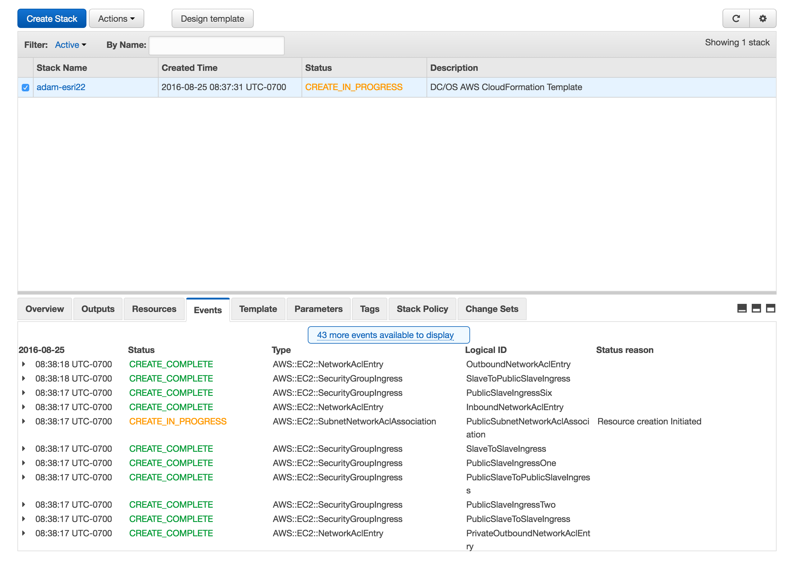 
 <b>Step 15:</b> 
 
Once the cluster is  done creating, you'll see  the status of your cluster set to "CREATE_COMPLETE."
 
 <b>Step 16:</b> 
To see the pulic hostname of your DC/OS Dashboard, select the cluster you just created  in the grid, and then select the "Outputs" tab.  You can get to your DC/OS dashboard by copying the value of  the DnsAddress row andpasting it into a browser.   
 
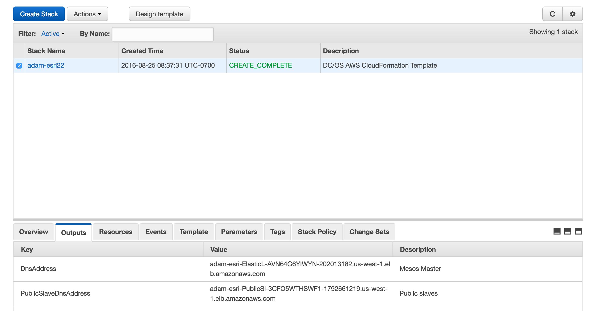 
 <b>Step 17:</b> 
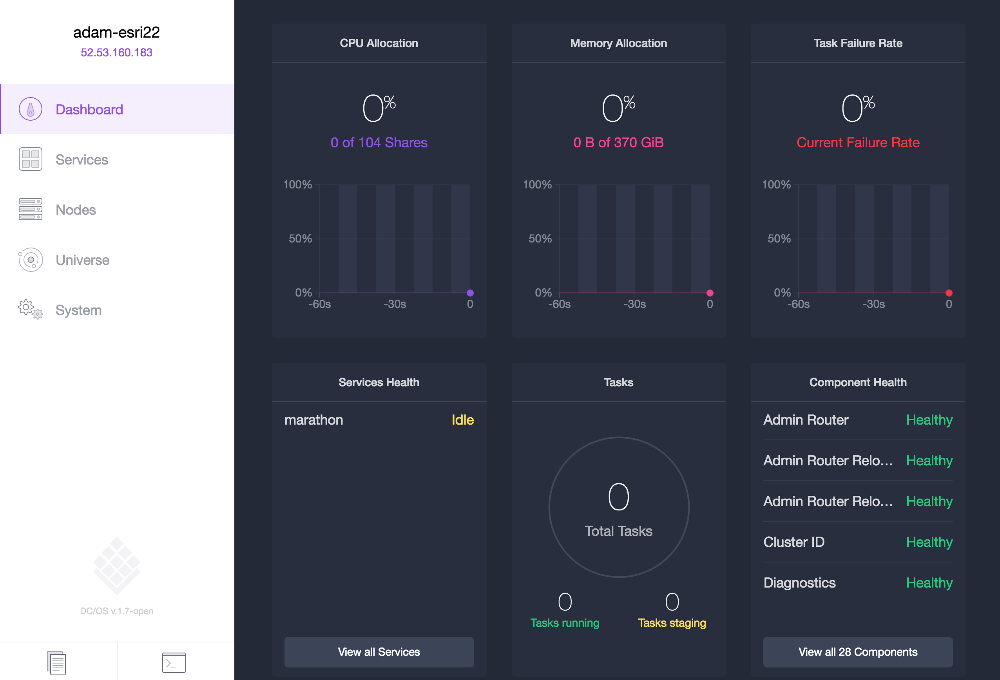 

  

  <b>Congratulations:</b> You now have a DC/OS cluster in place on Amazon Web Services.  Next, we will walk through <a href="../docs/dcos-explore.md">Explore the DC/OS and Mesos dashboards</a>

 
