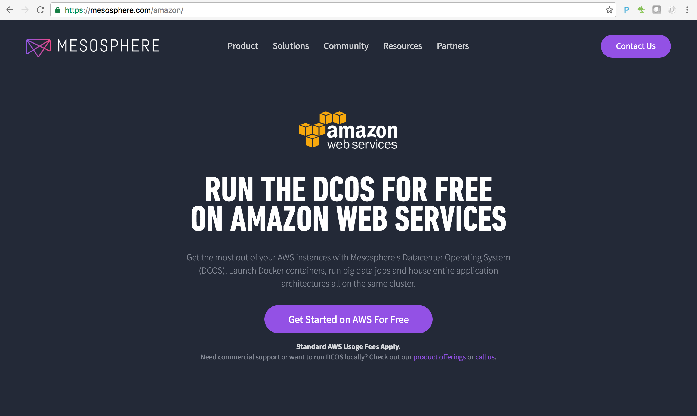
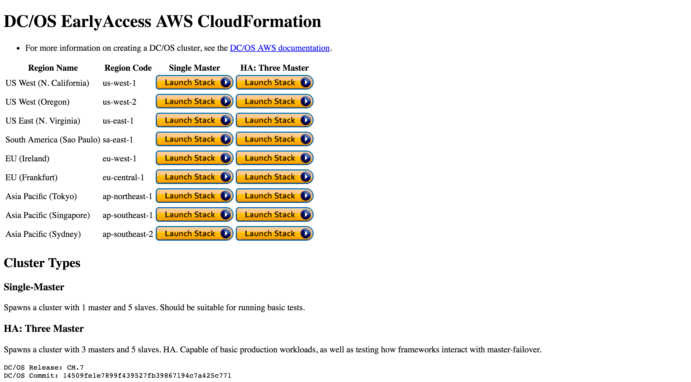
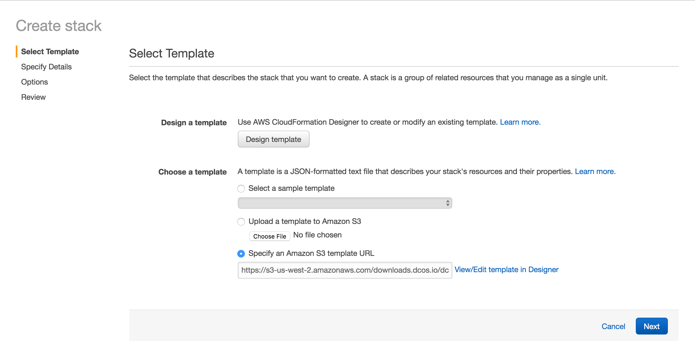

# Get a DC/OS cluster running on Amazon Web Services
<a href="https://mesosphere.com/">Mesosphere</a> (creator of <a href="http://mesos.apache.org/">Mesos</a> and <a href="https://dcos.io/">DC/OS</a>) has great documentation on how to establish a DC/OS cluster on Amazon. 

Step by step instructions coming soon ... 
In the meantime, please follow the instructions that can be found <a href="https://mesosphere.com/amazon/">here</a>. 
 

<b>Step 1:</b> Navigate to the <a href="http://www.mesosphere.com/amazon">Mesosphere Amazon launch page</a> and click the 'Get Started on AWS For Free' button. 

  <b>Step 2:</b> Read through the 'System' and 'Software' requirements. 

  <b>Step 3:</b> As a prerequisite you must have an Amazon EC2 Key Pair for the same region as your cluster. Key pairs cannot be shared across regions. The AWS key pair uses public-key cryptography to provide secure login to your AWS cluster.  If you don't already have a key pair for the region you wish to deploy a DC/OS cluster follow these <a href="amazon-keypair-setup.md">instructions</a>. 
  <b>Step 4:</b> Next. 

  
<a href="https://dcos.io/docs/1.7/administration/installing/cloud/aws/">Installing DC/OS on AWS</a>  
<a href="https://downloads.dcos.io/dcos/EarlyAccess/commit/14509fe1e7899f439527fb39867194c7a425c771/aws.html?_ga=1.161721663.282044494.1466715839">DC/OS Template</a> on CloudFormation  

  <b>Congratulations:</b> You now have a DC/OS cluster in place on Amazon Web Services.  Next, we will walk through <a href="../docs/dcos-explore.md">Explore the DC/OS and Mesos dashboards</a>
