# Schedule a Real-Time Analytic Task & a Source that emits events
We will now configure a Source to emit data into the Kafka brokers.  A real-time analytic task using SPark Streaming will then consume the data and write the results to the spatiotemporal-store.  The spatiotemporal-store uses Elasticsearch to efficiently index observations by space, time, and all the other attributes of the event.  The JavaScript map app periodically queries to reflect the latest state of observations on a map.

<b>Step 1:</b> We will now review a real-time analytic task marathon configuration found at <a href="../spatiotemporal-esri-analytics/rat01.json">spatiotemporal-esri-analytics/rat01.json</a>.  Breaking the marathon app configuration file down:<ul><li>deploys 3 instances of a 'rat01' deployed as Spark 1.6 Docker containers</li>
<li>each container is allocated 4 cpu shares & 2GB of memory</li>
<li>each container starts up with the command spark-submit with lots of application specific parameters</li>
<li>the --class gets bootstraped in via a URI downloaded prior to the start of each container</li></ul>
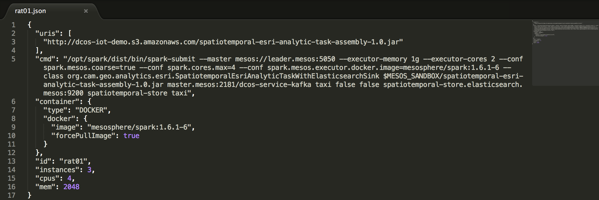 
 <b>Step 2:</b> To schedule <a href="../spatiotemporal-esri-analytics/rat01.json">spatiotemporal-esri-analytics/rat01.json</a> onto the DC/OS cluster issue the following DC/OS CLI command<ul><li>dcos marathon app add spatiotemporal-esri-analytics/rat01.json</li></ul>
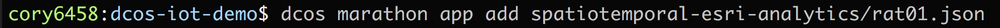 
 <b>Step 3:</b> Open the Marathon dashboard to view the deployment progress of rat01: 
 
 <b>Step 4:</b> Click on the rat01 application to see more details include what hosts and ports it was scheduled to: 
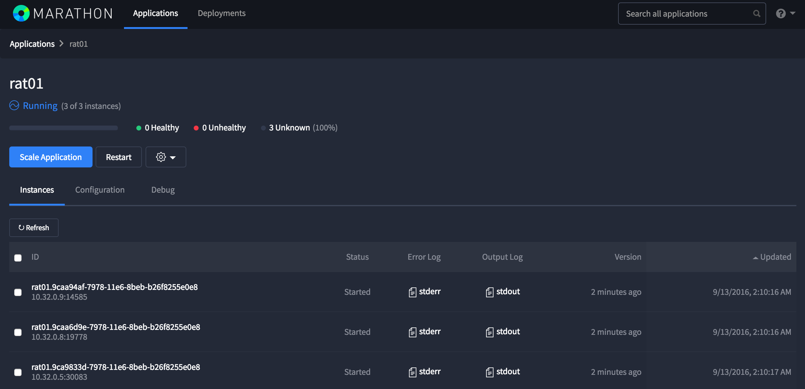 
 <b>Step 5:</b> Open the Mesos dashboard to view the active tasks of rat01: 
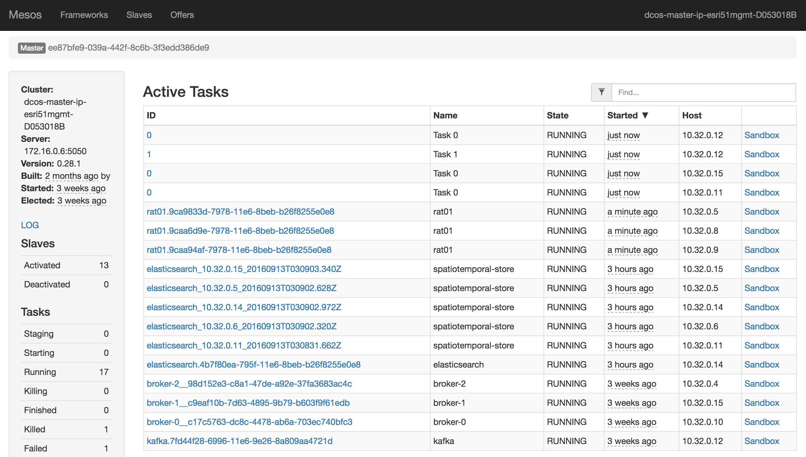 
 <b>Step 6:</b> For each rat01 instance click on it's 'Sandbox' and open the stdout file to monitor verbose print outs of rat01: 
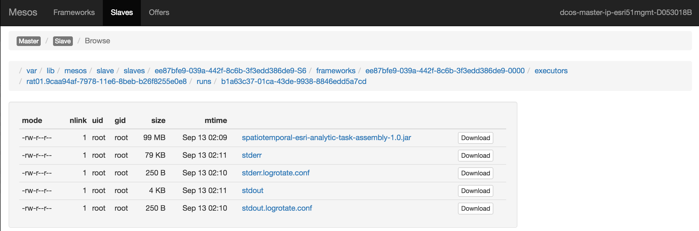 
 <b>Step 7:</b> The three stdout files of the associated rat01 instances are showing that they are saving 0 records to Elasticsearch.  This is because we have not yet enabled a Source that will emit events. 
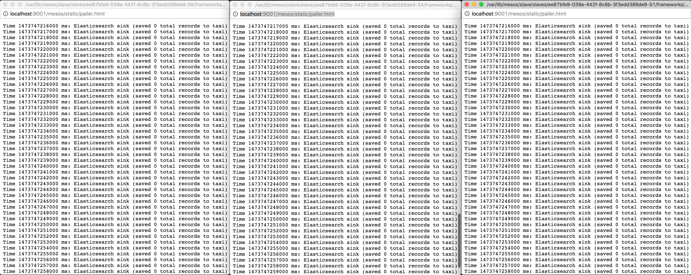 
 <b>Step 8:</b> In order for us to partition events sent to Kafka in an evenly distributed mode we will create a topic with partitions matching the number of brokers we have deployed.  note: the Source (producer) has code, <a href="../blob/master/spatiotemporal-event-source/src/main/scala/org/cam/geo/source/SimplePartitioner.scala">SimplePartitioner.scala</a> that 
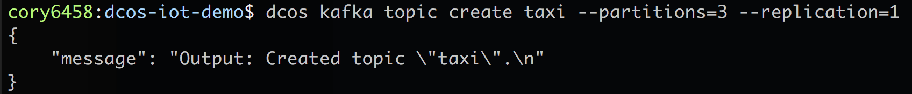 
 <b>Step 9:</b> ... 
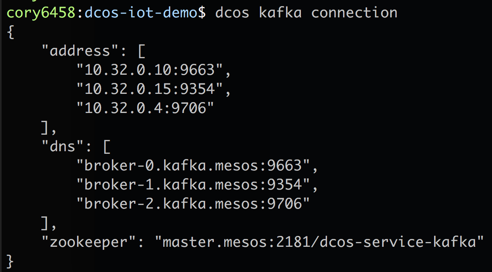 
 <b>Step 10:</b> ... 
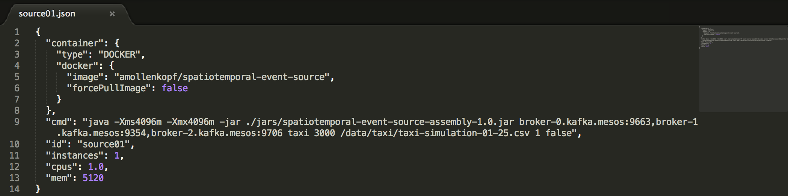 

 <b>Step 11:</b> To schedule a Source that emits events into a Kafka topic's partitions running on a DC/OS cluster issue the following DC/OS CLI command<ul><li>dcos marathon app add spatiotemporal-event-source/source01.json</li></ul>
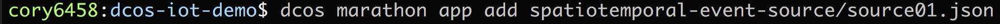 
 <b>Step 12:</b> ... 
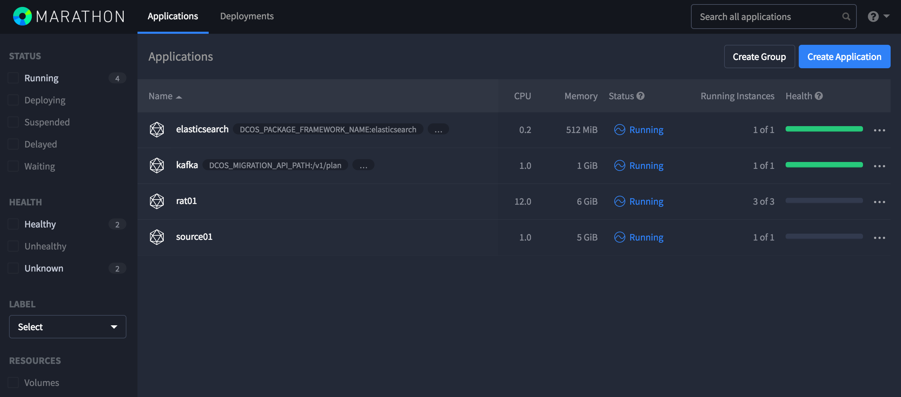 
 <b>Step 13:</b> ... 
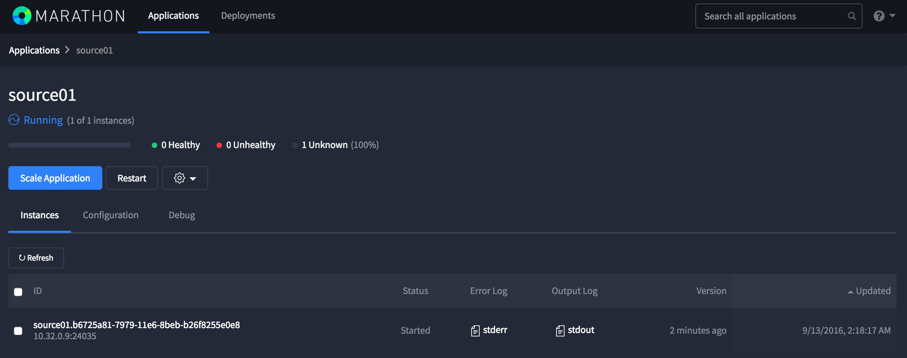 
 <b>Step 14:</b> ... 
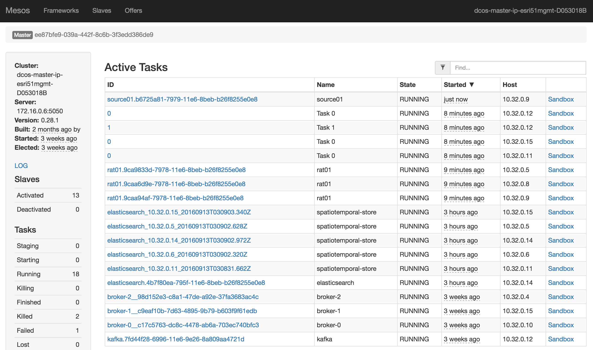 
 <b>Step 15:</b> ... 
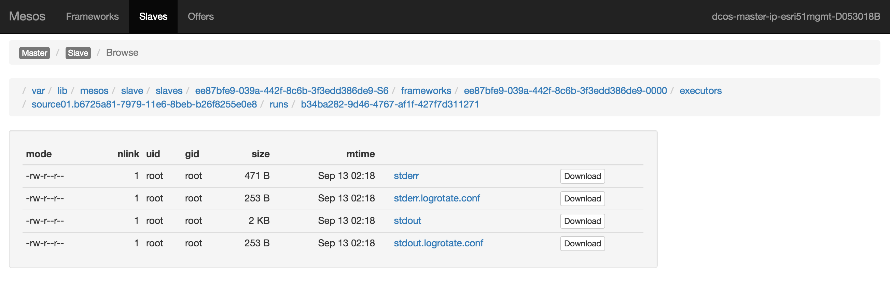 
 <b>Step 16:</b> ... 
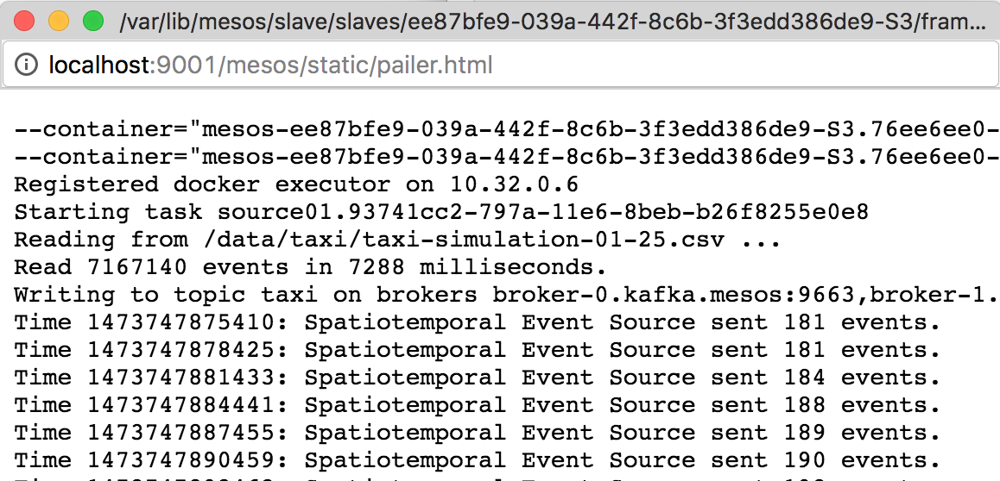 
 <b>Step 17:</b> ... 
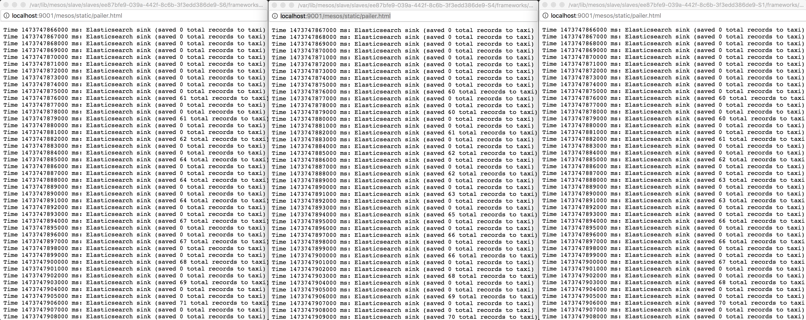 
 <b>Step 18:</b> ... 
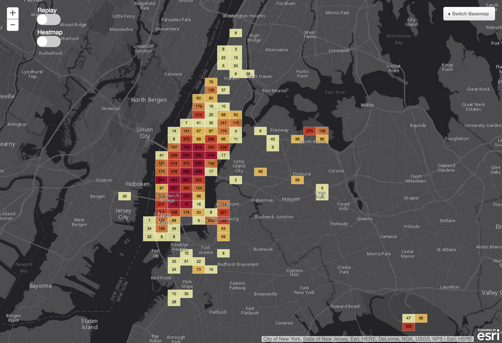 
 <b>Step 19:</b> ... 
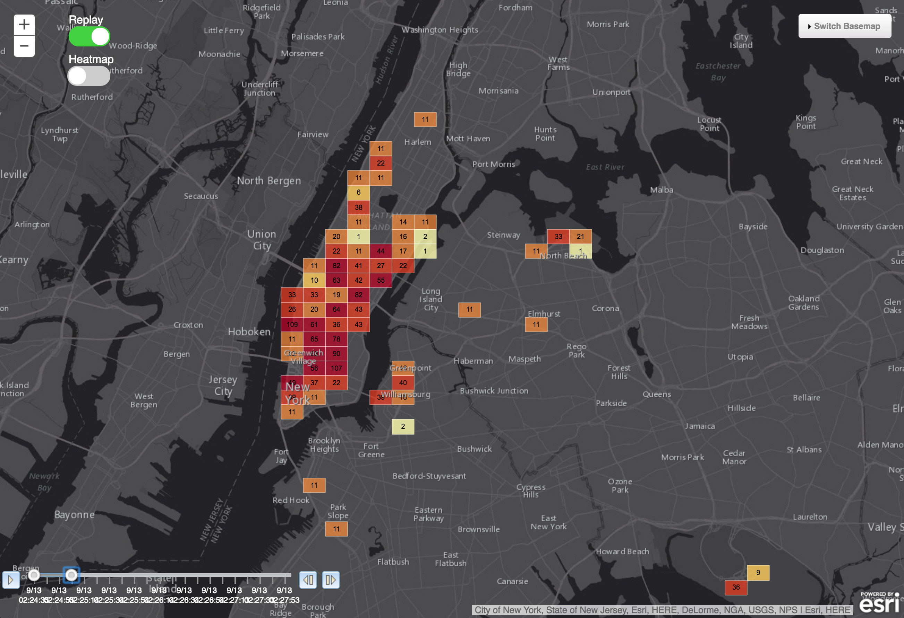 
 <b>Step 20:</b> ... 
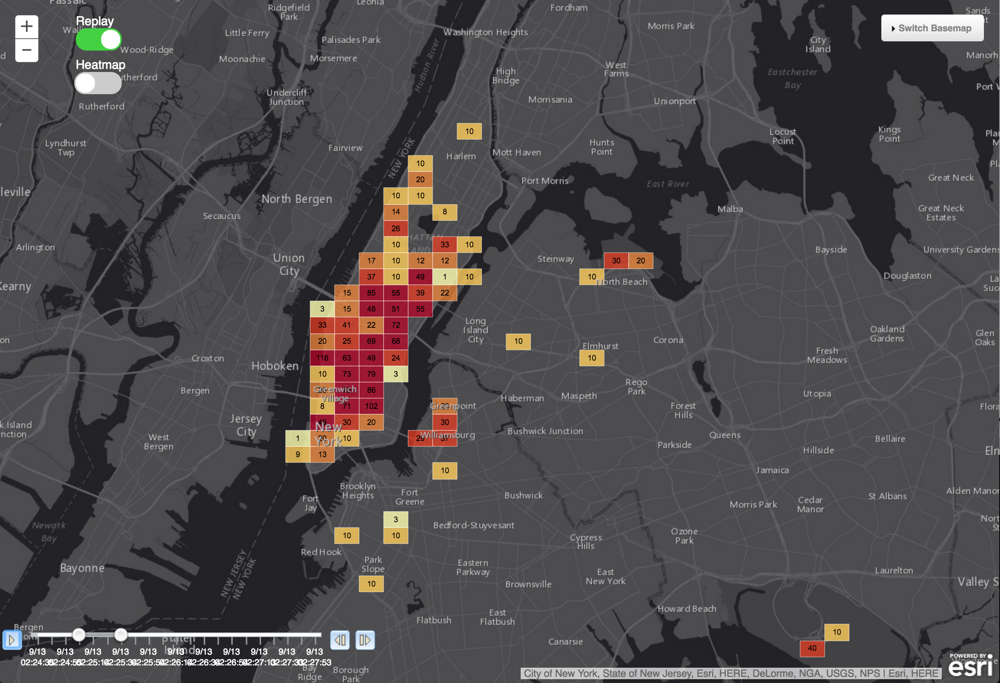 
 <b>Step 21:</b> ... 
 
 <b>Step 22:</b> ... 
 
 <b>Step 23:</b> ... 
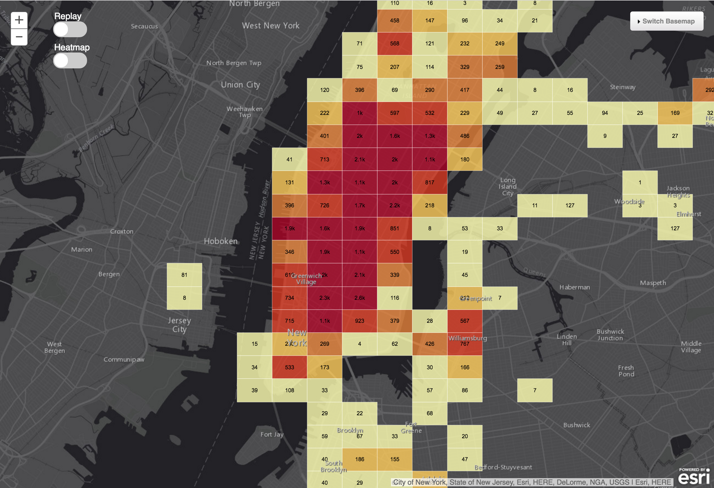 
 <b>Step 24:</b> ... 
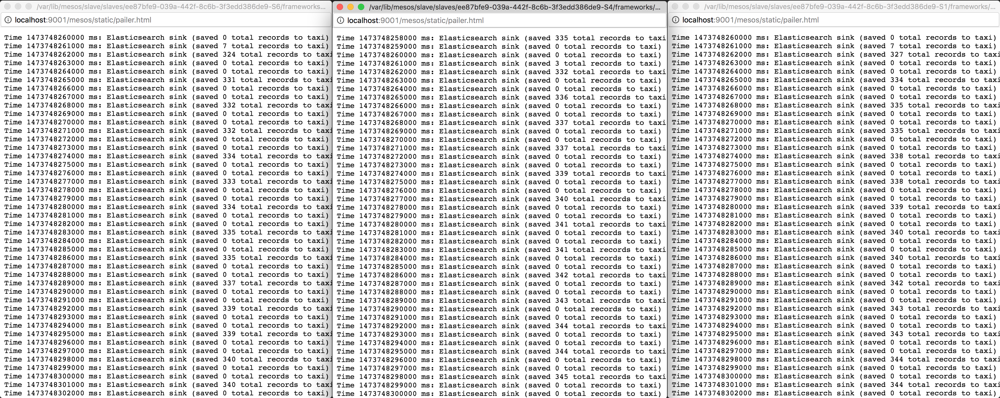 

