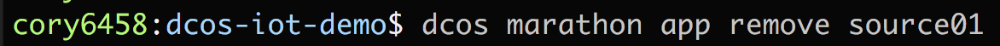
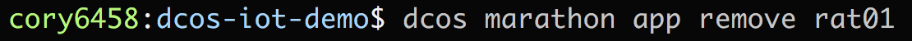
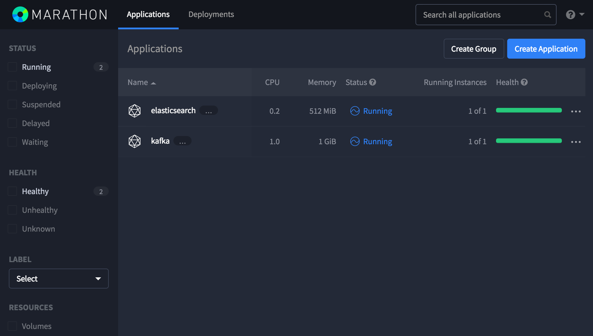
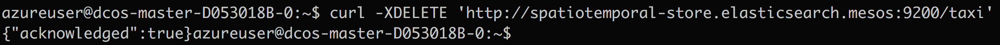
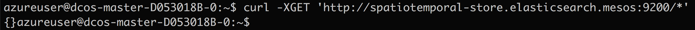

# Applying Cleanup Procedures Between Demo Runs
Often times when you show this demo you may want to start from a zero data situation to best illustrate how data flows in accumulates.  To accomplish this here is a tear down script that will reset all the components necessary to have re-establish a clean data environment. 

<b>Step 1:</b> Remove source01 by issueing the following DC/OS CLI command<ul><li>dcos marathon app remove source01</li></ul>
 
<b>Step 2:</b> Remove rat01 by issueing the following DC/OS CLI command<ul><li>dcos marathon app remove rat01</li></ul>
 
<b>Step 3:</b> Verify that source01 and rat01 are both removed from the application listing in the Marathon dashboard 
 
<b>Step 4:</b> Remove the Elasticsearch index and all of it's assoicated data by issuing the following command from the ssh tunnel shell of the master node <ul><li>curl -XDELETE 'http://spatiotemporal-store.elasticsearch.mesos:9200/taxi'</li></ul>
 
<b>Step 5:</b> Navigate to the Zookeeper Exhibitor dashboard  <ul><li>delete /kafka/consumers/taxi-consumer-group</li></ul>
 

