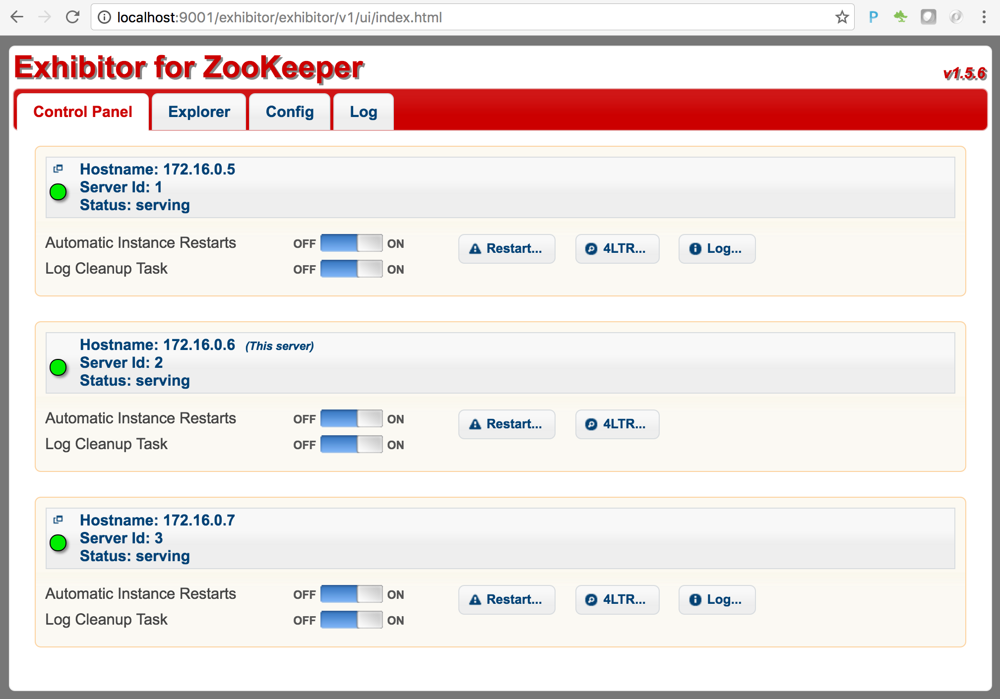
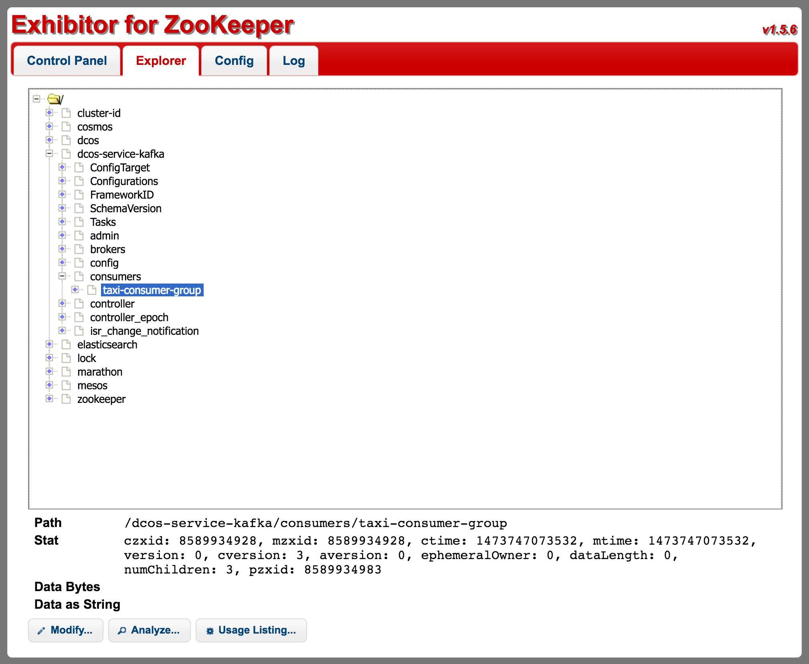
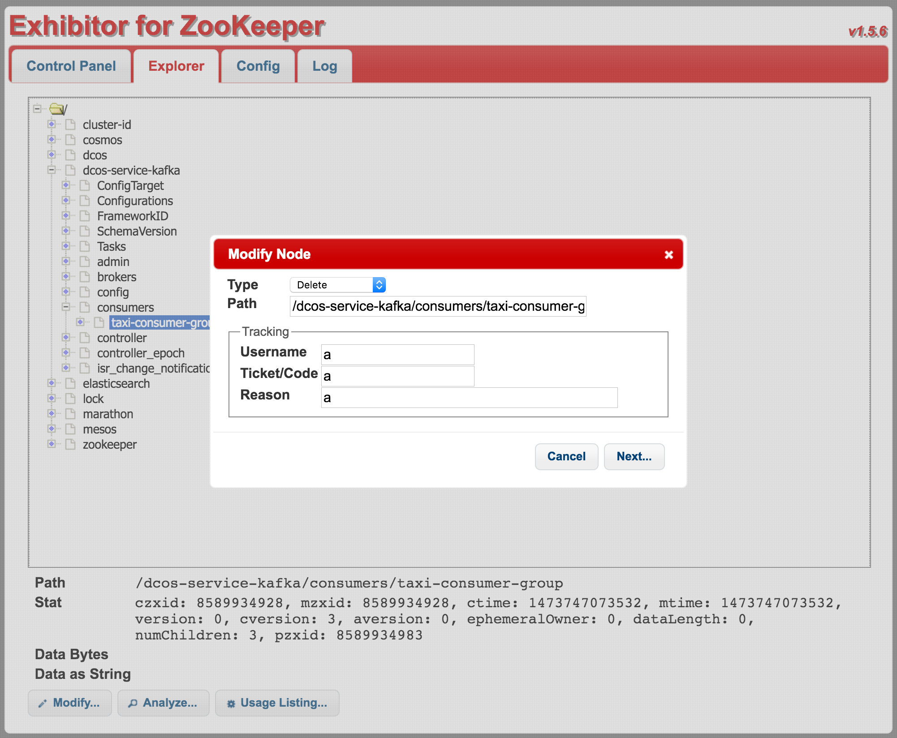
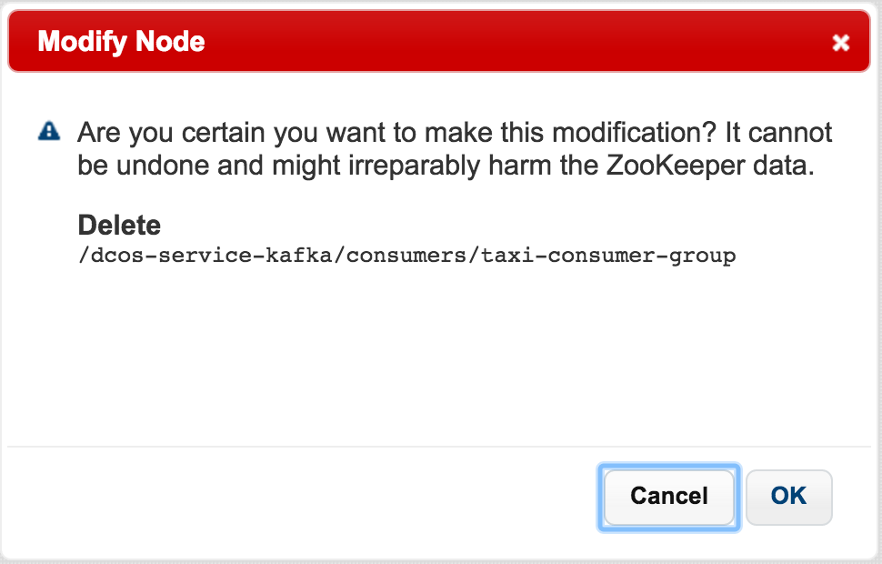

# Applying Cleanup Procedures Between Demo Runs
Often times when you show this demo you may want to start from a zero data situation to best illustrate how data flows in accumulates.  To accomplish this here is a tear down script that will reset all the components necessary to have re-establish a clean data environment. 

<b>Step 1:</b> Remove source01 by issuing the following DC/OS CLI command<ul><li>dcos marathon app remove source01</li></ul>
 
 <b>Step 2:</b> Remove rat01 by issuing the following DC/OS CLI command<ul><li>dcos marathon app remove rat01</li></ul>
 
 <b>Step 3:</b> Verify that source01 and rat01 are both removed from the application listing in the Marathon dashboard 
 
 <b>Step 4:</b> Remove the Elasticsearch index and all of it's assoicated data by issuing the following command from the ssh tunnel shell of the master node <ul><li>curl -XDELETE 'http://spatiotemporal-store.elasticsearch.mesos:9200/taxi'</li>
 
<li>to verify you can run: curl -XGET 'http://spatiotemporal-store.elasticsearch.mesos:9200/*' and see that you get empty results</li>
 
</ul>
 <b>Step 5:</b> Kafka consumer group offsets need to be cleared out so old data is not propogated to consumer when they reconnect using the same consumer group.  To do this the Kafka offsets are managed in the distributed config store state of the DC/OS cluster called Zookeeper.  There is Zookeeper Exhibitor dashboard that can be used to accomplish this.  To connect to Zookeeper Exhibitor:<ul><li>On Azure, with the SSH tunnel in place you can connect to the DC/OS dashboard with <a href="http://localhost:9001/exhibitor">http://localhost:9001/exhibitor</a>.</li>
<li>On Amazon, obtain the public IP address of your master(s) and connect with <your master url>/exhibitor.</li></ul>
 
 <b>Step 6:</b> In Zookeeper Exhibitor click on the 'Explorer' tab, expand the folder, expand the 'dcos-service-kafka' folder, expand the 'consumers' folder, and click on the 'taxi-consumer-group': 
 
 <b>Step 7:</b> With 'taxi-consumer-group' selected click on the 'Modify...' button, in the dialog box select a 'Type' value of 'Delete', fill in the Username/Ticket Code/Reason with a value of 'a' for each, and click the 'Next...' button. 
 
 <b>Step 8:</b> Click 'OK' on the 'Modify Node' confirmation dialog: 
 

 
All previous demo run state is now cleaned up so you can proceed to re-run the demo starting with the instructions at <a href="app-setup.md">schedule a real-time analytic task & a source that emits events</a>.
