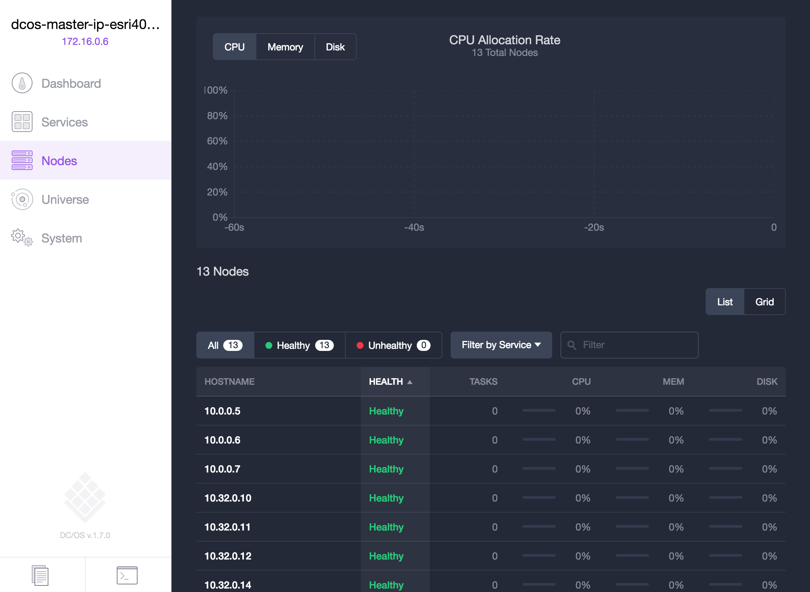
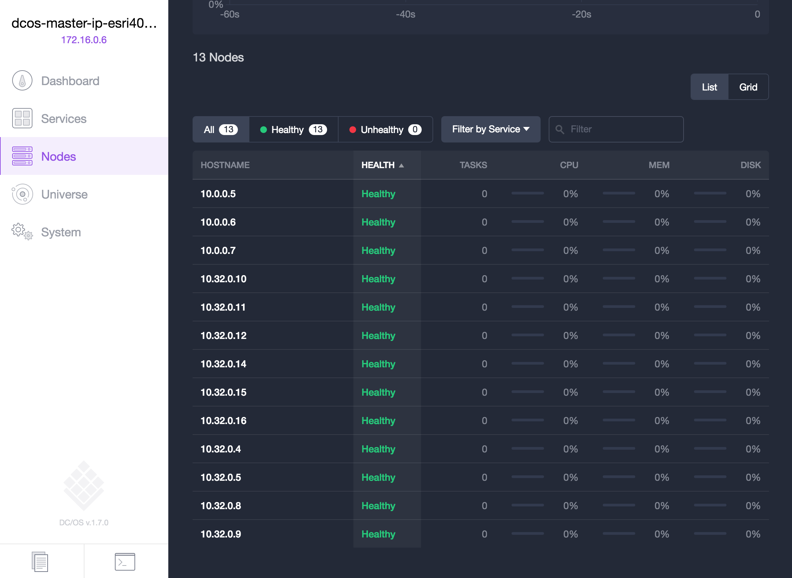
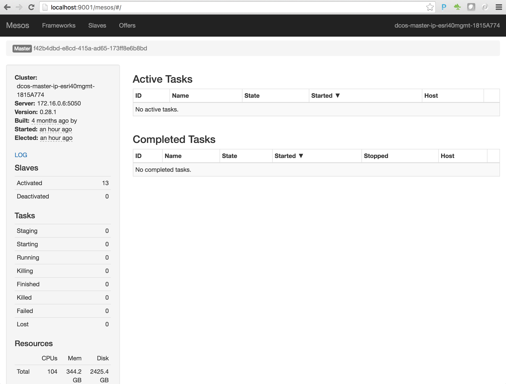

# Explore the DC/OS and Mesos dashboards 

The DC/OS and Mesos dashboards allows you to visualize what has been allocated on the cluster, enables you to manage <a href="https://github.com/mesosphere/universe/tree/version-3.x/repo/packages">packages (Mesos frameworks)</a> that you enable the cluster can use, and to schedule tasks to run on the cluster.

This section provides a brief walk through of the DC/OS & Mesos dashboards and describes what information can be seen and what actions can be performed.

<b>Step 1:</b> Connect to your DC/OS dashboard:<ul>
<li>On Azure, you first need to establish an SSH tunneling session.  To establish a secure SSH tunnel you should use the SSH key created in the previous section along with the value of the 'Public IP address' 'DNS name' of the Mesos master(s).</li></ul>
  <ul>
<li>On Azure, with the SSH tunnel in place you can connect to the DC/OS dashboard with <a href="http://localhost:9001">http://localhost:9001</a>.</li>
<li>On Amazon, obtain the public IP address of your master(s) and connect with &lt;your master url&gt;.</li></ul>
 <b>Step 2:</b> Once connected to your DC/OS dashboard you should see a high level dashboard of your cluster including information about CPU Allocation, Memory Allocation, Task Failure Rate, and Services Health.

<ul><li>CPU Allocation: showing 0 of 104 shares.  We chose 'D4_V2 Standard' (8 cores) instance types for our agent nodes.  104 shares of cpu allocation divided by 8 cores per node = 13 nodes.</li><ul>
<li>10 of these nodes we specified as private agents.  Private agent nodes are the nodes that typically perform the majority of task work that gets scheduled on the cluster.</li>
<li>The other 3 nodes are what was configured as public agents.  Public agent nodes are the the nodes that expose public IPs/ports out publicly and typically are only used for running load balancers such as marathon-lb that balance work to private agents.  While the number of public agents is not an option to specify when creating the cluster it is based on the number of masters you selected.  We specified a 3 master setup which resulted in 3 public agent nodes.  In fact, had we specified 5, 7, or 9 masters we would still get 3 public agent nodes.  The assumption of DC/OS is that if you want a highly available configuration for masters you also want a highly available configuration of public agents.  Likewise, if you selected a 1 master configuration for your cluster you would only get a single public agent.</li></ul>
<li>Memory Allocation: showing 0 B of 344 GiB.  With 13 nodes of 'D4_V2 Standard' (28GiB memory) the cluster has 364 GiB of memory.  DC/OS reserves a portion of the memory for it's own usage which is why we show 344 GiB or roughly 26GiB of memory per node.</li>
<li>Task Failure Rate: shows the rate of tasks (work that is scheduled on the DC/OS cluster) that have failed over time.  With distributed systems failure is a given and DC/OS has measures in place to keep tasks resilient upon failure.  This dashboard widget provides you visibility into failures that have happened over time.</li>
<li>Services Health: Shows the health of services that are running on the cluster.  Initially marathon is the only service on the cluster and is in an Idle state until we submit our first application to marathon.  Marathon is like a distributed init.d for the cluster where we submit apps to it to run and it will make sure they are running and resilient.  We will explore marathon in greater detail throughout this demonstration.</li></ul>
 <b>Step 3:</b> On the DC/OS dashboard click the 'Nodes' tab to see the nodes that are participating in the cluster.
 
  <b>Step 4:</b> Scroll down to see the full listing of nodes participating in the cluster.<ul>
<li>Node hostnames that start with 10.0.0.* are nodes that are participating as public agents node(s).</li>
<li>Node hostnames that start with 10.32.0.* are nodes that are participating as private agents.</li></ul>
 
  <b>Step 5:</b> asdf
 

