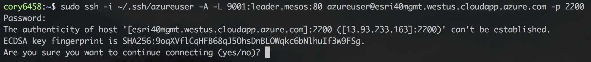

We will now explore the DC/OS and Mesos dashboards. 

The DC/OS dashboards allows you to visualize what has been allocated on the cluster, enables you to manage packages (Mesos frameworks) that the cluster can use, and to schedule tasks to run on the cluster.

This section provides a brief walk through of the DC/OS & Mesos dashboards and describes what information can be seen and what actions can be performed.

To connect to your DC/OS and Mesos dashboards:
* On Amazon, obtain the public IP address of your master(s) and connect to, <your master(s) url>/#/dashboard/.
* On Azure, copy the public IP address of your master(s) and establish an ssh tunneling session with the master.

  <b>Step 16:</b> We will use the 'Public IP address' 'DNS name' value of the DC/OS master(s) to establish a secure SSH tunnel using the SSH key created previously.

  <b>Step 17:</b> If prompted to 'Are you sure you want to continue connecting (yes/no): ', enter 'yes' and hit the Enter key.

  <b>Step 18:</b> Now that we have established an SSH tunnel to the DC/OS master(s) we can now access the DC/OS dashboard via URL in our browser, <a href="http://localhost:9001">http://localhost:9001</a>.

