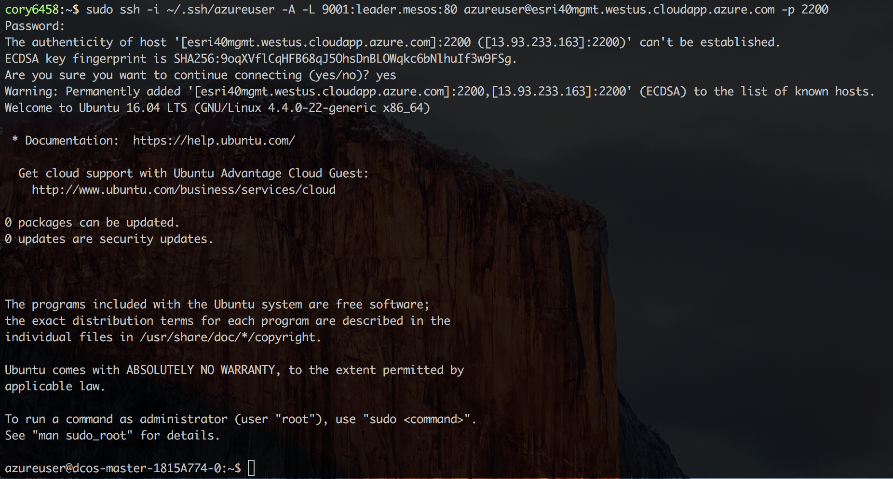
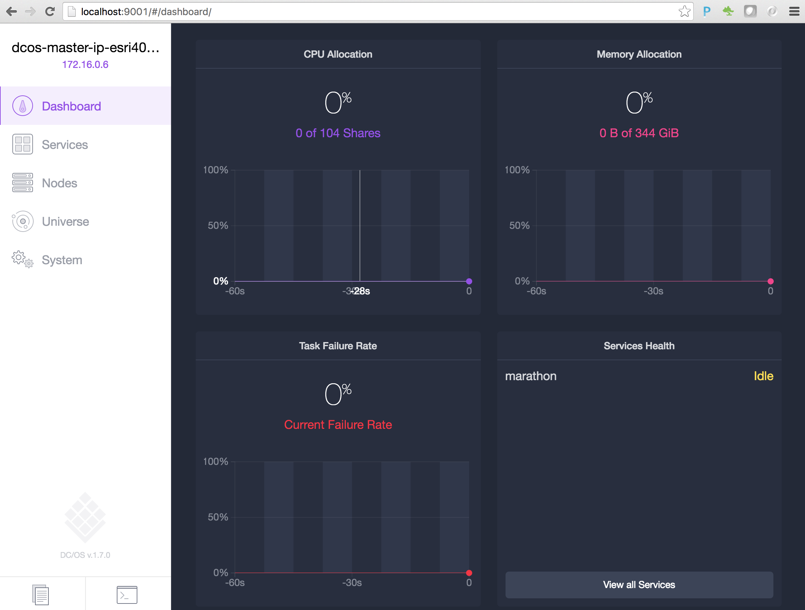

# Explore the DC/OS and Mesos dashboards 

The DC/OS and Mesos dashboards allows you to visualize what has been allocated on the cluster, enables you to manage <a href="https://github.com/mesosphere/universe/tree/version-3.x/repo/packages">packages (Mesos frameworks)</a> that you enable the cluster can use, and to schedule tasks to run on the cluster.

This section provides a brief walk through of the DC/OS & Mesos dashboards and describes what information can be seen and what actions can be performed.

<b>Step 1 (Azure only):</b> We will use the 'Public IP address' 'DNS name' value of the DC/OS master(s) to establish a secure SSH tunnel using the SSH key created previously.

  Now that an SSH tunnel has been established to the DC/OS master(s), the DC/OS dashboard is accessable via a browser at <a href="http://localhost:9001">http://localhost:9001</a>.
  <b>Step 2:</b> To connect to your DC/OS and Mesos dashboards use a browser to connect to:
* On Amazon, obtain the public IP address of your master(s) and connect with <your master(s) url>.
* On Azure, connect with <a href="http://localhost:9001">http://localhost:9001</a>.

