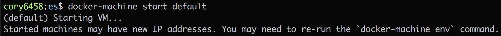
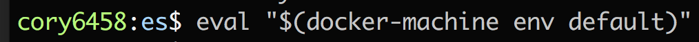
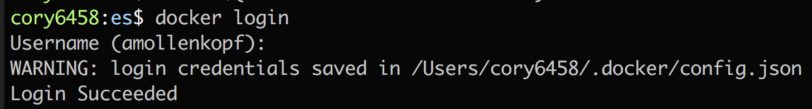
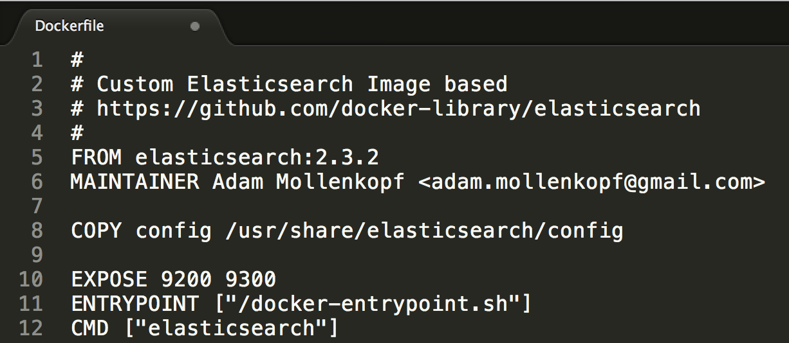
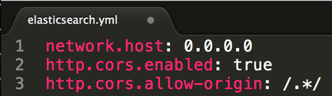
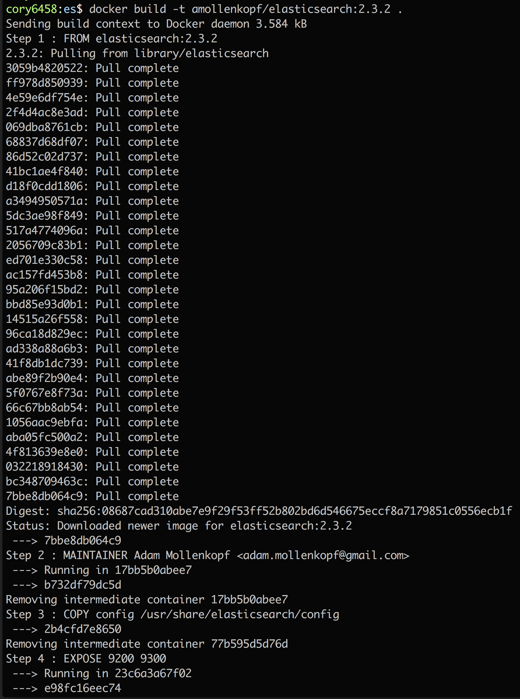
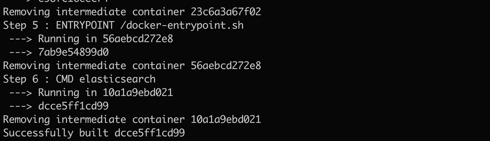
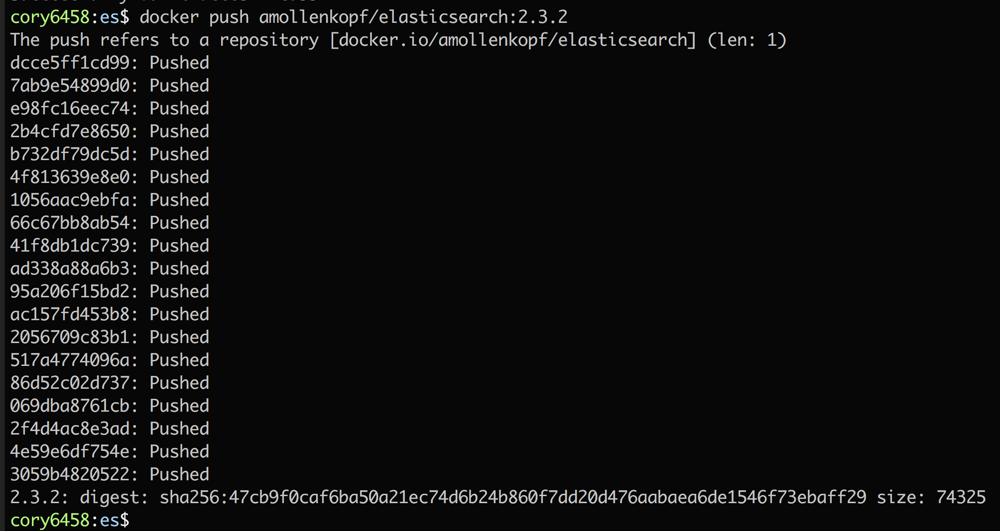

# How to create your own Elasticsearch docker image with CORS enabled

<b>Step 1:</b> Startup docker on your local machine. 
 
 <b>Step 2:</b> Update your environment context for the docker your just started. 
 
 <b>Step 3:</b> Login to <a href="https://hub.docker.com/">Docker Hub</a> with your credentials so that we can ultimately push the Docker image to your public repository. 
 
 <b>Step 4:</b> Change to the <a href="../es-docker">dcos-iot-demo/es-docker</a> directory. 
 
 <b>Step 5:</b> Review the <a href="../es-docker/Dockerfile">dcos-iot-demo/es-docker/Dockerfile</a> 
 
Breaking down this Dockerfile we are:<ul><li>starting FROM a base <a href="https://github.com/docker-library/elasticsearch">Elasticsearch Image</a></li><li>updating the base image's /usr/share/elasticsearch/config folder with the contents of <a href="../es-docker/config">dcos-iot-demo/es-docker/config</a>, which is just an <a href="../es-docker/config/elasticsearch.yml">elasticsearch.yml</a> config file that contains the configuration needed to enable <a href="https://www.w3.org/TR/cors/">Cross-Origin Resource Sharing</a> 
</li>
<li>exposing the normal <a href="https://www.elastic.co/guide/en/elasticsearch/guide/current/_talking_to_elasticsearch.html">Elasticsearch ports for 9200 & 9300</a></li><li>defining the entry point</li><li>specifying the command to run when the Docker image starts</li></ul>
 <b>Step 6:</b> ... 
 
 
 <b>Step 8:</b> ... 
 
