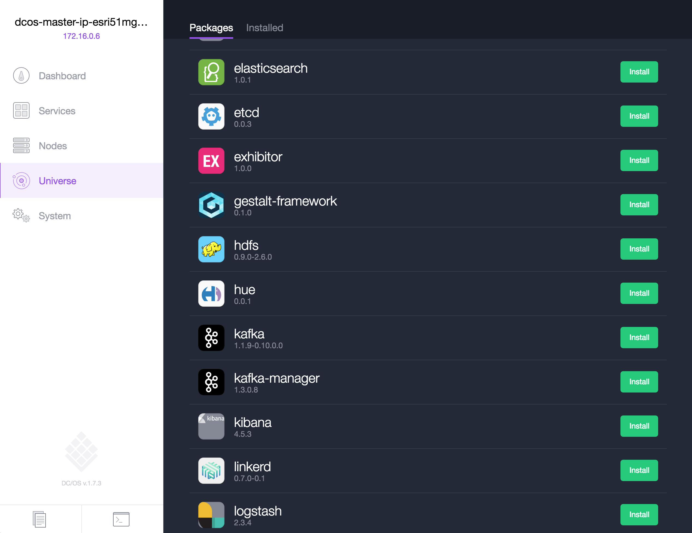
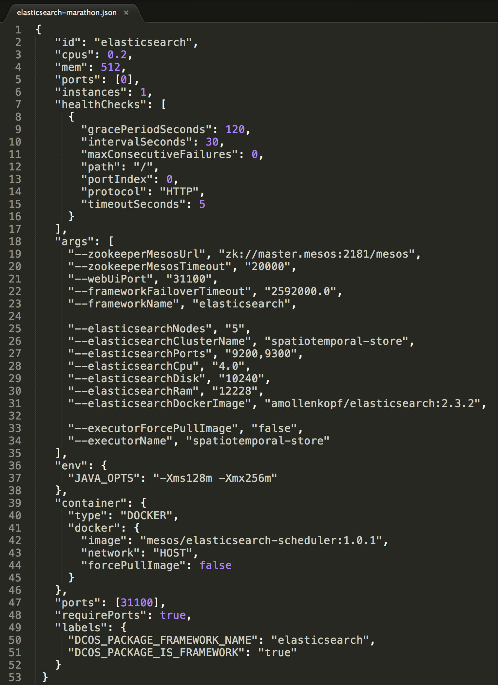
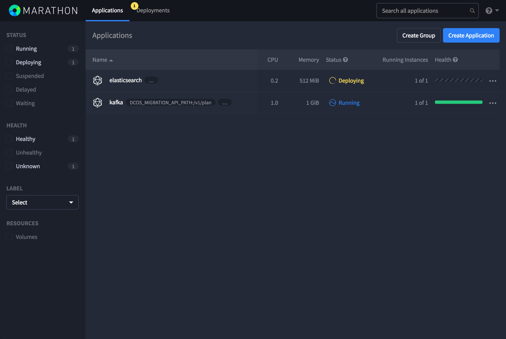
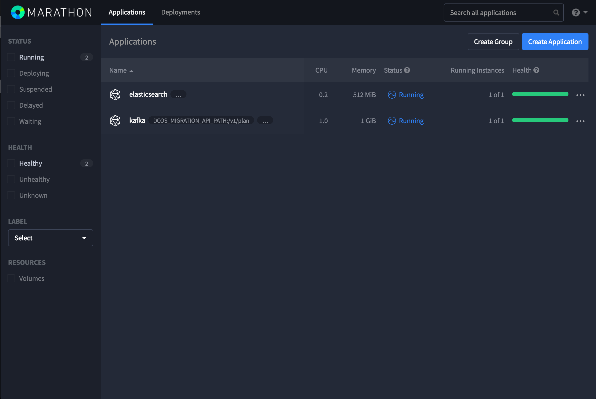
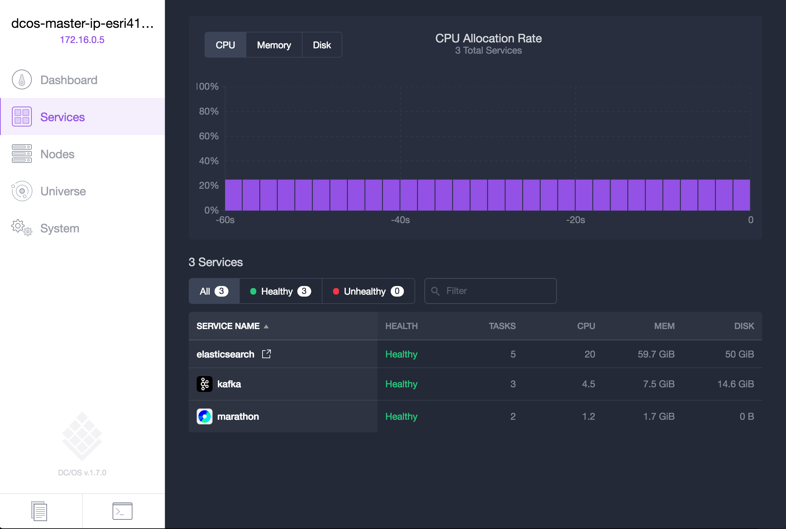
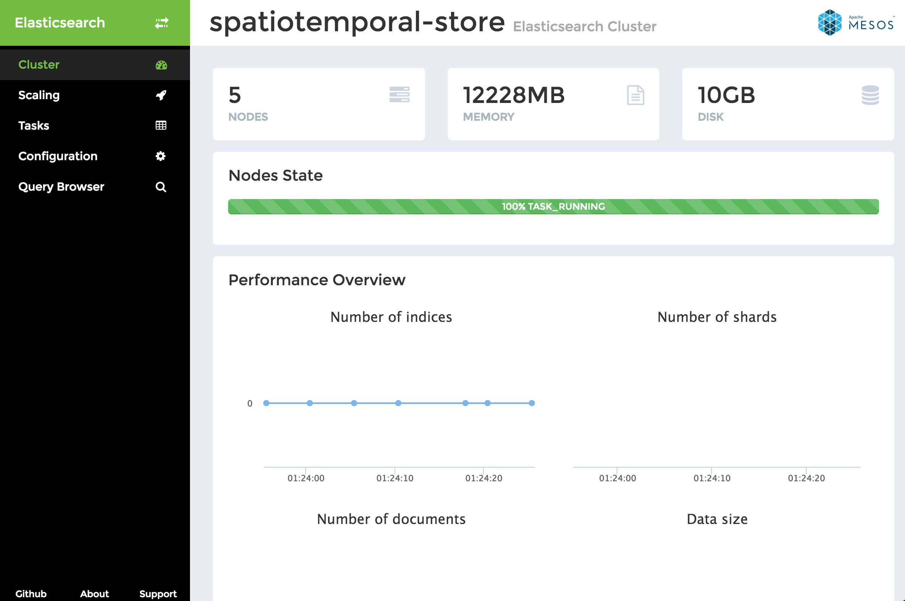
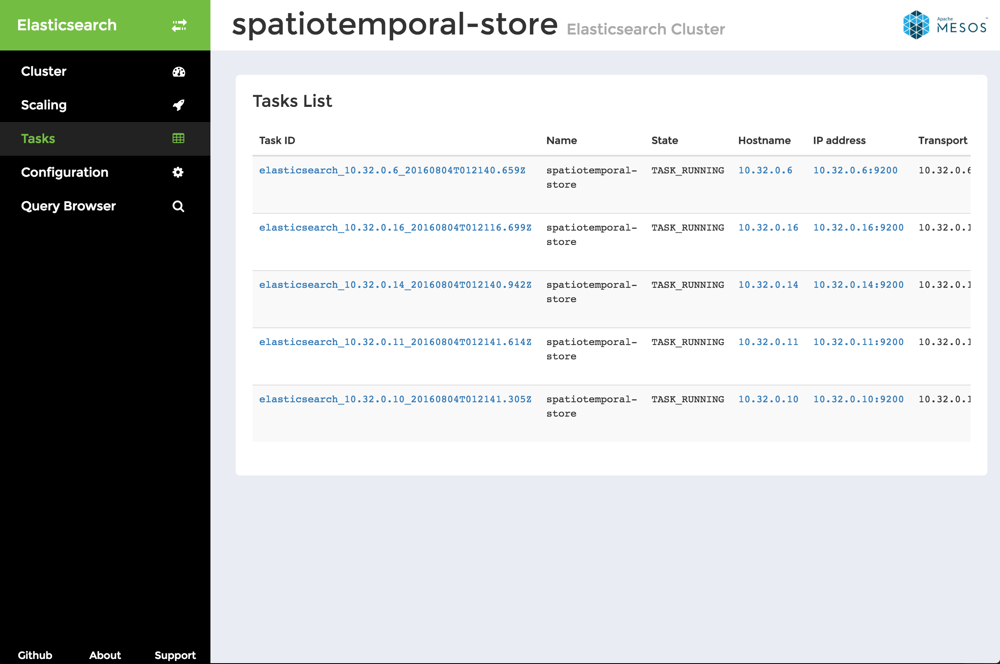
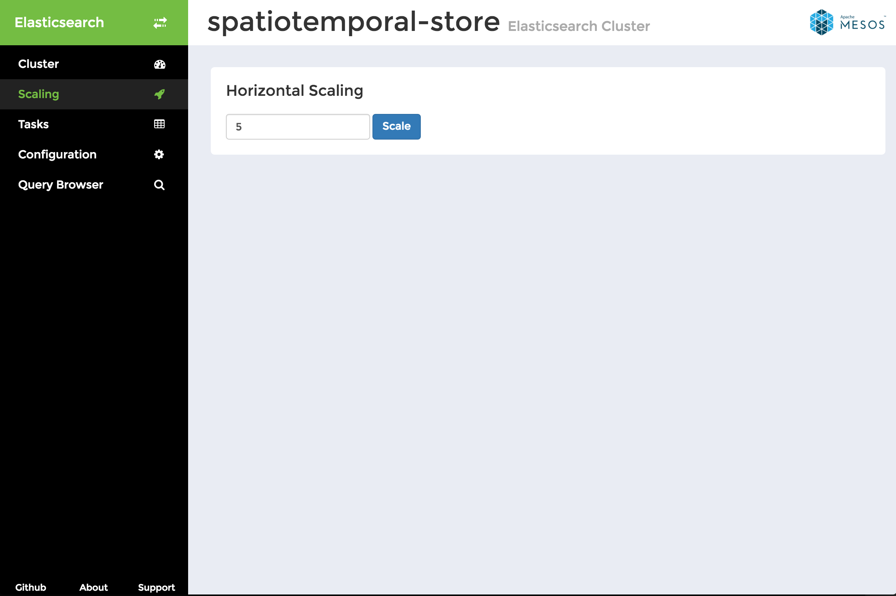

# Install Elasticsearch & Schedule a Cluster

<b>Step 1:</b> Elasticsearch can be installed via the Universe.  However, we will NOT be installing it via Universe as we need to make a small modification to Elasticsearch that is unfortunately not exposed by the Elasticsearch package parameters.

  <b>Step 2:</b> The small modification that is needed is to enable <a href="https://www.w3.org/TR/cors/">Cross-Origin Resource Sharing (CORS)</a> so that the JavaScript web map app (that we will use in later steps) can establish a line of communication with Elasticsearch. A Docker image <a href="https://hub.docker.com/r/amollenkopf/elasticsearch/">amollenkopf/elasticsearch</a> has been created and provided for you to work with that has the appropriate configuration in place.  If you prefer to create your own Docker image instead of using the provided one, see the <a href="es-setup-docker.md">How to create your own Elasticsearch docker image with CORS enabled</a> instructions.
  <b>Step 3:</b> To establish an Elasticsearch cluster with the CORS setting in place we will make use of the <a href="https://hub.docker.com/r/amollenkopf/elasticsearch/">amollenkopf/elasticsearch:2.3.2</a> Docker image and schedule the cluster to run via <a href="https://github.com/mesosphere/marathon">Marathon</a>.  Prior to doing this lets review the contents of the file we will submit to Marathon <a href="../elasticsearch-marathon.json">elasticsearch-marathon.json</a>. 
 
Properties worth a more detailed review include:
<ul><li>"id": the name of the Elasticsearch workers that will be shown in the DC/OS Service listing.</li>
<li>"args": "--elasticsearchNodes": the # of Elasticsearch data nodes you would like your cluster to be provisioned with.</li>
<li>"args": "--elasticsearchClusterName": the name that you would like to give your Elasticsearch cluster.</li>
<li>"args": "--elasticsearchCpu": the amount of cores that you would like to allocate per Elasticsearch data node.</li>
<li>"args": "--elasticsearchDisk": the amount of disk that you would like to allocate per Elasticsearch data node.</li>
<li>"args": "--elasticsearchRam": the amount of memory that you would like to allocate per Elasticsearch data node.</li>
<li>"args": "--elasticsearchDockerImage": the Elasticsearch image to utilize when provisioning data nodes.</li>
<li>"args": "--executorName": the name that you would like to give to the Elasticsearch executor, shown in the Application listing of Marathon.</li></ul>
 <b>Step 4:</b> To schedule an Elasticsearch cluster with Marathon on DC/OS submit the following command via the DC/OS CLI: 'dcos marathon app add <a href="../elasticsearch-marathon.json">elasticsearch-marathon.json</a>'. 

  <b>Step 5:</b> The progress of the Elasticsearch executor scheduling can be seen by navigating to the Marathon UI. 

  <b>Step 6:</b> Once the Elasticsearch executor has been scheduled it will show as running in the Marathon UI. 

  <b>Step 7:</b> Navigating to the DC/OS Service tab we can now see a service for 'elasticsearch'.  Hovering over the text of the 'elasticsearch' service presents a popout icon that we can click on to view more details of Elasticsearch cluster in a new browser tab. 

  <b>Step 8:</b>... 

  <b>Step 9:</b>... 

  <b>Step 10:</b>... 

