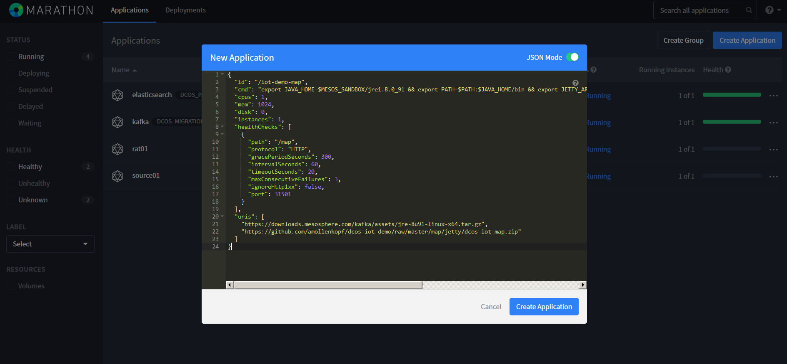
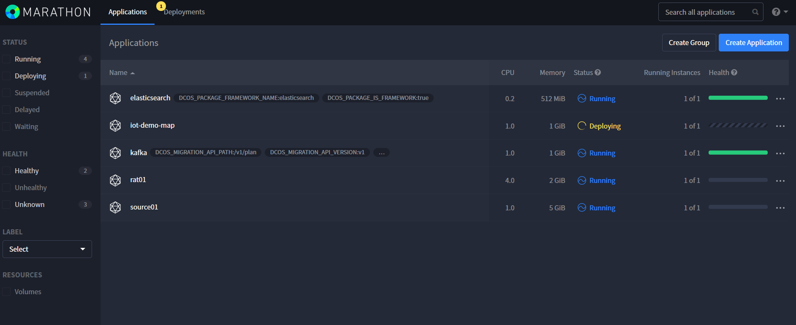
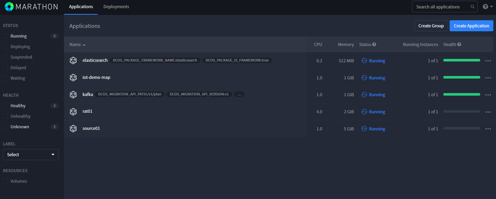

# Deploy Web Map in Marathon 

<b>Step 1:</b> Deploy the app using Marathon.

From Marathon click Create Application.  Click on "JSON Mode"; then replace the json with <a href="../map/jetty/dcos-iot-map.json">dcos-iot.map.json. </a>

## Highlist of JSON
- The "cmd" sets JAVA_HOME and adds it to the PATH. Defines a JETTY_ARGS to set the app port then runs Jetty.
- The "uri" is the path to the JRE and dcos-iot.app.zip. These are downloaded when Marathon starts the application. The JRE is retrieved from Kafka assets. The dcos-iot.app.zip is retrieved from the github project. Details on how the app was created can be found <a href="../map/jetty/README.md".
- The "healthChecks" verify the app is running on port 31501.

Click Create Application. 

After a minute or two the app should be "Green" and running.

<b>Step 2:</b> Create Tunnels

Use this command to create a tunnel to the application (31501) and to Elasticsearch (9200)
$ ssh -i ~/.ssh/azure -L 31501:iot-demo-map.marathon.mesos:31501-L 9200:spatiotemporal-store.elasticsearch.mesos:9200 azureuser@esri51mgmt.westus.cloudapp.azure.com -p 2200

<b> Step 3:</b> Access the App

Now you can use your browser to navigate to http://localhost:31501/map.

