# Install Kafka & schedule brokers

<b>Step 1:</b> In the DC/OS dashboard navigate to 'Universe'.  The 'Universe' is where you can manage what packages (mesos frameworks) your cluster can make use of.
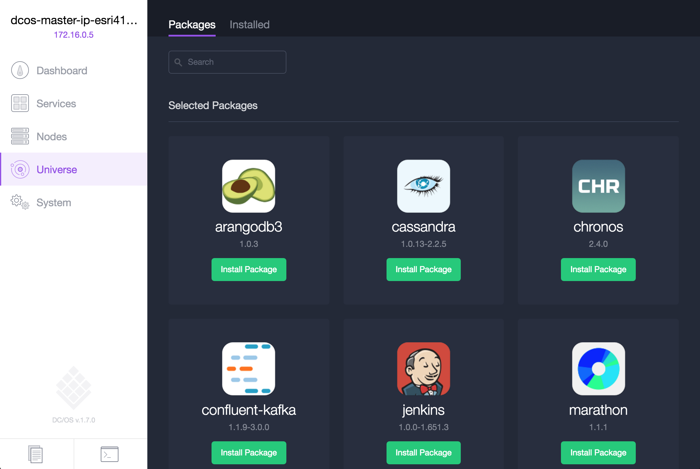
  <b>Step 2:</b> Scroll down in the 'Universe' package listings to find the 'Kafka' package and click it's corresponding 'Install' button.
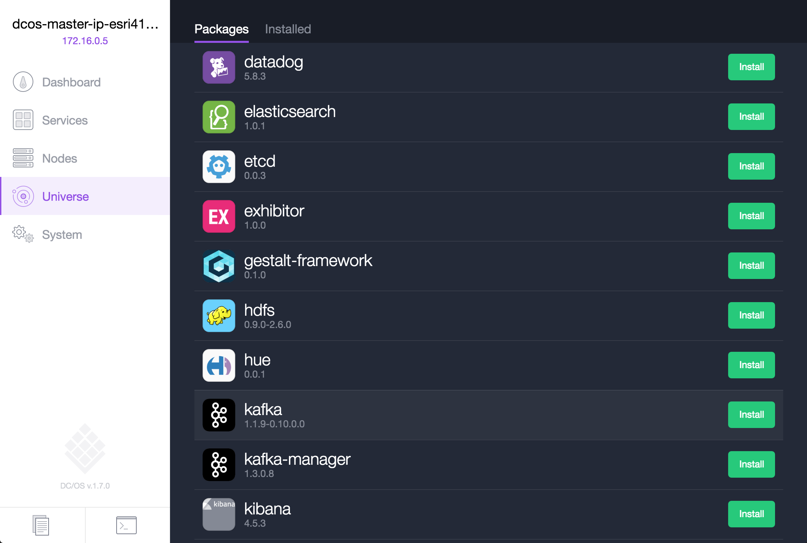
  <b>Step 3:</b> Click the 'Install Package' button to start the package installation process.
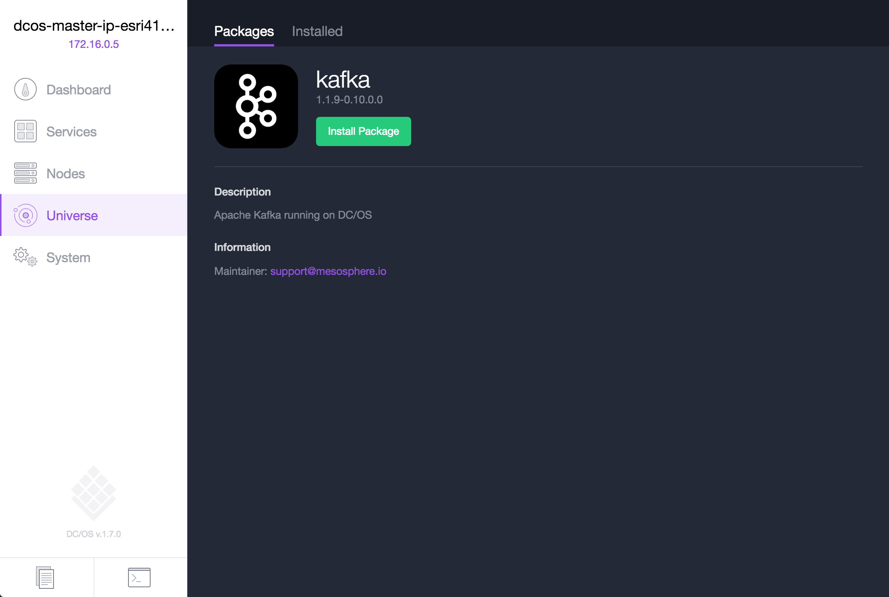
  <b>Step 4:</b> Click the 'Advanced Installation' link to fine tune the installation parameters.
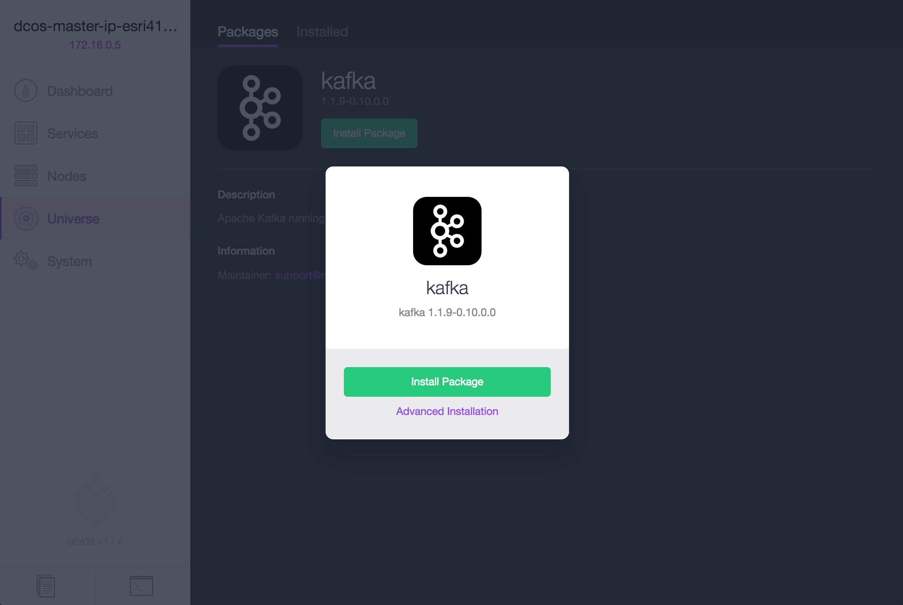
  <b>Step 5:</b> Click the 'service' parameter group, scroll through it's available options, and keep all defaults.
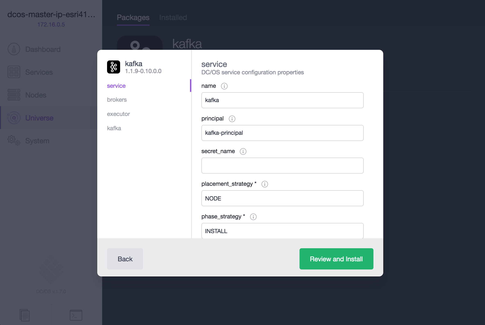
  <b>Step 6:</b> Click the 'brokers' parameter group and scroll through it's available options.
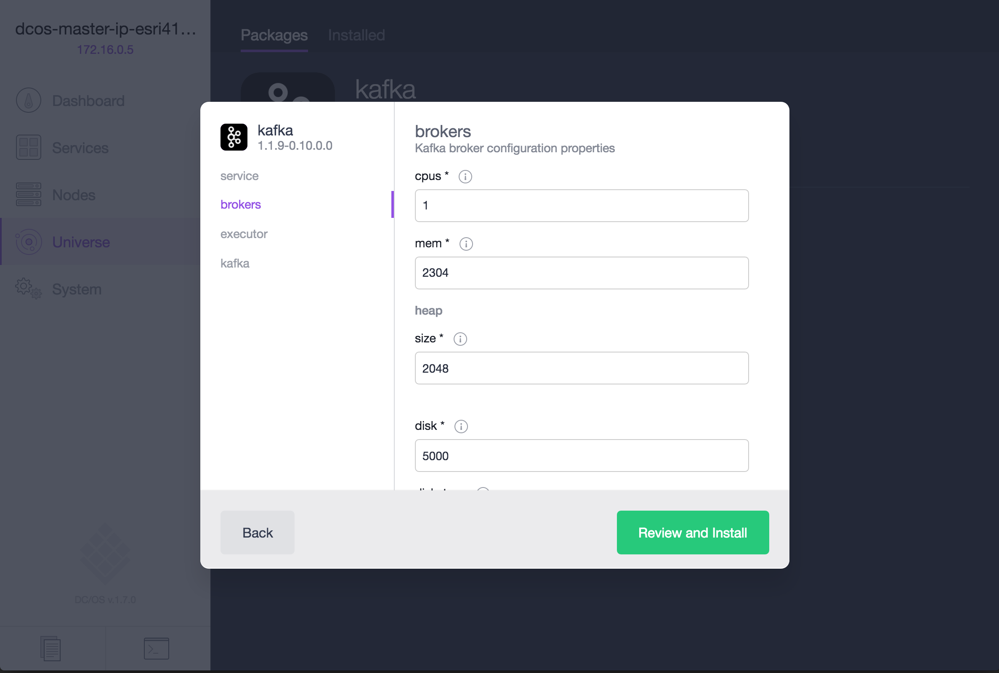
  <b>Step 7:</b> Find the 'count' parameter and change the value to the number of brokers you desire, for the purpose of the demo we will keep the default of '3'.
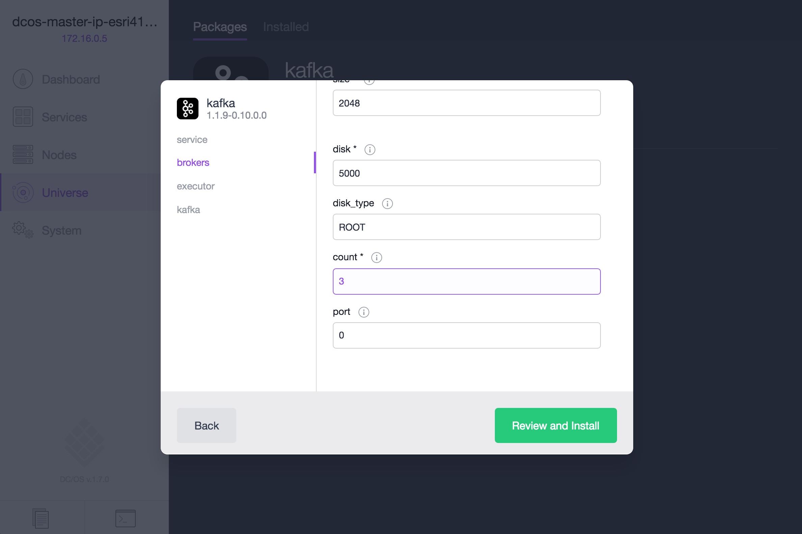
  <b>Step 8:</b> Click the 'kafka' parameter group and scroll through it's available options.
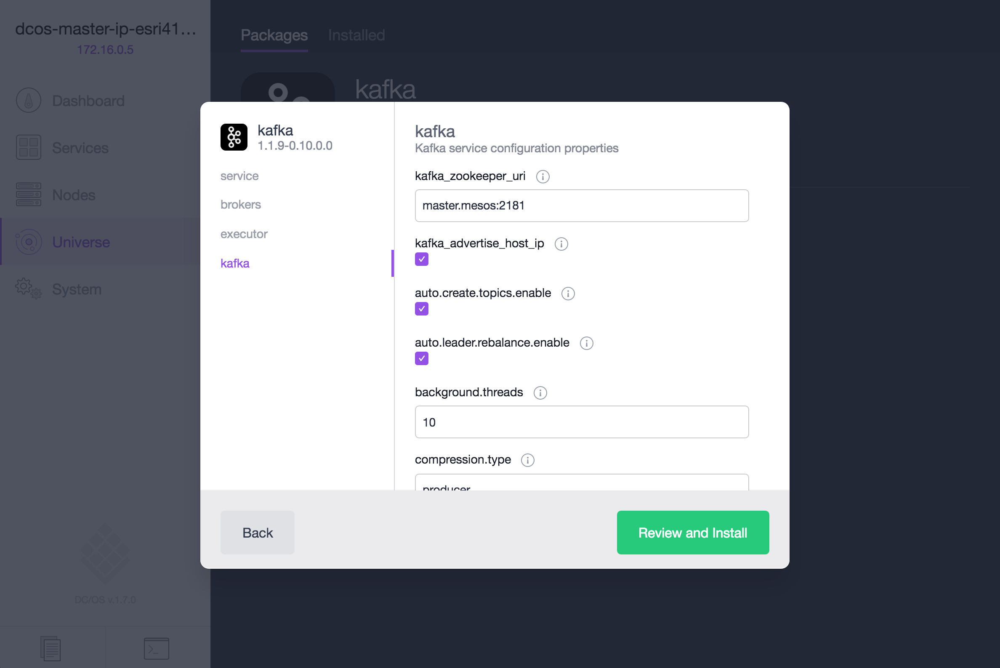
  <b>Step 9:</b> Find the 'delete.topic.enable' parameter and enable it so that we will be able to delete topics between demo runs.
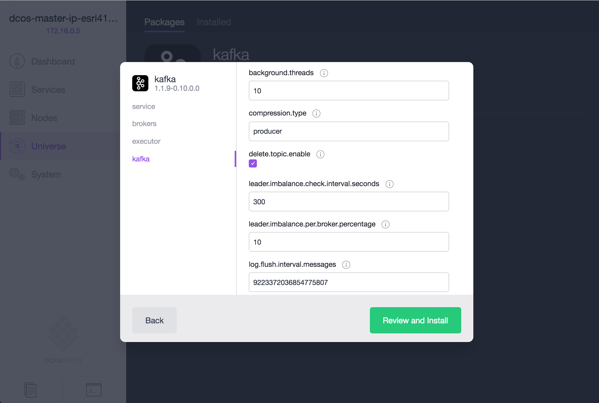
  <b>Step 10:</b> Click the 'Review and Install' button and review the parameters values.

  <b>Step 11:</b> Click the 'Install' button to install the package and click the 'Acknowledge (check)' button.
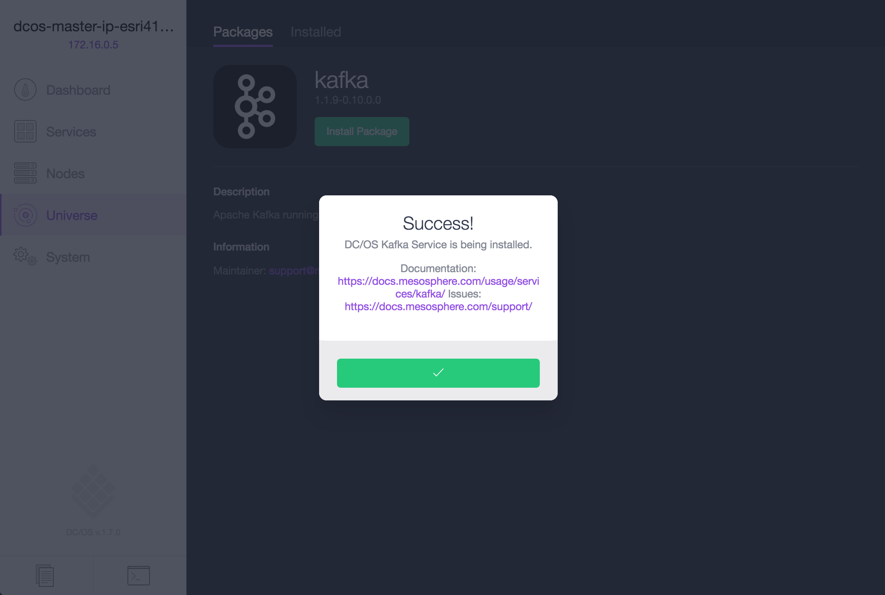
  <b>Step 12:</b> In the DC/OS dashboard navigate to 'Services'.  The 'Services' tab is where you can monitor what services have been scheduled and are running on the DC/OS cluster.  Notice there is a Service named 'kafka' that now appears.
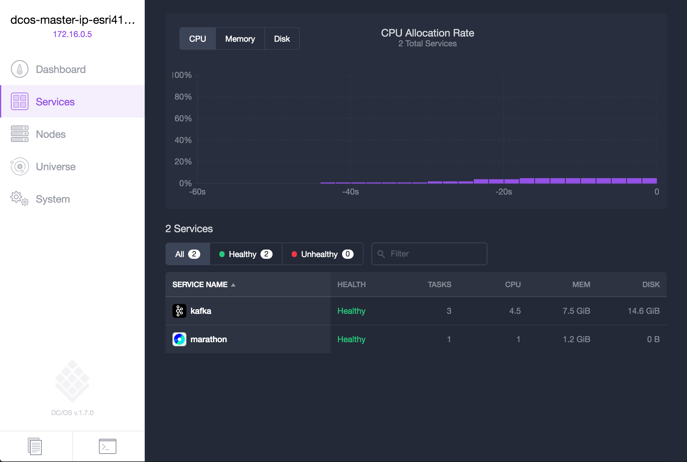
  <b>Step 13:</b> Click on 'kafka' in the service listing to open up more information on the 'kafka' service.  Here we can see the three brokers, their names, their status, and the resources that have been allocated to them.

  <b>Step 14:</b> Install the dcos-cli (Command Line Interface).

  <b>Step 15:</b> Using the dcos-cli we can interact with Kafka.  Type 'dcos kafka --help' to see the available commands. 
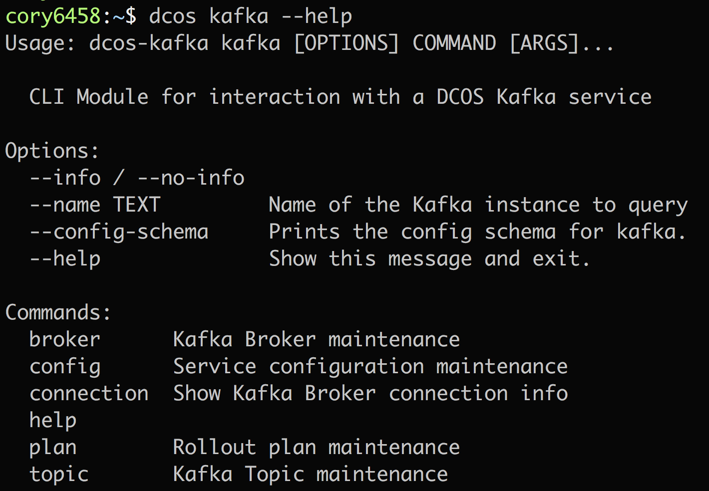
  <b>Step 16:</b> You can get a listing of broker names.  Type 'dcos kafka broker list'. 
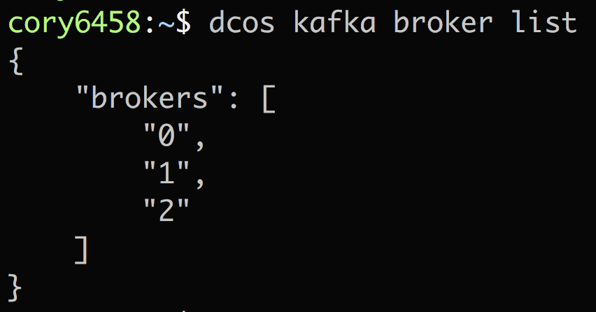
  <b>Step 17:</b> You can get connection details which is needed information to share with Kafka producers.  Type 'dcos kafka connection'. 
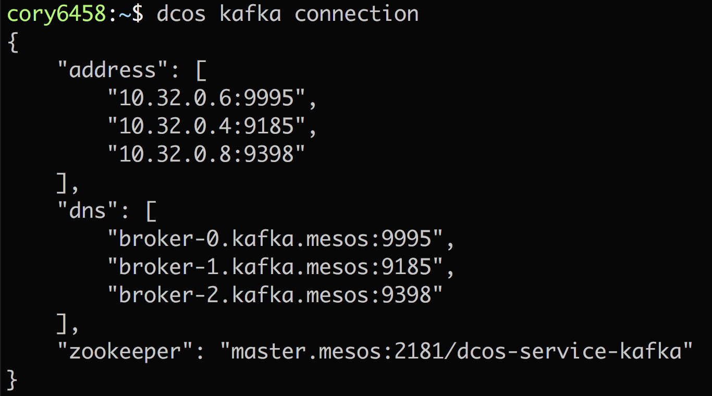

  <b>Congratulations:</b> You now have Kafka installed with three brokers ready to receive data on the DC/OS cluster.  Next, we will walk through how to <a href="../docs/es-setup.md">Install & schedule an Elasticsearch cluster</a>

