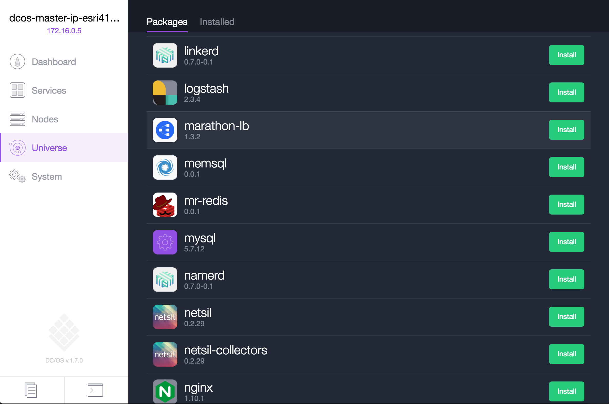
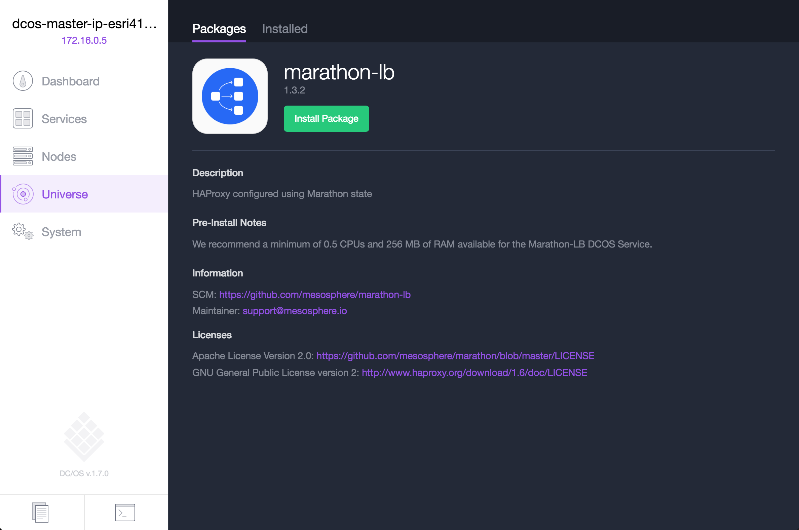
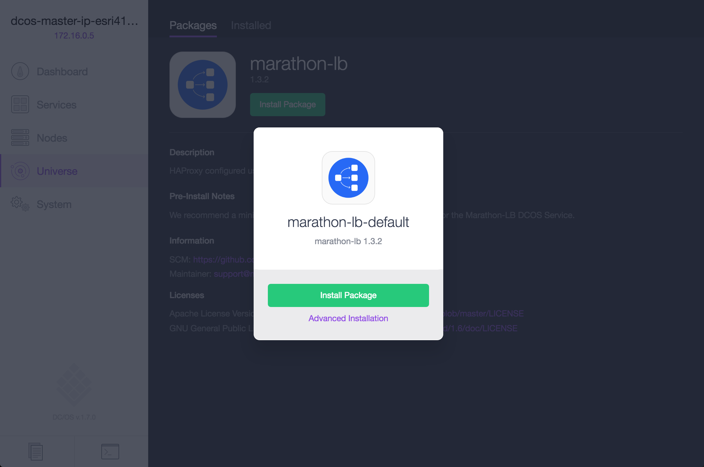
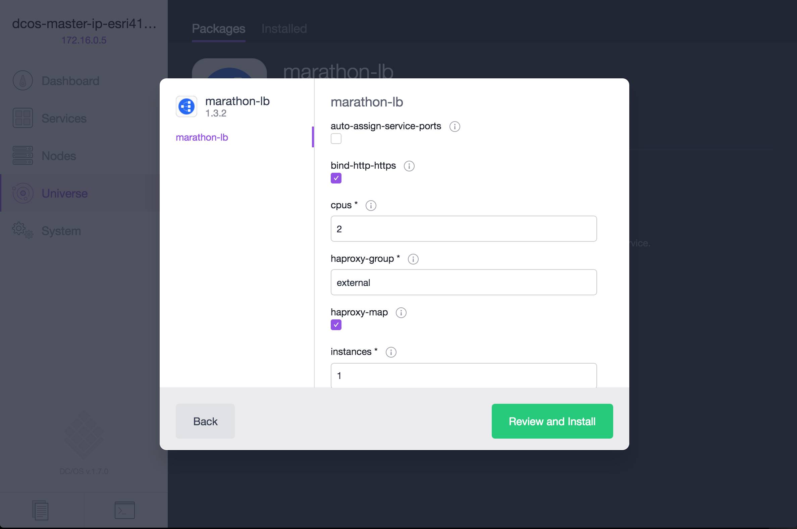
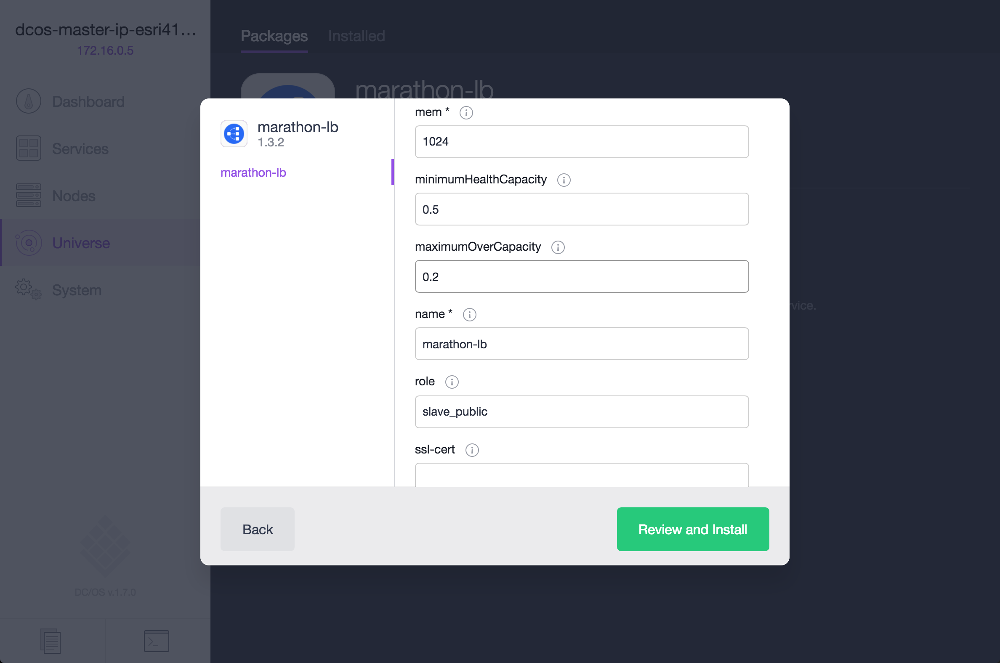
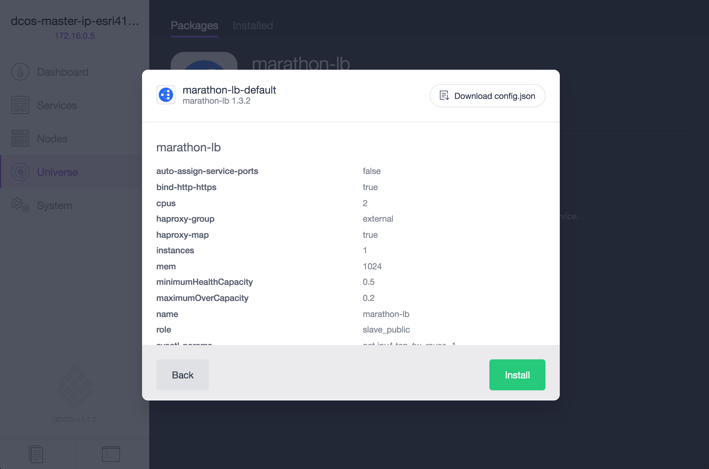
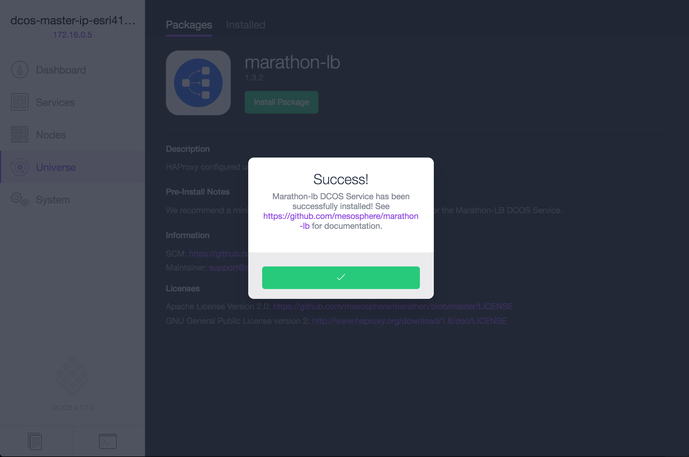
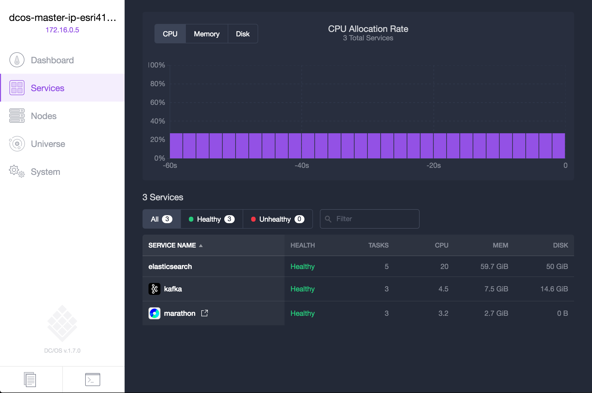
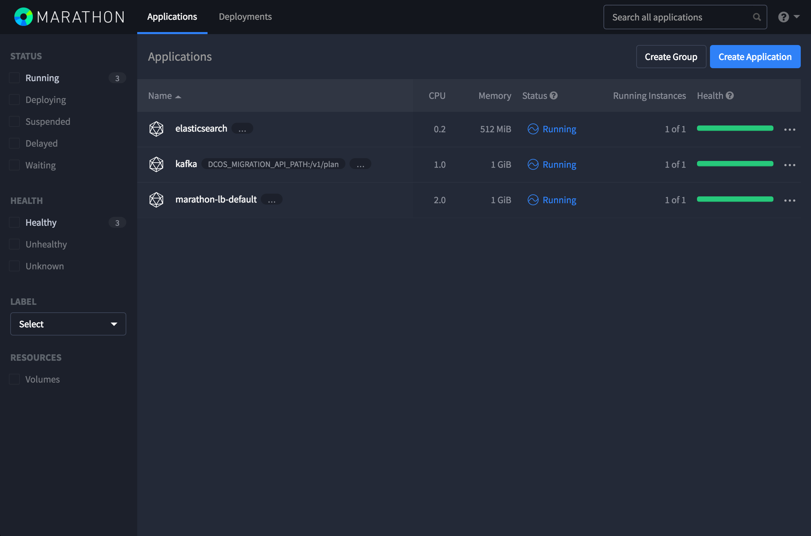
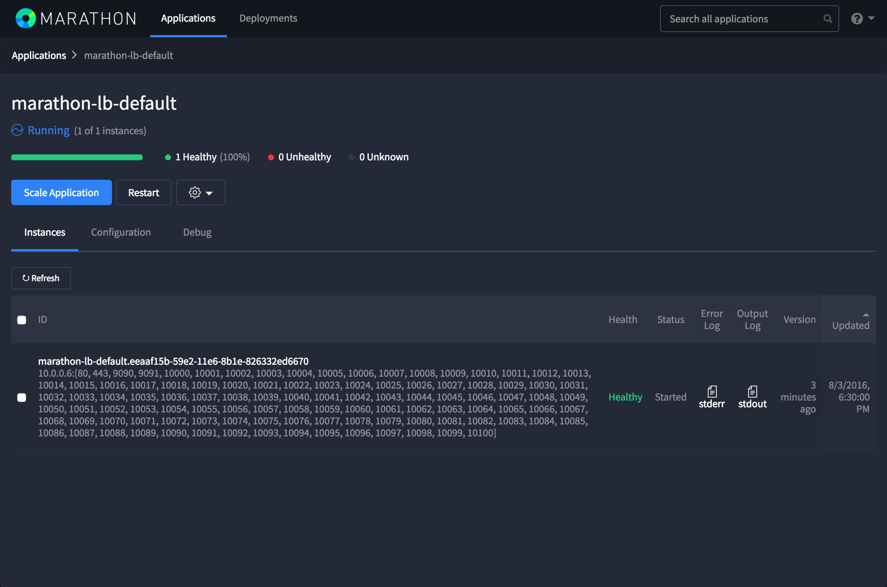

# Schedule a Load Balancer to run on Public Agents

<b>Step 1:</b> ...
 
 <b>Step 2:</b> ...
 
 <b>Step 3:</b> ...
 
 <b>Step 4:</b> ...
 
 <b>Step 5:</b> ...
 
 <b>Step 6:</b> ...
 
 <b>Step 7:</b> ...
 
 <b>Step 8:</b> ...
 
 <b>Step 9:</b> ...
 
 <b>Step 10:</b> ...
 
 <b>Step 11:</b> ...
 

  <b>Congratulations:</b> You now have a load balancer (marathon-lb) installed on public agents are ready to load balance application requests on the DC/OS cluster.  Next, we will walk through how to Open up Load Balancer Ports on either <a href="../docs/ports-setup.md">Microsoft Azure or <a href="../docs/ports-amazon-setup.md">Amazon Web Services</a>.

