# Open up Load Balancer Ports on Microsoft Azure

<b>Step 1:</b>  ...
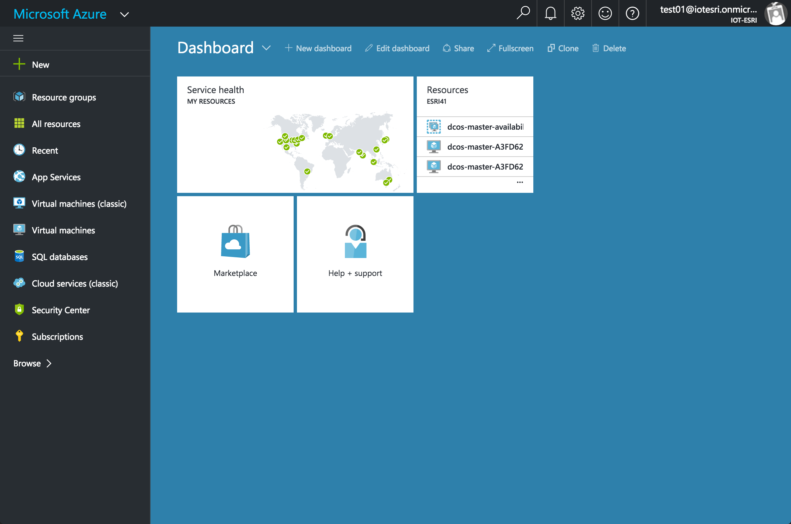 
 <b>Step 2:</b> ...
 
 <b>Step 3:</b> ...
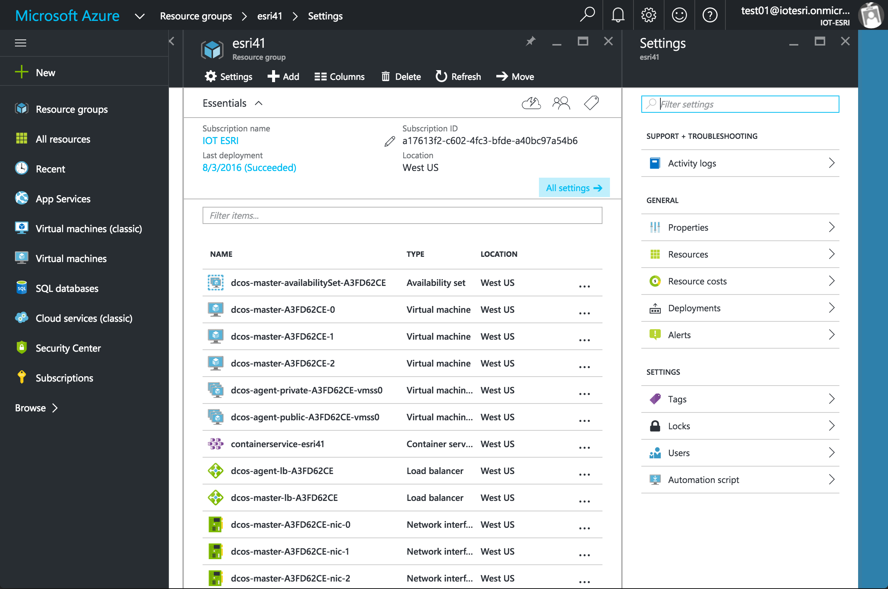 
 <b>Step 4:</b> ...
 
 <b>Step 5:</b> ...
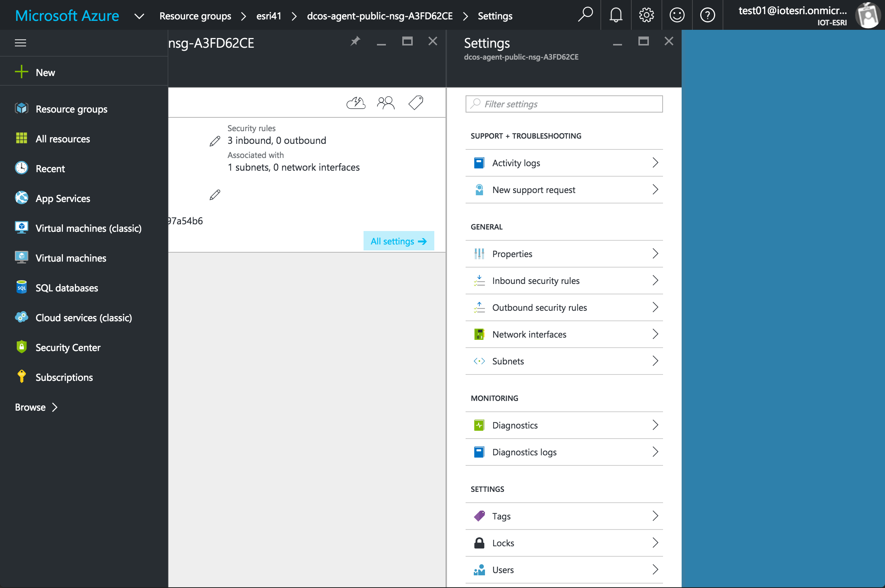 
 <b>Step 6:</b> ...
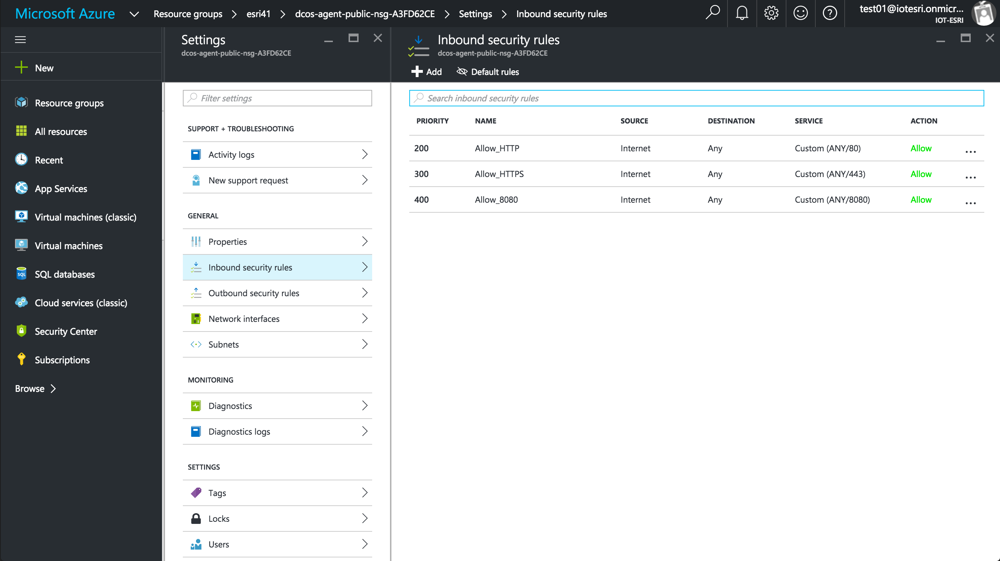 
 <b>Step 7:</b> ...
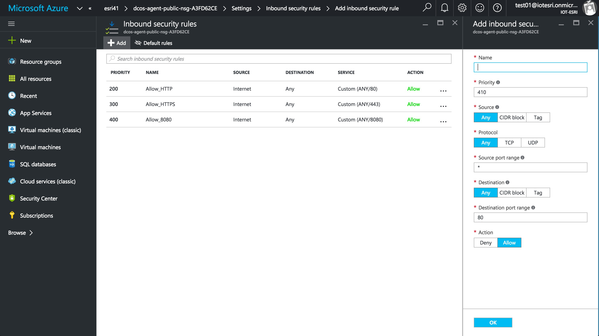 
 <b>Step 8:</b> ...
 
 <b>Step 9:</b> ...
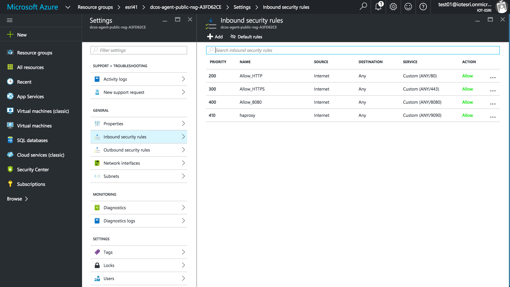 
 <b>Step 10:</b> ...
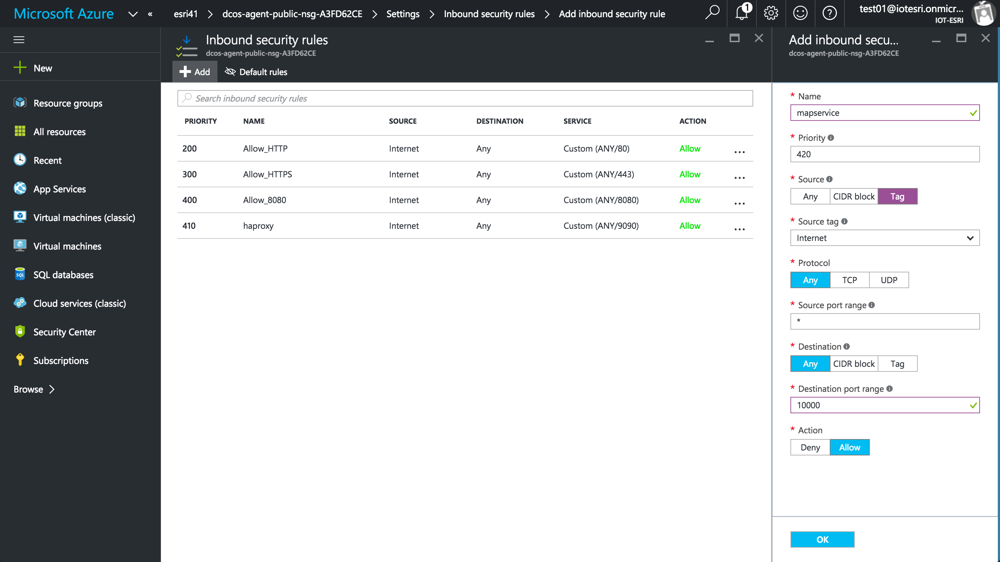 
 <b>Step 11:</b> ...
 
 <b>Step 12:</b> ...
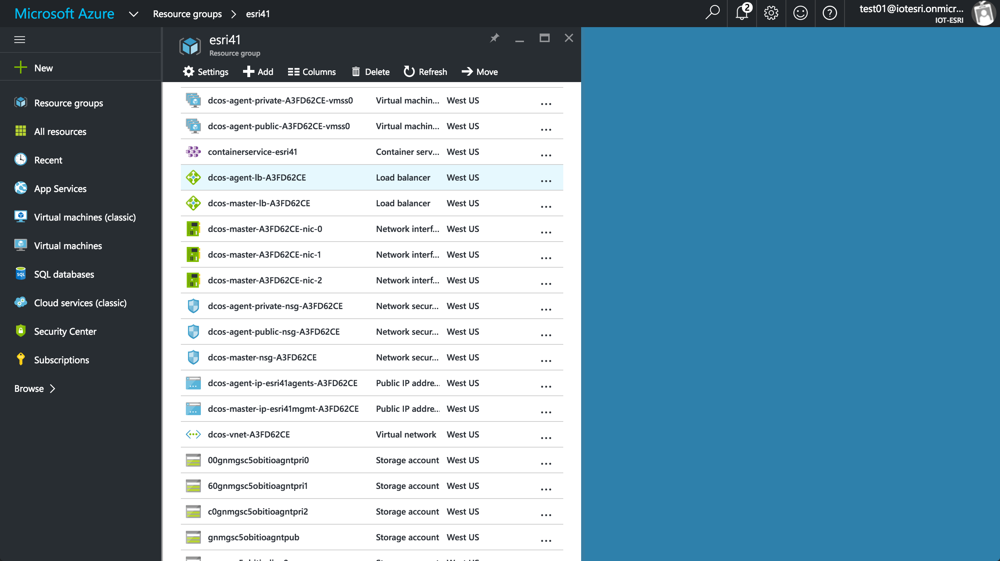 
 <b>Step 13:</b> ...
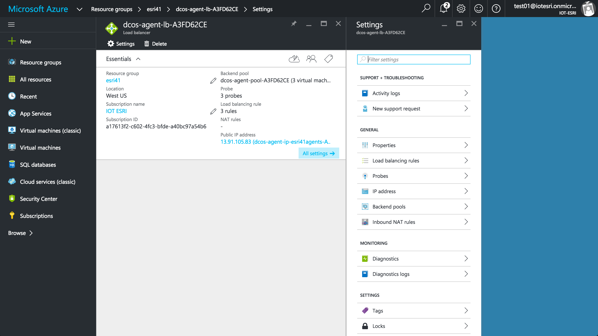 
 <b>Step 14:</b> ...
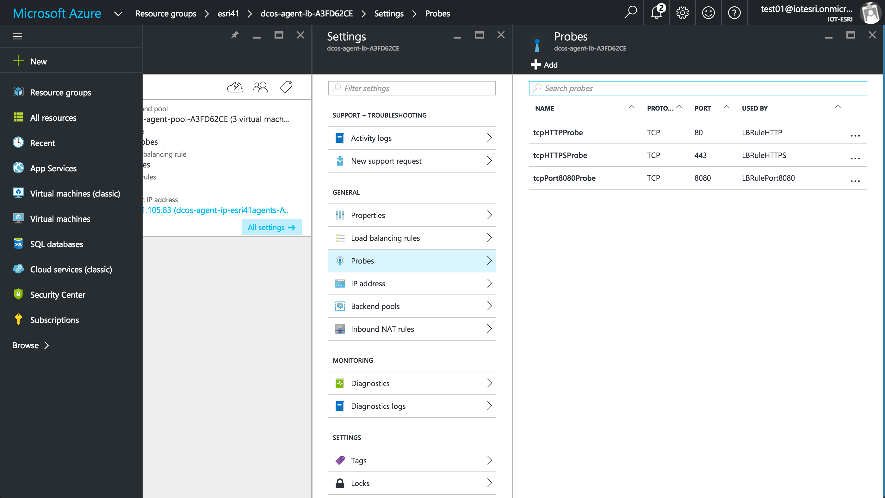 
 <b>Step 15:</b> ...
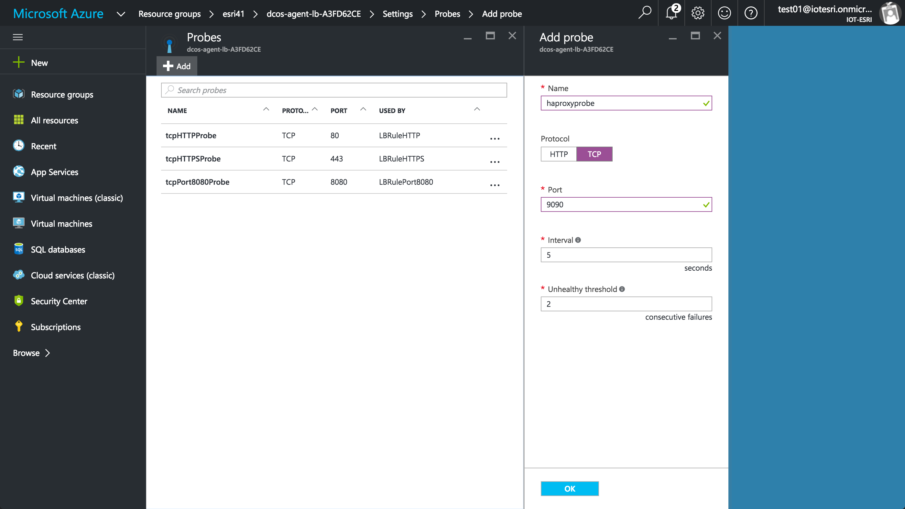 
 <b>Step 16:</b> ...
 
 <b>Step 17:</b> ...
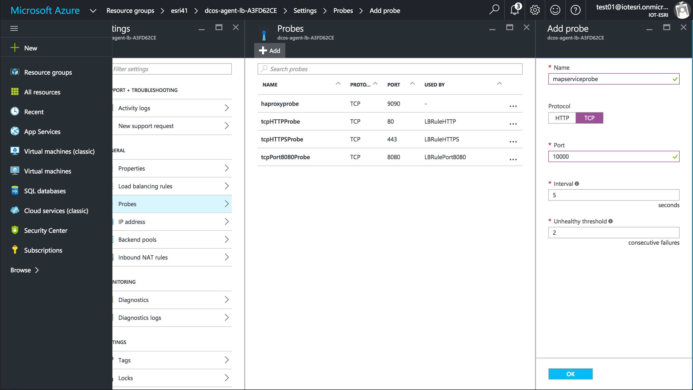 
 <b>Step 18:</b> ...
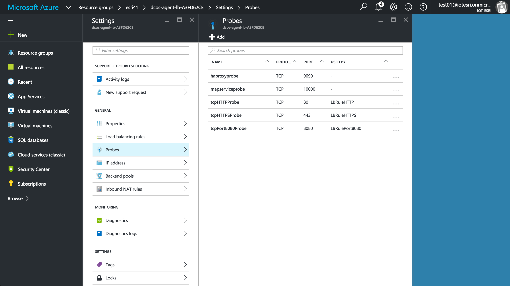 
 <b>Step 19:</b> ...
 
 <b>Step 20:</b> ...
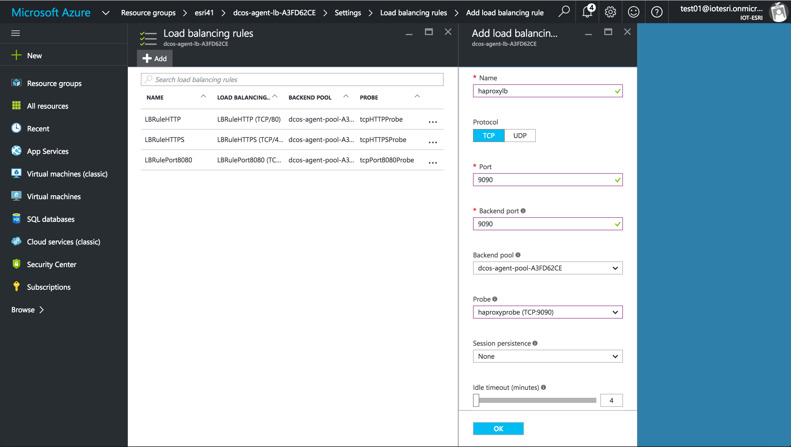 
 <b>Step 21:</b> ...
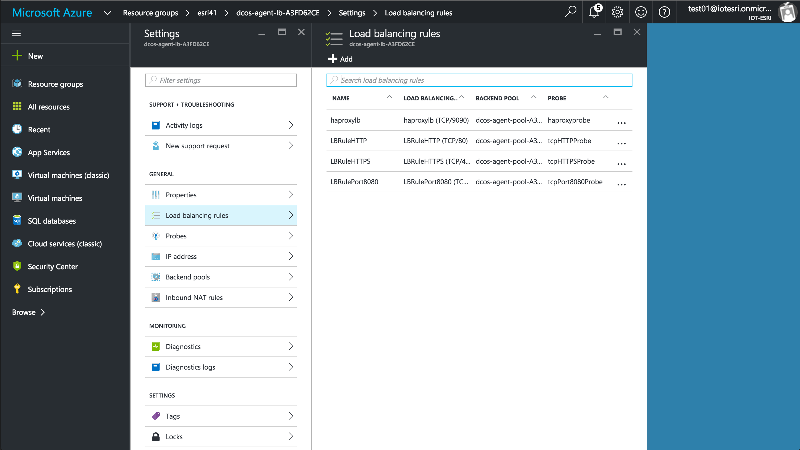 
 <b>Step 22:</b> ...
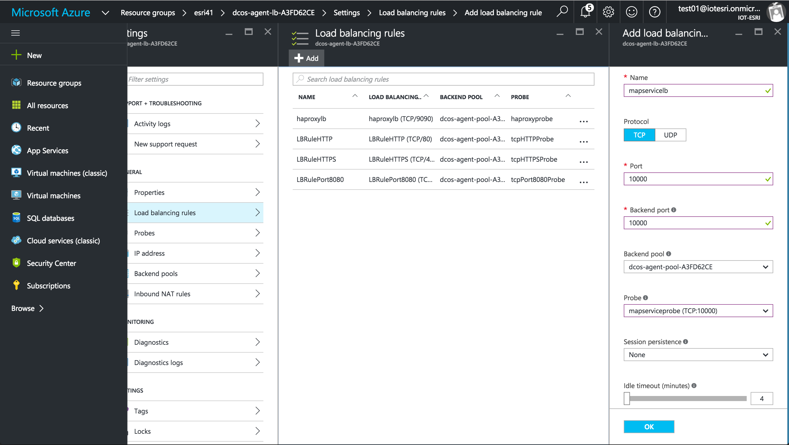 
 <b>Step 23:</b> ...
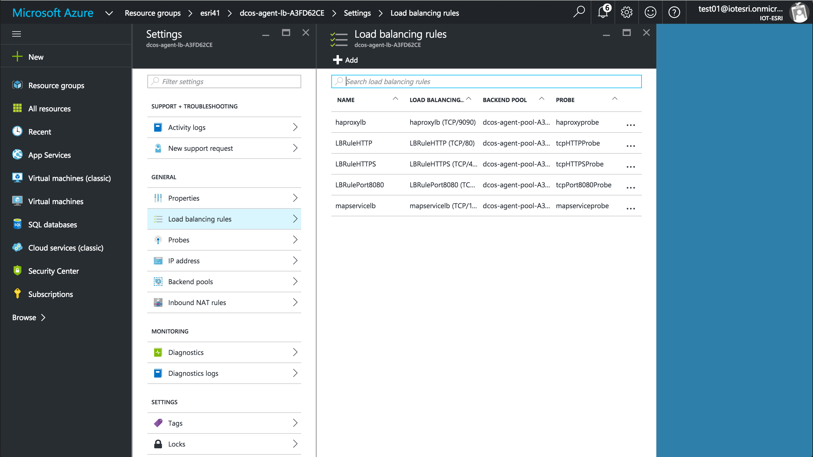 
 <b>Step 24:</b> ...
 
