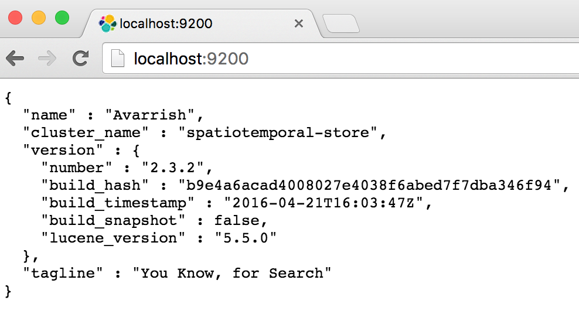
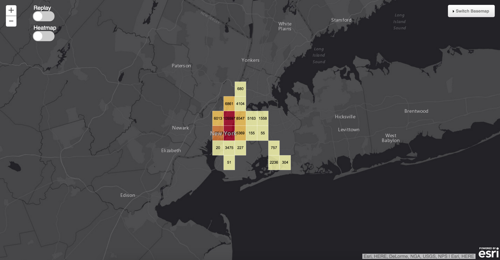
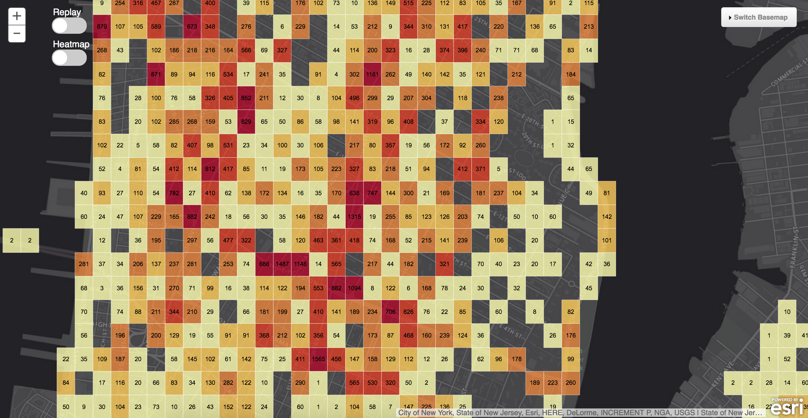
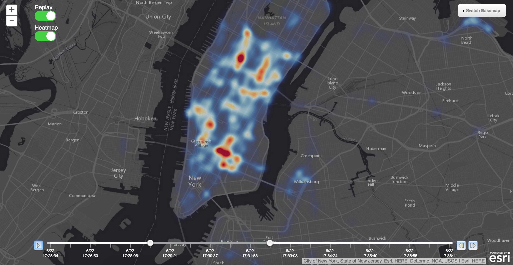
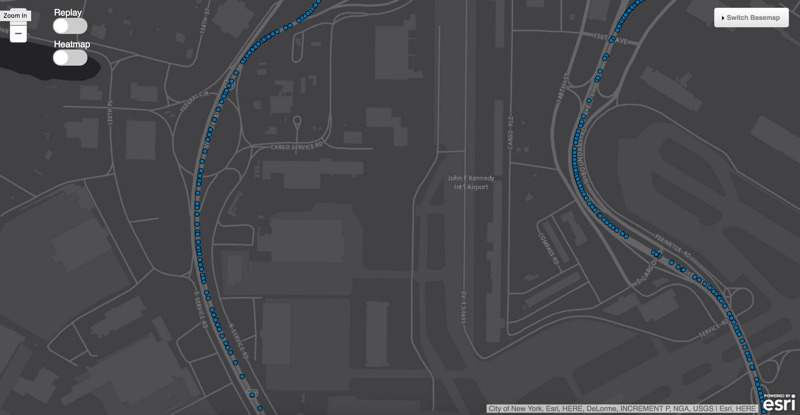

### Map Web Application

This is a custom JavaScript based Web application to visualize the dcos-iot-demo data in a map focused browser based client application. It uses the [ArcGIS JavaScript API](https://developers.arcgis.com/javascript/), [elasticsearch.js API](http://www.elastic.co/guide/en/elasticsearch/client/javascript-api/current/index.html) and a [Geohash library for Javascript](https://github.com/davetroy/geohash-js)

### Deployment & Configuration

1. Deploy the files in this folder in your clusters web server.
  * If you want to deploy the map web application on an external web server, you need to establish a tunnel from the web server to the {es} instant of the cluster and change the {es} host url as described in 2.
2. On default the app will try to communicate with {es} on http://spatiotemporal-store.elasticsearch.mesos:9200
  * Open the URL in a browser on your clusters machine where the web server is located to verify communication with {es} is working. You should be able to hit an {es} landing page looking like the following:
  
  
  _Note: This example is using an external webserver with a tunnel to the {es} cluster bound to localhost_

  * If you need to change the {es} host URL go to line 89/90 of the index.html (in this section you can also change the name of the datasource name (index/type) in case you did not use the default taxi name)
  * Optional: To change the FeatureThreshold (value when to switch from aggregated view to individual feature view) edit the number in line 93 of the index.html
 
### Capabilities

* Aggregation view in GeoHash (displays Count of features per bucket) or HeatMap style:

 * GeoHash bins are dynamically resizing and adjusting color ramp dependend on zoom level

* Replay data in any viewing mode

* Individual feature view when FeatureThreshold is reached

* Change Basemap via Widget in top right corner

### Contact

Feel free to reach out if you have questions regarding this map web application

  - [Send an email](mailto:tpaschke@esri.com)
