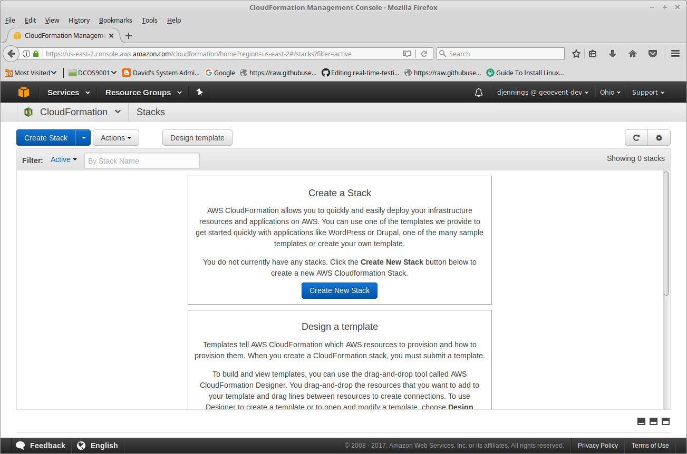
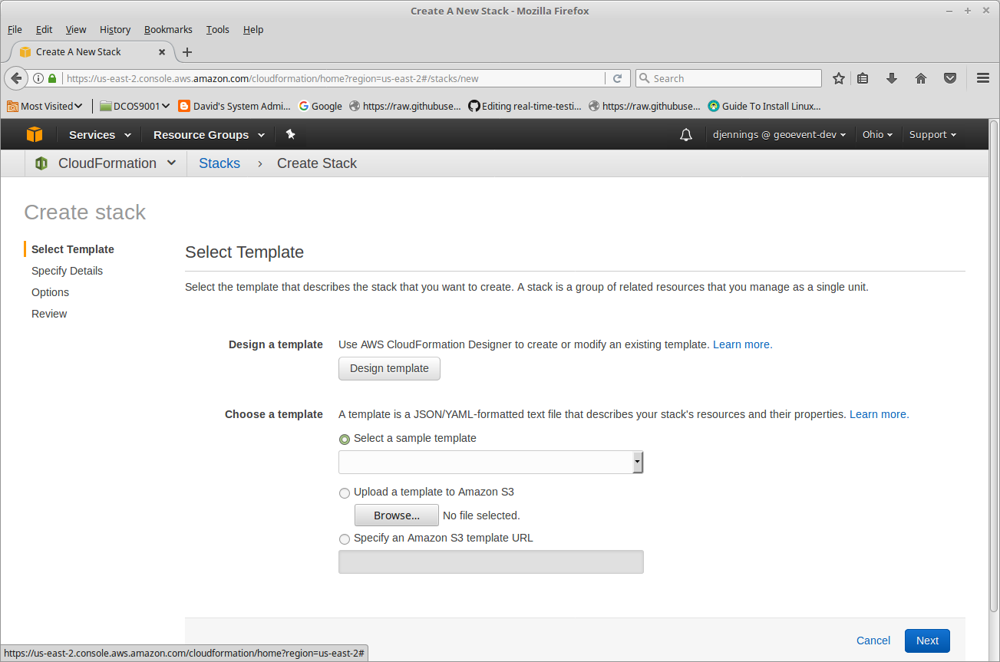
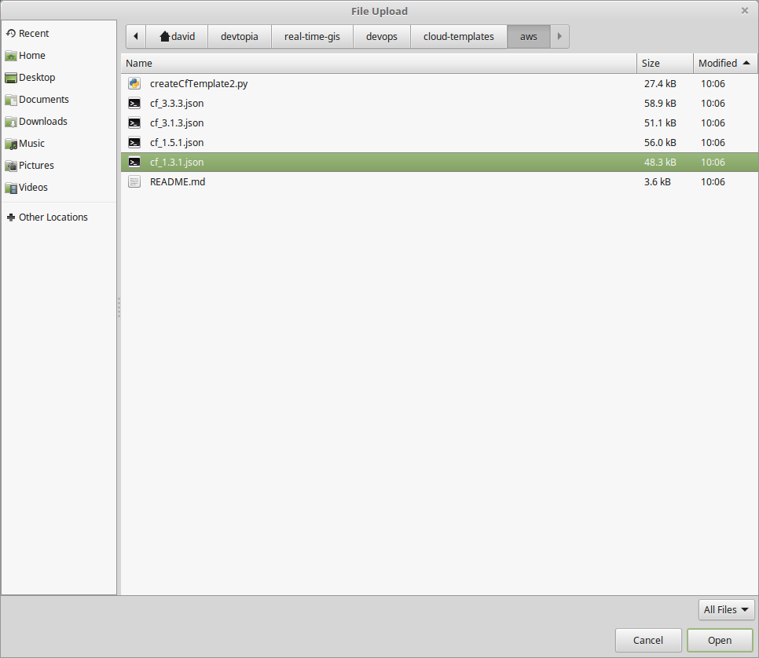
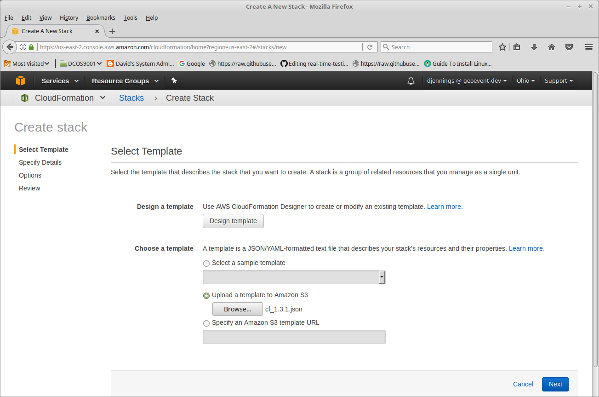
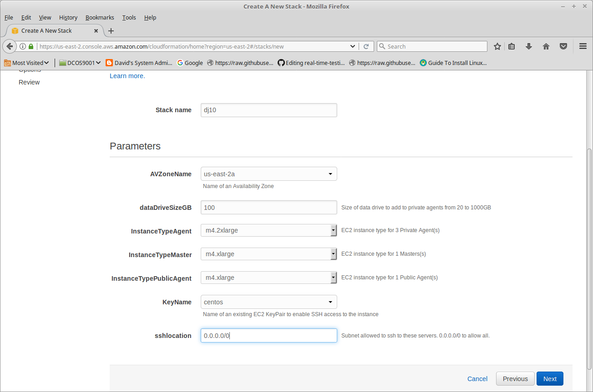
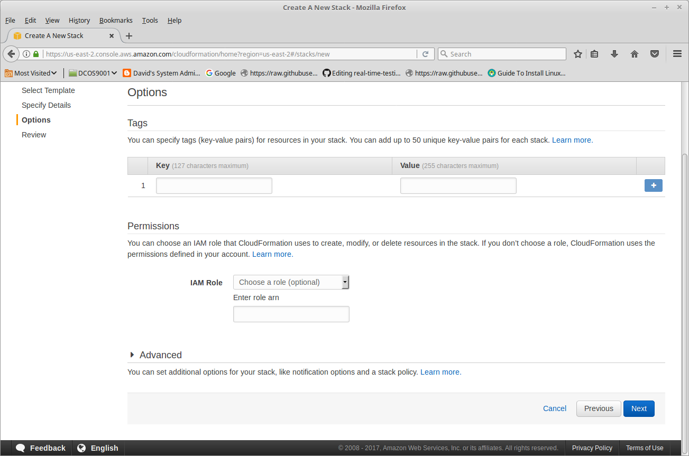
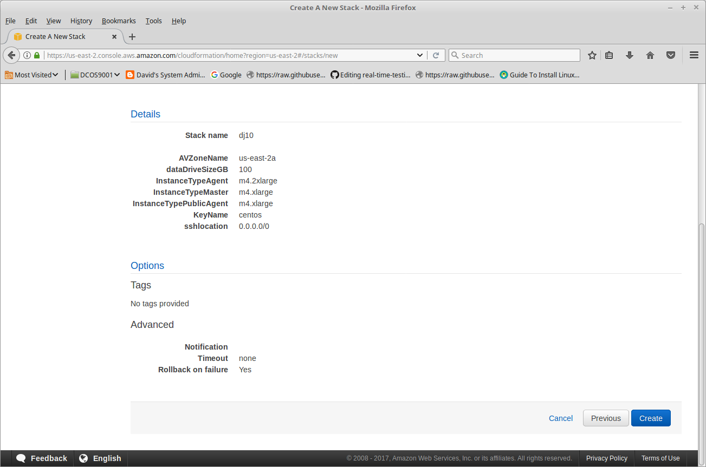
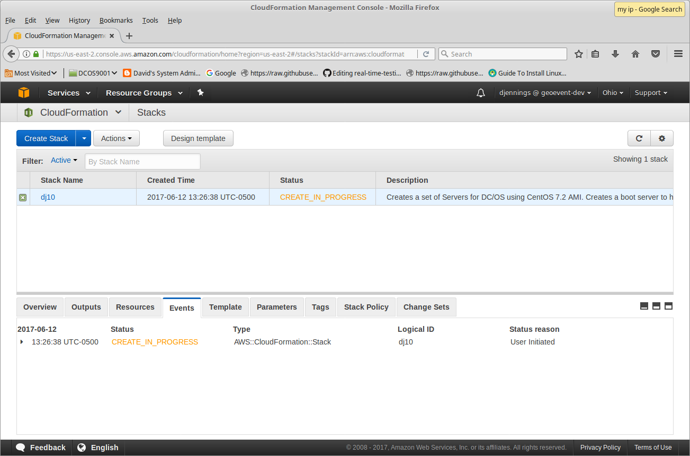
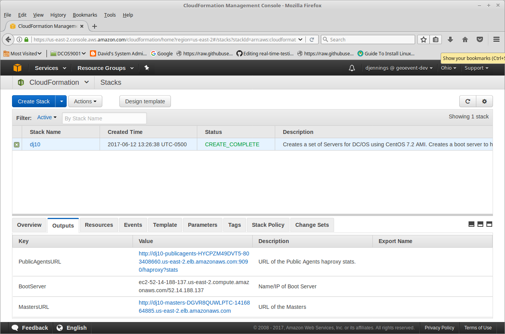

# Create DC/OS Cluster Azure

## Create a Key Pair
Before doing the install you'll need to create a Key Pair and Download the private key.

## Login to AWS

Navigate to CloudFormation

 

Create New Stack

 

Under "Choose a template" click Browse.

Navigate and select a template.  There are some pre-built templates.
- cf_1.3.1.json : creates 1 master, 3 private agents, and 1 public agent
- cf_1.5.1.json : creates 1 master, 5 private agents, and 1 public agent
- cf_3.1.3.json : creates 3 master, 1 private agents, and 3 public agent << Not useful for normal operations; used for testing templates
- cf_3.3.3.json : creates 3 master, 3 private agents, and 3 public agent

**NOTE:** If you need another configuration; you'll need to first run the Python script [createCfTemplate2.py](../cloud-templates/aws/createCfTemplate2.py).  Edit the script and add an output for the desired number of masters, private agents, and public agents.

For Development cf_1.5.1.json is a good choice.

 

Click Open

 

Click Next

## Enter Configurations for the Cluster

Specified Stack Name. All of the instances will be tagged with this name.

Pick a Zone.  

Set size for the data drive. For most development 100G is sufficient.

Pick Instance sizes
- m4.2xlarge is good choice for Private Agents
- m4.xlarge is good choice for Masters
- m4.xlarge is good choice for Public Agents

Pick your key

Set 

Specify sshlocation
- 0.0.0.0/0 allows you to login from anywhere
- 198.102.62.250/32 would only allow login from this IP  (Google search "my ip")

 

Click Next

Nothing needed here.

 

Click Next

## Create Cluster

Review and click Create 
**Warning:** This will create several EC2 instances.

 

The creation process begins.  

 

After a few minutes it will complete.  

Click on Ouputs tab.

 

Note the IP address of the BootServer (e.g. 52.14.188.137).

Now you are ready to [install DCOS](dcos.md)

## Removing the Cluster

Do destroy/remove the cluster
- Go to CloudFormation in AWS
- Select the Stack with the Stack Name
- From Actions select Delete
- Click "Yes, Delete"

This will remove everthing created by the Cloudformation template.

