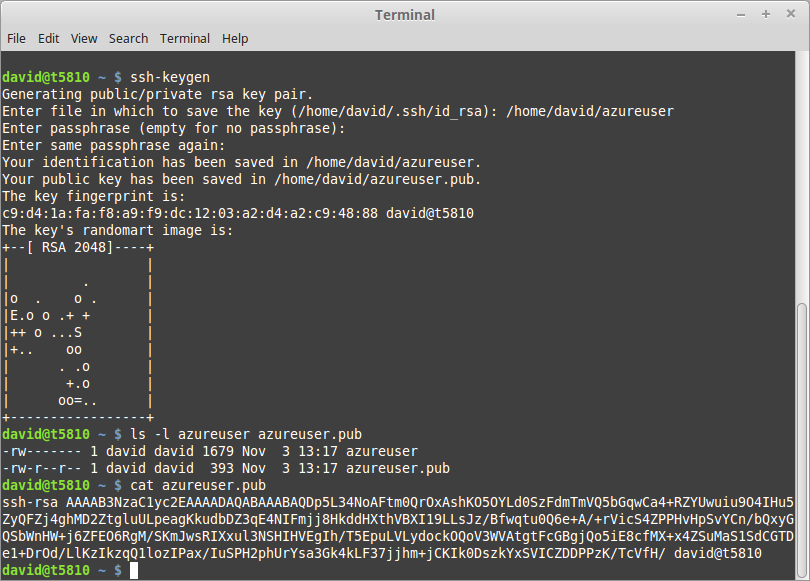
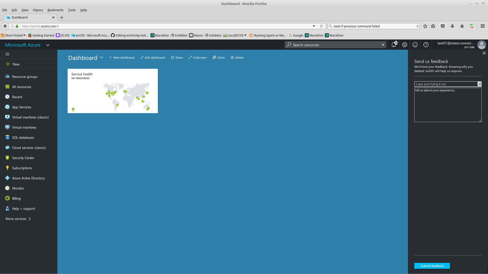
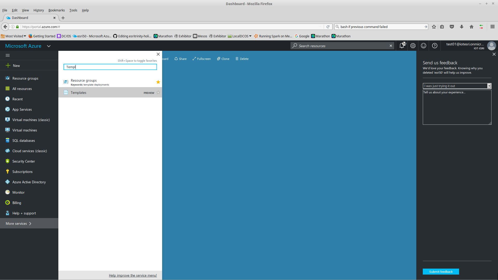
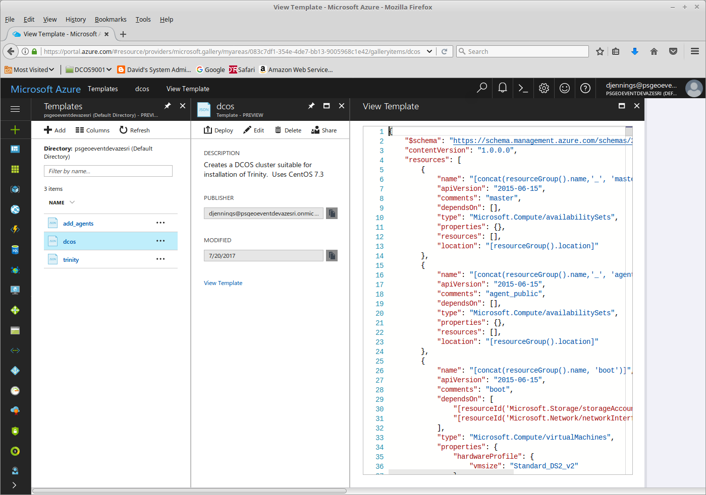
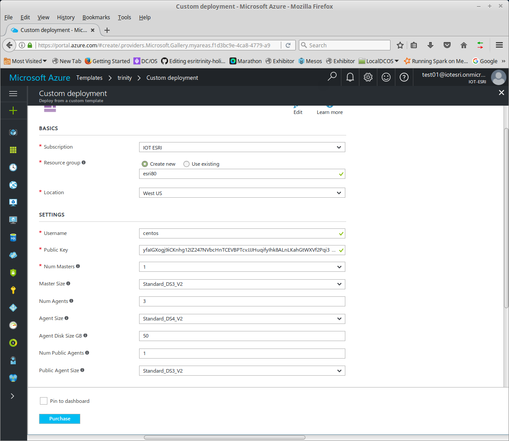
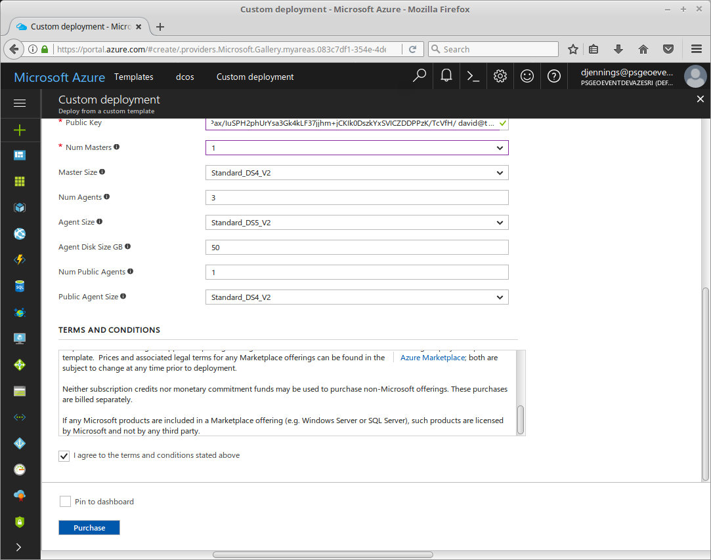
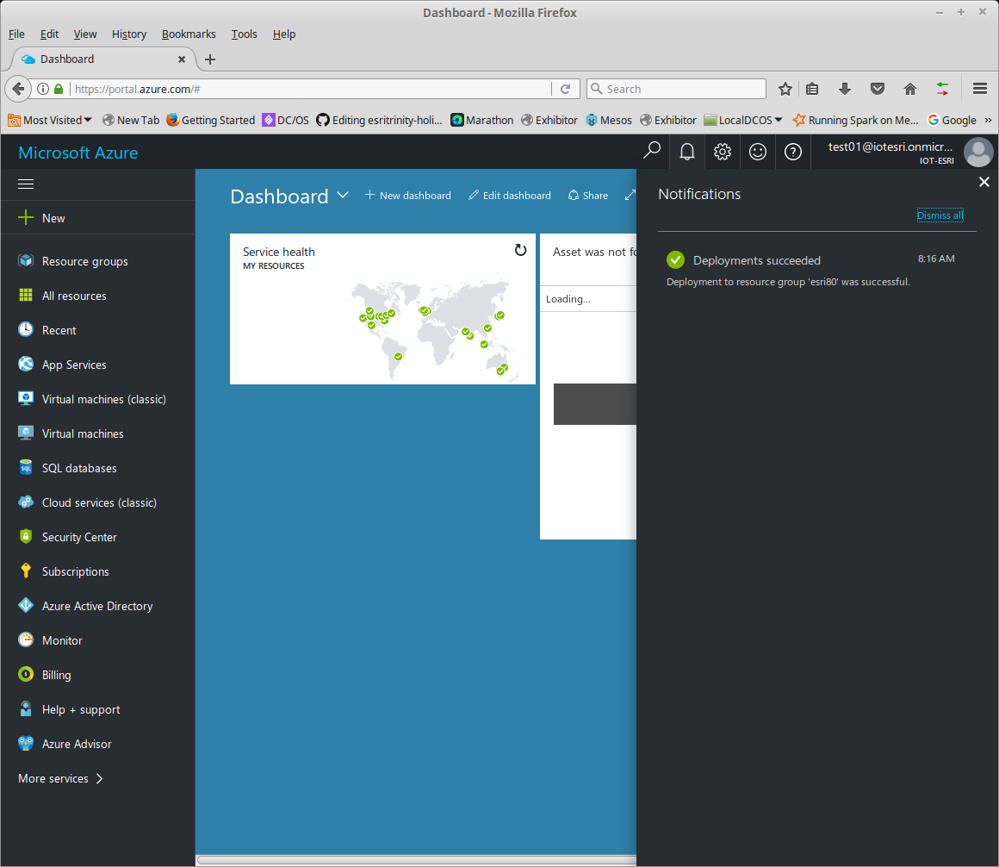
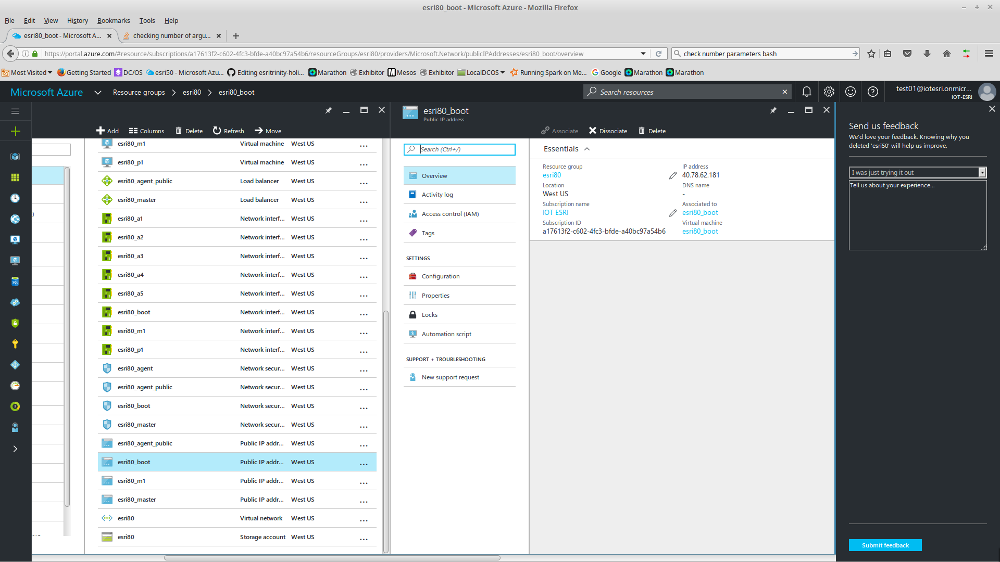

# Create DC/OS Cluster Azure

The procedure assumes you already [Created the Template](../cloud-templates/azure).

## You'll need a SSH Key Pair
If you don't have one; here is the process to create one.

This can be done from command line on Linux, Mac, or MobaXterm (Windows).
<pre>
$ ssh-keygen
</pre>
- Change the path to the key (e.g. /home/david/azureuser)
- Leave passphrase blank.

NOTE: If you already have a private key (azureuser) with a password you can remove the password with these commands.
<pre>
$ mv azureuser azureuser_withpassword
$ openssl rsa -in azureuser_withpassword -out azureuser
</pre>

Creates two files (azureuser and azureuser.pub)
 
 
 

## Goto Azure Portal
 

Click More Services and Search for Templates
 
Select Templates

## Select the Template 

Use the "dcos" template.

 

Click Deploy

 

NOTE: In the image I used centos for my username. This is the default for the scripts; I recommend changing to centos for username and centos.pem; this is what is used be default in Amazon Web Services.  

## Enter Resource Group

Enter Name: (e.g. esri80)

## Under Parameters
- Username (e.g. azureuser)
- Public Key (e.g. contents of azureuser.pub).
- Num Masters (1 is good for dev; 3 for production)
- Master Size (DS3_V2 works)
- Num Agents (5 is good for dev)
- Agent Size (DS4_V2 works)
- Agent Disk Size GB (50 is good for most dev work)
- Num Public Agents (1 is good for dev)
- Public Agent Size (DS3_V2 works)

NOTE: If you hover over the "i"; this will give you a hint.

Scroll down and check "I agree to terms and conditions stated above"

 
Click Purchase

It will take about 5-10 minutes for the Resource Group to build.

 

On Azure Portal navigate to find public IP of the "boot" server.

 

Now you are ready to [install DCOS](dcos.md)

## Removing Cluster
When you want to remove/delete the cluster
- Login to Azure
- Select the Resource Group
- Click Delete
- Enter the Resource Group Name
- Click OK
