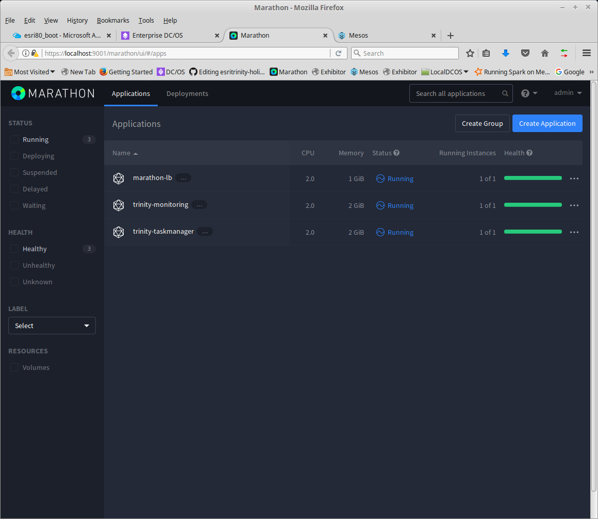
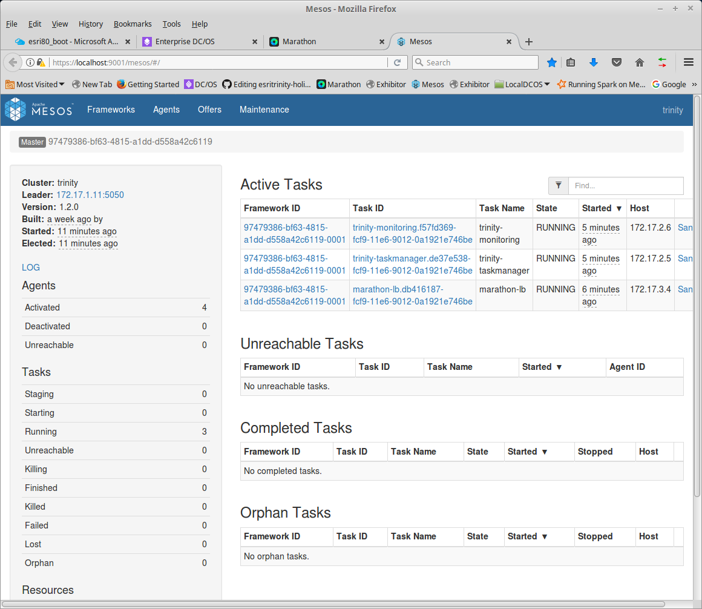

# Install DCOS

## Copy Private Key to Boot Server

Copy your private key to the boot server.

**NOTE**: For AWS the default user is centos. The example command lines below are for azure and assume you created a user named azureuser and that your private key is also named azureuser; you'll need to adjust command lines for AWS.

<pre>
$ scp -i {private-key} {private-key} {username}@{boot server ip}:.

Example:
$ scp -i azureuser azureuser azureuser@40.78.62.181:.
</pre>

## Copy Install Script to Boot Server

- [install_dcos.sh](install_dcos.sh) is a Bash Script that installs DCOS.

For Linux or Mac users you can use scp to copy the files.  Windows users can use a program like [Mobaxterm](http://mobaxterm.mobatek.net/).

From your local workstation.

<pre>
$ scp -i {Private Key} {File you want to upload} {Username}@{Boot Server IP}:.

Examples:
$ scp -i azureuser devtopia/real-time-gis/devops/install/install_dcos.sh azureuser@40.78.62.181:.
</pre>

## Secure shell to Boot
<pre>
$ ssh -i azureuser  azureuser@40.78.62.181
</pre>
You are now logged into boot server as azureuser.

## Fix Scripts (Windows only)

If you use scp from a Windows workstation; Windows injects line endings that are incompatible with Linux. You can fix the files using "dos2unix". 

<pre>
$ sudo yum -y install dos2unix
$ dos2unix *.sh
</pre>

## Run DCOS Installer

**WARNING:** Windows users be careful about typos. Mobaxterm sends strange characters when you backspace. If you make an error during entry; use Ctrl-C and start over. 

Run the script specifying the number of masters, number of agents, and number of public agents. 

<pre>
$ sudo bash install_dcos.sh {Number of Masters} {Number of Private Agents} {Number of Public Agents}

For Example for 1 master, 5 private agents, and 1 public agent.

$ sudo bash install_dcos.sh 1 5 1
</pre>

You'll see a list of versions you can install.
<pre>
1) Latest Community Edition  3) Custom
2) Version 1.9.0
Which version of DCOS do you want to install: 
</pre>

Specify the version you want, using the number (e.g. 1 for Latest Community Edition).

Option 3 allows you to enter the URL from [Mesosphere Releases](https://dcos.io/releases/)

For example you can install earlier version of Community Edition

- For [1.8.6](https://dcos.io/releases/1.8.6/) use https://downloads.dcos.io/dcos/stable/commit/cfccfbf84bbba30e695ae4887b65db44ff216b1d/dcos_generate_config.sh
- For [1.8.7](https://dcos.io/releases/1.8.7/) use https://downloads.dcos.io/dcos/stable/commit/1b43ff7a0b9124db9439299b789f2e2dc3cc086c/dcos_generate_config.sh

You'll be prompted to specify the OS Username. In this case enter "azureuser".

Then you'll be prompted for the PKI Filename. In this case enter "azureuser".

**NOTE:** I've set the defaults to centos for username and centos.pem for the PKI Filename. For AWS you can just hit enter to accept the default values.

The script will display the installation details.

Authentication is disabled. 

It takes about 5-10 minutes for the Boot Setup to complete.

The DC/OS install usually takes another 5-10 minutes.

The last line output is “DCOS is Ready”

## Accessing DCOS

You can access DCOS via masters DNS name.  

For Azure the template creates a DNS name that includes the resource group name and zone. (e.g. https://esri88dcos.westus.cloudapp.azure.com). 

For AWS got to the MastersURL shown in CloudFormation Outputs.  (e.g. http://dj42-masters-8KKXTQR06AVK-1264100292.us-east-2.elb.amazonaws.com).

## Tunnelling  (Optional)  

From your workstation you can create a Tunnel to DCOS.  You can tunnel via the boot server.

<pre>
$ ssh -i {private key} -L {Local Port}:m1:443 {username}@{boot server ip}

Example to tunnel localhost:9001 to m1:443  
$ ssh -i azureuser -L 9001:m1:443 azureuser@40.78.62.181
</pre>

From a browser connect to DCOS (https://localhost:9001).  The first time you connect you'll get a warning about "Your connection is not secure". You'll need to accept the key to continue. 

## Logging into Cluster

Sometimes for testing or investigation you may want to log into one of the cluster servers.

The servers are given names that coorespond to their function.
- Masters are named m1, m2, ...
- Private Agents are named a1, a2, a3, ...
- Public Agents are named p1, p2, ...
- Boot Server is named: boot

You can ssh from the boot server to one of the agents using either it's name or ip as shown in Mesos.

<pre>
Example:
$ ssh -i azureuser a1
$ ssh -i azureuser 172.17.2.4
</pre>

## Other DCOS Tools 

Marathon and Mesos are also available
 

 

## Troubleshooting
If something goes wrong review the log files in the installation folder.

Often you can correct the problem and rerun the install_dcos.sh script.

If that doesn't work you can try resetting. (e.g. bash install_dcos.sh 0 0 0). Reset removes key files necessary to retry installation and stops nginx docker used by boot.  

### Login Error
When browsing to DCOS you get an error message:
<pre>
Error requesting UI Configuration

You can also join us on our Slack channel or send us an email at help@dcos.io.
</pre>

I've seen this when I create a new cluster. If you close and reopen the browser the problem will likely go away.  Another work around is to go to Marathon or Mesos page (e.g. https://localhost:9001/marathon); this will redirect and allow you to enter your username/password.  Then you can get to DCOS as usual. 

### CentOS Mirror Problem
If the installation fails and you see messages like:
[Errno 14] HTTP Error 404 - Not Found Trying other mirror in the logs.

<pre>
$ sudo yum clean all
$ sudo yum repolist
$ sudo bash install_dcos.sh 0 0 0
</pre>
Then run the installer again.  *** Note: You may get an error about about docker.service; but the installation should continue***

### If All Else Fails
If all else fails; you'll have to remove the resource group and try again.
